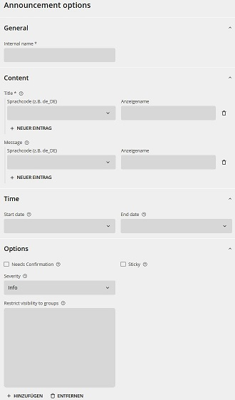

Announcements sind Benachrichtigungen, die zentral an dieser Stelle erstellt werden, um mehrere openDesk User zu informieren.  

**Gut zu wissen:**

Die Liste der angelegten Announcements wird über die Suche angezeigt:  
Klicken Sie auf das **Lupensymbol"** im Feld **Suche ...**.  

Der Wert des **Anzeigenamens**:  
-   darf nicht identisch mit einem anderen Benutzernamen sein
-   darf nur Ziffern, Buchstaben, Punkte, Bindestriche, oder Unterstriche enthalten
-   muss mindestens 2 Zeichen lang sein
-   muss mit einer Ziffer oder einem Buchstaben beginnen und enden
-   darf nicht "admin" sein. 

## Announcements anlegen

**Voraussetzungen:**  
Sie sind als IAM Administrator im Admin-Portal angemeldet.  

**Schritte**  

1.  Klicken Sie die **Announcements**-Kachel unter **Verwaltung Portal**.  
Die Suche nach Announcements öffnet sich.  
1.  Klicken Sie **Hinzufügen**.  
Die Eingabemaske wird geöffnet.  
  
1.  Geben Sie einen **Namen** ein.
1.  Geben Sie bei **Titel** den **Sprachcode** und den **Anzeigenamen** (Titel) ein.  
1.  Geben Sie bei **Nachricht** den **Sprachcode** und den **Text** ein.  
1.  Sie haben folgende weitere optionale Möglichkeiten:
    -   Setzen Sie ein **Anfangsdatum** und ein **Enddatum** für die Anzeige der Benachrichtigung, um die Anzeige zeitlich einzugrenzen.  
    -   Setzen Sie ein Häkchen bei **Bestätigung**, um die Quittierung durch die Empfänger zu erzwingen.  
    -   Setzen Sie ein Häkchen bei **Anheften**, um die Nachricht permanent anzuzeigen.  
    **Hinweis**:  
    Falls Sie kein Enddatum für die Nachricht angeben, wird diese angezeigt, bis Sie sie aus dem System löschen.
    -   Setzen Sie eine Kategorie für die "Schwere" der Nachricht:
        - Information
        - Warnung
        - Ergebnis
        - Gefahr
    -   Beschränken Sie die Sichtbarkeit der Nachricht für bestimmte User und Gruppen:  
    Legen Sie die zugriffsberechtigten Accounts und Gruppen fest:
        1. Klicken Sie **Hinzufügen**.  
    Die Auswahlmaske wird geöffnet.
        1. Klicken Sie auf das **Lupensymbol** Mitte rechts in der Suchmaske.  
    **Tipp**:  
    Verwenden Sie bei Bedarf die Suchfilter **Objekteigenschaft** und die entsprechend dynamischen Sub-Filter zur Eingrenzung der Suche.  
    **Benutzergruppen** finden Sie, wenn Sie "Gruppen" als "Objekteigenschaft" wählen und dann suchen.  
    Die Suchergebnisse werden angezeigt.
        1.  Setzen Sie die Häkchen bei den benötigten Accounts und klicken Sie **Hinzufügen**.  
    Die ausgewählten Accounts werden bei den zugriffsberechtigten Personen in der Eingabemaske angezeigt.
        1.  Setzen Sie die Häkchen bei den benötigten Accounts um sie zu aktivieren.

1.  Klicken Sie **LDAP-Objekt erzeugen**.  
  
Die Nachricht wird im System erstellt.

HIER WEITER

## Announcements ändern

**Voraussetzungen:**  
Sie sind als IAM Administrator im Admin-Portal angemeldet.  

**Schritte**  

1.  Klicken Sie die **Ressourcen**-Kachel unter **Verwaltung Groupware**.  
Die Suche nach Ressourcen öffnet sich.  
1.  Klicken Sie auf das **Lupensymbol"** im Feld **Suche LDAP-Objekte**.  
Die Liste der im System vorhandenen Ressourcen wird angezeigt.  
1.  Wählen Sie eine Ressource, um die Daten zu aktualisieren. Verwenden Sie ggf. die Suche.  
Die Eingabemaske wird angezeigt.  
1.  Aktualisieren Sie die Daten und klicken Sie **Speichern**.  
  
Die Daten werden aktualisiert.  
Die Eingabemaske wird geschlossen und die Liste der im System vorhandenen Ressourcen wird angezeigt.

## Announcements löschen

**Voraussetzungen:**  
Sie sind als IAM Administrator im Admin-Portal angemeldet.  

**Schritte**  

1.  Klicken Sie die **Ressourcen**-Kachel unter **Verwaltung Groupware**.  
Die Suche nach Ressourcen öffnet sich.  
1.  Klicken Sie auf das **Lupensymbol"** im Feld **Suche LDAP-Objekte**.  
Die Liste der im System vorhandenen Ressourcen wird angezeigt.  
1.  Klicken Sie die gewünschte Ressource in der Liste an.  
1. Klicken Sie **Löschen**.  
Die Bestätigungsanfrage **Objekte löschen** öffnet sich.
1.  Bestätigen Sie mit **Löschen**.  
Achten Sie darauf, dass das Häkchen bei **Zugehörige Objekte löschen** gesetzt ist.  

Die Ressource wird im System gelöscht.

## Links

-   [Herstellerinformationen Benutzerverwaltung](https://docs.software-univention.de/manual/5.0/de/user-management/index.html)

