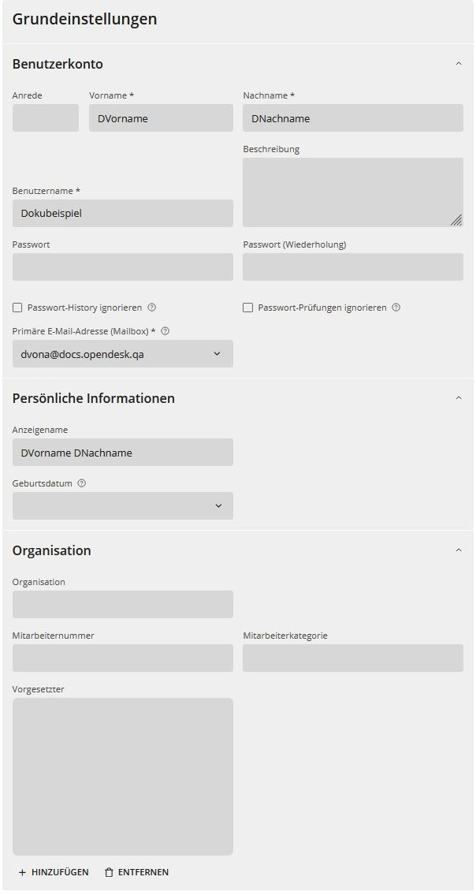
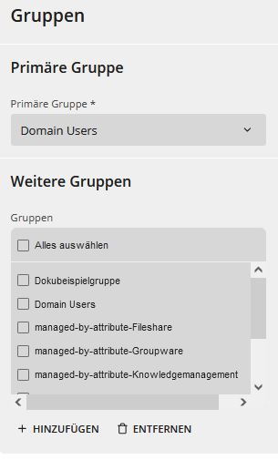
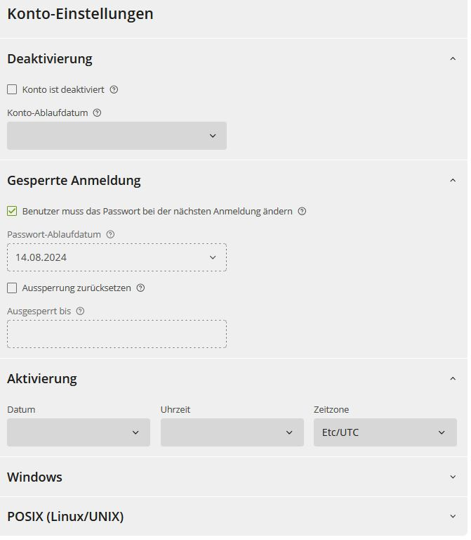
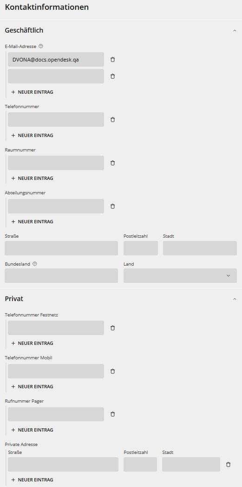
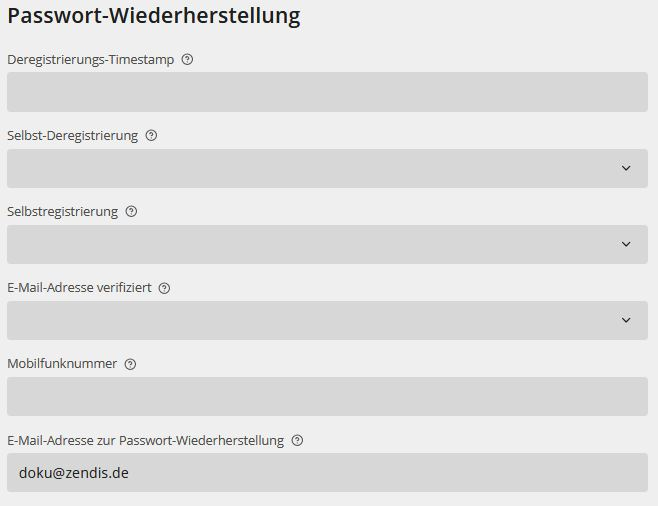
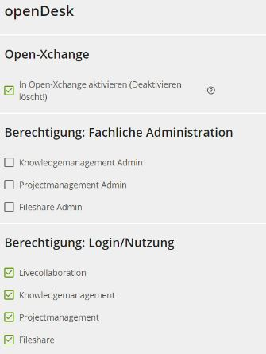

:::note
Im Folgenden werden ausschließlich openDesk-spezifische Felder erklärt. 
Beachten Sie die Hilfstexte des Herstellers zu den Feldern.
:::

**Voraussetzungen:**
Sie sind als Administrator im Admin-Portal angemeldet. Sie haben die Eingabemaske für die Benutzereinstellungen geöffnet.

:::note
Die folgenden Standardeigenschaften sind **ausschließlich für die globale Administration** des Portals relevant und sollten nicht verändert werden:

-   Sektion Konto
    -   Windows Abschnitt
    -   POSIX Abschnitt
-   Optionen (komplett)
-   Guardian (komplett)
-   OX App Suite
    -   OX-Context mit openDesk-Featuretoggle
    -   sonstige Felder
-   Erweitere Einstellung (komplett)
-   Richtlinien (komplett)
-   OX Resourcen
    -   OX App Suite (komplett)
:::

## Allgemein

:::note 
Beachten Sie auch die fachlichen Vorgaben Ihrer Organisation.
Beachten Sie außerdem die Hilfetexte zu den Feldern jeweils hinter den Fragezeichen-Icons auf der Eingabemaske selbst.
:::

  

:::tip[Gut zu wissen]
Die mit einem * gekennzeichneten Felder sind Pflichtangaben und dürfen nicht leer bleiben. Diese wurden auch über die verkürzte Eingabemaske zum Anlegen neuer Benutzer bereits gefüllt.  
Die Pflichtfelder wurden auch über die verkürzte Eingabemaske zum Anlegen neuer Benutzer bereits gefüllt.  
Der **Anzeigename** wird automatisch aus Vorname und Nachname gebildet, kann aber auch abweichend hier editiert werden.  
Der **Benutzername** wird automatisch in den ***local part* der E-Mail-Adresse** der Mailbox dieses Benutzers übernommen.
:::

## Gruppen

:::note  
Beachten Sie auch die fachlichen Vorgaben Ihrer Organisation.
Beachten Sie außerdem die Hilfetexte zu den Feldern jeweils hinter den Fragezeichen-Icons auf der Eingabemaske selbst.
:::

  

**Schritte:**  

1. Wählen Sie die **primäre Gruppe**.
1. Setzen Sie nach Bedarf die Häkchen für alle **weiteren Gruppen**, die diesen Account enthalten sollen.
1. Klicken Sie **Speichern**.  
Mit **Hinzufügen** können Sie weitere benötigte Gruppen in die Auswahl einblenden.

:::tip[Gut zu wissen]
Jeder Account muss mindestens einer Gruppe (primäre Gruppe) zugeordnet sein.
:::

## Konto

:::note  
Beachten Sie auch die fachlichen Vorgaben Ihrer Organisation.  
Beachten Sie außerdem die Hilfetexte zu den Feldern jeweils hinter den Fragezeichen-Icons auf der Eingabemaske selbst.
:::

  

:::tip[Gut zu wissen]
Die mit einem * gekennzeichneten Felder sind Pflichtangaben und dürfen nicht leer bleiben.  
Die Sektionen Windows und POSIX (Linux/UNIX) sind **ausschließlich für die globale Administration** des Portals relevant und sollten nicht verändert werden.
:::

## Kontakt

:::note 
Beachten Sie auch die fachlichen Vorgaben Ihrer Organisation.  
Beachten Sie außerdem die Hilfetexte zu den Feldern jeweils hinter den Fragezeichen-Icons auf der Eingabemaske selbst.
:::

:::tip[Gut zu wissen]
Die mit einem * gekennzeichneten Felder sind Pflichtangaben und dürfen nicht leer bleiben. 
:::

## Passwort-Wiederherstellung

:::note
Beachten Sie auch die fachlichen Vorgaben Ihrer Organisation.  
Beachten Sie außerdem die Hilfetexte zu den Feldern jeweils hinter den Fragezeichen-Icons auf der Eingabemaske selbst.
:::

  

Es wird automatisch ein Anmelde-Link an die hier eingetragene E-Mail Adresse gesendet.

:::tip[Gut zu wissen]
Die **Erstanmeldung** verwendet ebenfalls die Felder aus der Maske **Passwort-Wiederherstellung**.
:::

## openDesk

:::note  
Beachten Sie auch die fachlichen Vorgaben Ihrer Organisation.  
Beachten Sie außerdem die Hilfetexte zu den Feldern jeweils hinter den Fragezeichen-Icons auf der Eingabemaske selbst.
:::

  

Setzen Sie Häkchen für die Rechte für die Einzelanwendungen in openDesk. Der Screenshot zeigt exemplarisch die Rechte eines "default-users".

:::tip[Gut zu wissen]
Aus Gründen der Sicherheit, z.B. vor Phishing und anderen Angriffen, wird eine angemessene Trennung der alltäglichen Aufgaben eines openDesk-Nutzers von den administrativen Aufgaben eines openDesk Administrators bei der Installation von openDesk empfohlen. In diesem Fall erhält jeder Account bei der Anmeldung über die Benutzerrechte die Portalangebote, für die er zugelassen ist. Der normale Benutzerzugang (Benutzer-Vorlage openDesk User) führt in das openDesk Standardportal und der Benutzerzugang als Administrator (Benutzer-Vorlage openDesk Admin) führt in das openDesk Administratorportal.
:::
