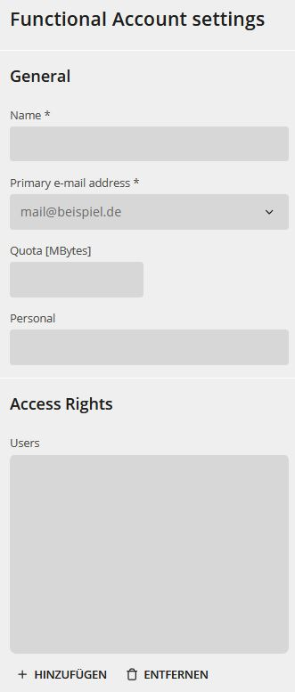
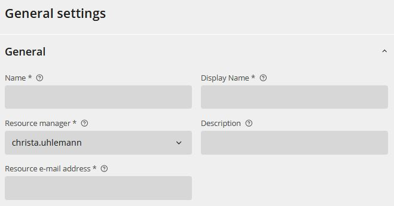

## Funktionspostfächer

Funktionspostfächer sind funktionsgebundene E-Mail-Adressen einer Organisation, z.B. opendesk@zendis.de.

:::tip[Gut zu wissen]
Die Liste der angelegten Funktionspostfächer wird über die Suche angezeigt:  
Klicken Sie auf das **Lupensymbol"** im Feld **Suche ...**.  

Der Wert von **Personal** (Anzeigename für das Funktionspostfach):  
-   darf nicht identisch mit einem anderen Benutzernamen sein
-   darf nur Ziffern, Buchstaben, Punkte, Bindestriche, oder Unterstriche enthalten
-   muss mindestens 2 Zeichen lang sein
-   muss mit einer Ziffer oder einem Buchstaben beginnen und enden
-   darf nicht "admin" sein. 
:::

### Funktionspostfächer anlegen

**Voraussetzungen:**  
Sie sind als IAM Administrator im Admin-Portal angemeldet.  

**Schritte**  

1.  Klicken Sie die **Funktionspostfächer**-Kachel unter **Verwaltung Groupware**.  
Die Suche nach Funktionspostfächern öffnet sich.  
1.  Klicken Sie **Hinzufügen**.  
Die Eingabemaske wird geöffnet.  
  
1.  Geben Sie **Name** und **Mailadresse** ein.  
1.  Optional:
    - Geben Sie die gewünschte **Quota** (Größenvorgabe in MBytes) ein.
    - Geben Sie **Personal** (Anzeigename zusätzlich zur E-Mail-Adresse) ein.  
1.  Legen Sie die zugriffsberechtigten Accounts und Gruppen fest:
    1. Klicken Sie **Hinzufügen**.  
    Die Auswahlmaske wird geöffnet.
    1. Klicken Sie auf das **Lupensymbol** Mitte rechts in der Suchmaske.  
    **Tipp**:  
    Verwenden Sie bei Bedarf die Suchfilter **Objekteigenschaft** und die entsprechend dynamischen Sub-Filter zur Eingrenzung der Suche.  
    **Benutzergruppen** finden Sie, wenn Sie "Gruppen" als "Objekteigenschaft" wählen und dann suchen.  
    Die Suchergebnisse werden angezeigt.
    1.  Setzen Sie die Häkchen bei den benötigten Accounts und klicken Sie **Hinzufügen**.  
    Die ausgewählten Accounts werden bei den zugriffsberechtigten Personen in der Eingabemaske angezeigt.
    1.  Setzen Sie die Häkchen bei den benötigten Accounts um sie zu aktivieren.
1.  Klicken Sie **LDAP-Objekt erzeugen**.  
  
Das Funktionspostfach wird im System erstellt.

### Funktionspostfächer ändern

**Voraussetzungen:**  
Sie sind als IAM Administrator im Admin-Portal angemeldet.  

**Schritte**  

1.  Klicken Sie die **Funktionspostfächer**-Kachel unter **Verwaltung Groupware**.  
Die Suche nach Funktionspostfächern öffnet sich.  
1.  Klicken Sie auf das **Lupensymbol"** im Feld **Suche LDAP-Objekte**.  
Die Liste der im System vorhandenen Funktionspostfächer wird angezeigt.  
1.  Wählen Sie ein Funktionspostfach, um die Daten zu aktualisieren. Verwenden Sie ggf. die Suche.  
Die Eingabemaske wird angezeigt.  
1.  Aktualisieren Sie die Daten und klicken Sie **Speichern**.  
  
Die Daten werden aktualisiert.  
Die Eingabemaske wird geschlossen und die Liste der im System vorhandenen Funktionspostfächer wird angezeigt.

### Funktionspostfächer löschen

**Voraussetzungen:**  
Sie sind als IAM Administrator im Admin-Portal angemeldet.  

**Schritte**  

1.  Klicken Sie die **Funktionspostfächer**-Kachel unter **Verwaltung Groupware**.  
Die Suche nach Funktionspostfächern öffnet sich.  
1.  Klicken Sie auf das **Lupensymbol"** im Feld **Suche LDAP-Objekte**.  
Die Liste der im System vorhandenen Funktionspostfächer wird angezeigt.  
1.  Klicken Sie das gewünschte Funktionspostfach in der Liste an.  
1. Klicken Sie **Löschen**.  
Die Bestätigungsanfrage **Objekte löschen** öffnet sich.
1.  Bestätigen Sie mit **Löschen**.  
Achten Sie darauf, dass das Häkchen bei **Zugehörige Objekte löschen** gesetzt ist.  

Das Funktionspostfach wird im System gelöscht.

## Ressourcen

Ressourcen sind E-Mail-Adressen für buchbare Objekte, z.B. Konferenzräume oder Firmenfahrzeuge.  

:::tip[Gut zu wissen]
Die Liste der angelegten Ressourcen wird über die Suche angezeigt:  
Klicken Sie auf das **Lupensymbol"** im Feld **Suche ...**.  

Der Wert des **Anzeigenamens**:  
-   darf nicht identisch mit einem anderen Benutzernamen sein
-   darf nur Ziffern, Buchstaben, Punkte, Bindestriche, oder Unterstriche enthalten
-   muss mindestens 2 Zeichen lang sein
-   muss mit einer Ziffer oder einem Buchstaben beginnen und enden
-   darf nicht "admin" sein. 
:::

### Ressourcen anlegen

**Voraussetzungen:**  
Sie sind als IAM Administrator im Admin-Portal angemeldet.  

**Schritte**  

1.  Klicken Sie die **Ressourcen**-Kachel unter **Verwaltung Groupware**.  
Die Suche nach Ressourcen öffnet sich.  
1.  Klicken Sie **Hinzufügen**.  
Die Eingabemaske wird geöffnet.  
  
1.  Geben Sie **Name** und **Anzeigename** ein.  
1.  Geben Sie die **verantwortliche Person** ein.
1.  Optional: Geben Sie eine **Beschreibung** ein.  
1.  Geben Sie die **Mailadresse** ein.  
1.  Klicken Sie **LDAP-Objekt erzeugen**.  
  
Die Ressource wird im System erstellt.

### Ressourcen ändern

**Voraussetzungen:**  
Sie sind als IAM Administrator im Admin-Portal angemeldet.  

**Schritte**  

1.  Klicken Sie die **Ressourcen**-Kachel unter **Verwaltung Groupware**.  
Die Suche nach Ressourcen öffnet sich.  
1.  Klicken Sie auf das **Lupensymbol"** im Feld **Suche LDAP-Objekte**.  
Die Liste der im System vorhandenen Ressourcen wird angezeigt.  
1.  Wählen Sie eine Ressource, um die Daten zu aktualisieren. Verwenden Sie ggf. die Suche.  
Die Eingabemaske wird angezeigt.  
1.  Aktualisieren Sie die Daten und klicken Sie **Speichern**.  
  
Die Daten werden aktualisiert.  
Die Eingabemaske wird geschlossen und die Liste der im System vorhandenen Ressourcen wird angezeigt.

### Ressourcen löschen

**Voraussetzungen:**  
Sie sind als IAM Administrator im Admin-Portal angemeldet.  

**Schritte**  

1.  Klicken Sie die **Ressourcen**-Kachel unter **Verwaltung Groupware**.  
Die Suche nach Ressourcen öffnet sich.  
1.  Klicken Sie auf das **Lupensymbol"** im Feld **Suche LDAP-Objekte**.  
Die Liste der im System vorhandenen Ressourcen wird angezeigt.  
1.  Klicken Sie die gewünschte Ressource in der Liste an.  
1. Klicken Sie **Löschen**.  
Die Bestätigungsanfrage **Objekte löschen** öffnet sich.
1.  Bestätigen Sie mit **Löschen**.  
Achten Sie darauf, dass das Häkchen bei **Zugehörige Objekte löschen** gesetzt ist.  

Die Ressource wird im System gelöscht.

## Links

-   [Herstellerinformationen Benutzerverwaltung](https://docs.software-univention.de/manual/5.0/de/user-management/index.html)

