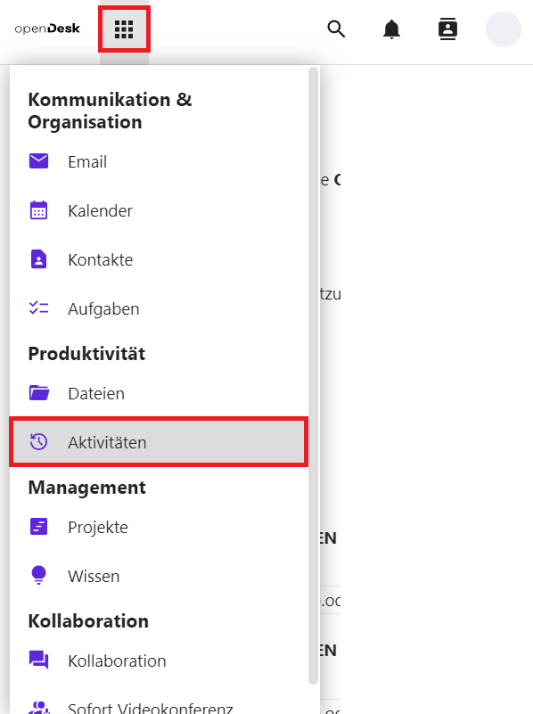

Es gibt zwei Möglichkeiten, auf das Modul **Aktivitäten** zuzugreifen. Die erste ist, wenn Sie sich auf der Startseite befinden. Klicken Sie auf das Modul **Aktivitäten**.

Die zweite Möglichkeit ist, wenn Sie sich in einem anderen Modul befinden. Klicken Sie auf das **9-Punkte-Symbol** . Dort können Sie das Untermodul **Aktivitäten** auswählen.

Alle zuletzt durchgeführten Aktivitäten werden nach Auswahl des Moduls chronologisch aufgelistet.

Die Auflistung der Aktivitäten wird in **Alle Aktivitäten** , **Von Ihnen,** **Von anderen, Favoriten, Dateiänderungen, Sicherheit, Dateifreigaben, Kommentare** und **Antivirus** aufgeteilt. Sie können sehen, welche Dokumente Sie selbst bearbeitet haben und welche freigegebenen Dokumente andere Nutzerinnen und Nutzer bearbeitet oder freigegeben haben.

Folgende Aktivitäten werden erfasst

- Von wem wurden Dokumente oder Ordner erstellt?
- Wer hat ein Dokument zu welchem Zeitpunkt verändert?

Wer hat wann welches Dokument gelöscht?  Veränderungen können Sie direkt überprüfen, indem Sie über den Titel des Dokuments das Dokument öffnen.

## Aktivitäten filtern

Um die Auflistung der Aktivitäten zu filtern, können Sie links in der Spalte verschiedene Filter auswählen:

Im Folgenden werden die Filter kurz beschrieben:

### Eigene Aktivitäten

Um nur die eigenen Aktivitäten zu sehen, wählen Sie den Punkt **Von Ihnen** aus.

### Aktivitäten von anderen Personen

Unter dem Punkt **Von anderen** haben Sie die Möglichkeit, sich nur die Aktivitäten der anderen Personen in geteilten Dokumenten anzeigen zu lassen.

### Favoriten

Die Auswahl von **Favoriten** ermöglicht Ihnen das Anzeigen von Aktivitäten in Dateien, die Sie als Favoriten markiert haben.

### Dateiänderungen

Sie können nach **Dateiänderungen** filtern und sich so eine Liste anzeigen lassen, in der nur Dateien mit Änderungen aufgelistet werden.

### Sicherheit

Sie können nach **Sicherheit** filtern und sich so eine Liste anzeigen lassen, in der nur Sicherheits-Veränderungen aufgelistet werden.

### Dateifreigaben

Aktivitäten können auch nach **Dateifreigaben** gefiltert werden, sodass aufgelistet wird, wer wann welche Dateien mit wem geteilt hat.

### Kalender

Änderungen am Kalender oder an Kalenderterminen werden Ihnen unter dem Punkt **Kalender** angezeigt.

### Aufgaben

Änderungen an Aufgaben werden Ihnen durch einen Klick auf **Aufgaben** angezeigt.

### Kommentare

Unter dem Punkt **Kommentare** werden nur neue und geänderte Kommentare angezeigt.

### Kontakte

Sie können **Kontakte** wählen, um Änderungen an Kontakten und Adressbüchern anzuzeigen.

### Antivirus

Die Aktivitäten des Antiviren-Programms werden Ihnen über die Auswahl **Antivirus** angezeigt.

## Einstellungen

Über **Aktivitätseinstellungen** unten links auf dem Bildschirm können Sie einen **RSS-Feed** für die Aktivitäten aktivieren. Setzen Sie dazu einen Haken bei **RSS-Feed aktivieren** . Daraufhin erscheint ein Textfeld mit dem dazugehörigen Link, den Sie kopieren und mit anderen teilen können.

### Persönliche Benachrichtigungseinstellungen

Klicken Sie auf **Persönliche Benachrichtigungseinstellungen** , um genauer festzulegen, ob und in welcher Form Sie über verschiedene Aktivitäten benachrichtigt werden möchten.
