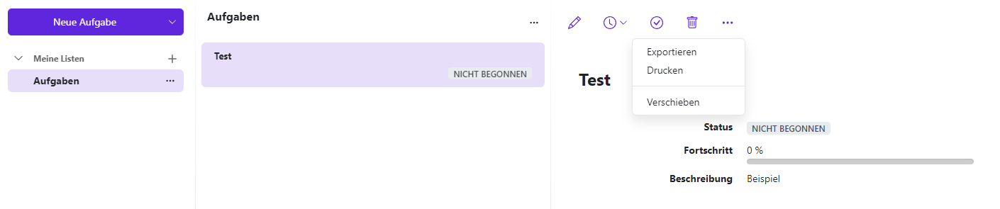
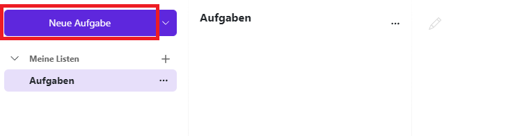
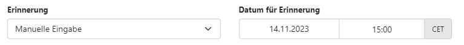
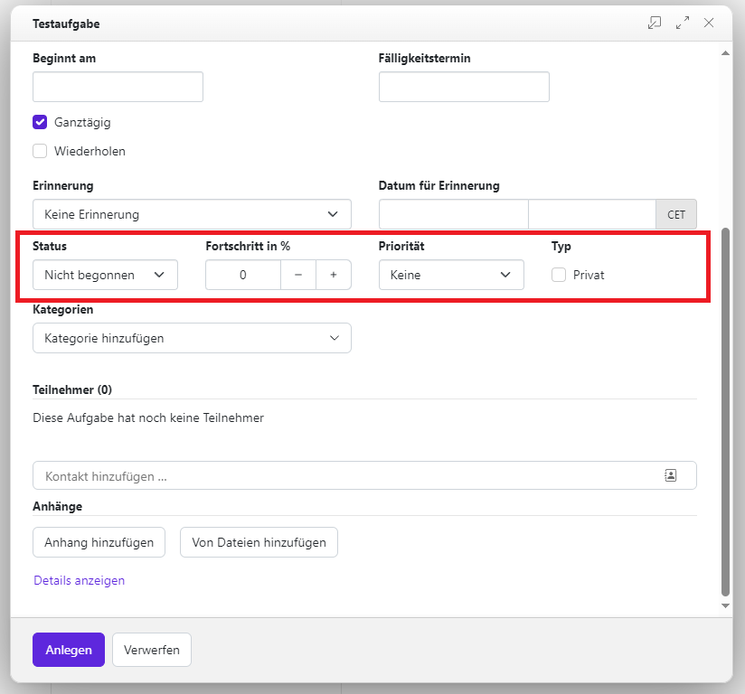
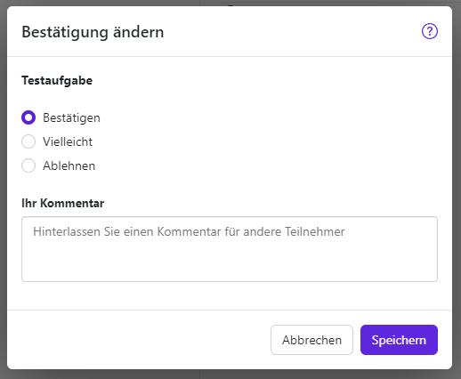

Um mit dem Anlegen und Verwalten von Aufgaben zu beginnen, wählen Sie in der Kategorie **Kommunikation &amp; Organisation** das Untermodul **Aufgaben** aus.

Nachdem Sie das Modul geöffnet haben, werden die zuletzt erstellten Aufgaben aufgelistet. Bei der ersten Verwendung ist diese Liste noch leer. Sie können Ihre Aufgaben nach Dringlichkeit, Status, Fälligkeitstermin, Betreff und Priorität sowie alphabetisch auf- und absteigend sortieren (**3-Punkte-Schaltfläche**).

Die Aufgaben-Werkzeugleiste enthält verschiedene Funktionen zum Hinzufügen, Bearbeiten und Verwalten von Aufgaben. Sie haben hier folgende Möglichkeiten:

- neue Aufgaben anlegen
- Aufgaben bearbeiten
- das Fälligkeitsdatum einer Aufgabe ändern
- Aufgaben als erledigt markieren
- ausgewählte Aufgaben löschen
- persönliche Ordner anzeigen lassen
- neue Ordner hinzufügen

## Aufgaben anzeigen

Erfahren Sie, wie die Aufgaben eines Aufgabenordners auf unterschiedliche Weise angezeigt werden können.

Öffnen Sie zuerst in der Ordneransicht einen Aufgabenordner. Klicken Sie danach in der Liste auf eine Aufgabe. Genauere Angaben zur Aufgabe werden in der Detailansicht angezeigt.

### Optionen

- Möchten Sie die Liste der Aufgaben sortieren oder nur unerledigte Aufgaben anzeigen lassen, klicken Sie rechts über der Liste auf die **3-Punkte-Schaltfläche**
- Mit einem Doppelklick auf eine Aufgabe in der Liste wird diese in einem neuen Fenster geöffnet

## Neue Aufgaben anlegen

Über die Menüleiste im Aufgabenbereich können Sie eine neue Aufgabe anlegen. Klicken Sie hierzu in der Werkzeugleiste auf **Neue Aufgabe**.

Es öffnet sich ein neues Fenster. Jetzt können Sie einen **Betreff** und bei Bedarf auch eine nähere **Beschreibung** eingeben.

Klicken Sie auf **Anlegen** um Ihre Aufgabe zu speichern.

### Erinnerung für die Aufgabe einrichten

Sie können beim Anlegen einer Aufgabe auch eine Erinnerung für diese Aufgabe einrichten. Folgen Sie dazu den ersten Schritten unter [Neue Aufgaben anlegen](neue-aufgaben-anlegen.md), klicken Sie jedoch noch nicht auf Anlegen. Klicken Sie stattdessen unten auf **Formular erweitern** und klappen **dann** das Dropdown-Menü unter **Erinnerung** aus. Hier könen Sie wählen, wann die Erinnerung für Ihre Aufgabe kommen soll.

Wenn Sie **Manuelle Eingabe** auswählen, können Sie bei **Datum für Erinnerung** selbst festlegen, wann die Erinnerung genau kommen soll. Geben Sie ein Datum und eine Uhrzeit ein und klicken Sie abschließend auf **Anlegen**.

### Status einer Aufgabe einstellen

Im Fenster **Aufgabe erstellen** haben Sie die Möglichkeit, den Status Ihrer erstellten Aufgabe zu ändern. Klicken Sie dazu, falls noch nicht geschehen, auf **Formular erweitern** und navigieren zu **Status**.

Hier können Sie auswählen, welchen **Status** Ihre **Aufgabe** erhalten soll. Wählen Sie hierfür einen passenden Status aus dem Dropdown-Menü:

- Nicht begonnen
- In Bearbeitung
- Erledigt
- Warten
- Verschoben

Sie können auch angeben, wie weit Ihre **Aufgabe** bereits fortgeschritten ist. Wählen Sie hierzu bei **Fortschritt in %** über die Plus- und Minusschaltflächen den passenden Prozentsatz aus.

### Priorität einer Aufgabe einstellen

Sie können einer Aufgabe eine Priorität zuweisen. Dies können Sie gleich beim Anlegen der Aufgabe im Fenster **Aufgabe erstellen** erledigen. Möchten Sie hingegen für eine bestehende Aufgabe die Priorität einstellen, so wählen Sie die Aufgabe in der Liste aus und klicken oben in der Menüleiste auf **Bearbeiten**.

Klicken Sie danach in beiden Fällen, falls noch nicht geschehen, auf **Formular erweitern**. Rechts neben den Statuseinstellungen können Sie das Menü **Priorität** aufrufen und die gewünschte Priorität auswählen.

### Sichtbarkeit einer Aufgabe einstellen

Sie können auswählen, ob eine **Aufgabe** für andere Teilnehmerinnen und Teilnehmer sichtbar sein soll. Dies können Sie gleich beim Anlegen der Aufgabe im Fenster **Aufgabe erstellen** erledigen. Möchten Sie hingegen für eine bestehende **Aufgabe** die **Priorität** einstellen, so wählen Sie die **Aufgabe** in der Liste aus und klicken oben in der Menüleiste auf **Aufgabe bearbeiten**.

Klicken Sie danach in beiden Fällen, falls noch nicht geschehen, auf **Formular erweitern**. Rechts neben **Status** und **Priorität** können Sie unter **Typ** die **Aufgabe** als **Privat** markieren. So können andere Teilnehmerinnen und Teilnehmer Ihre Aufgabe nicht sehen. Lassen Sie den Haken hingegen weg, wenn Sie möchten, dass Ihre **Aufgabe** für andere sichtbar ist.

### Mitglieder einer Aufgabe hinzufügen

Sie haben die Möglichkeit, Teilnehmerinnen und Teilnehmer zu einer von Ihnen erstellten **Aufgabe** hinzuzufügen oder aus ihr zu entfernen.

Wählen Sie die Aufgabe aus, zu der Sie Teilnehmerinnen und Teilnehmer hinzufügen möchten, und klicken Sie in der Menüleiste auf **Aufgabe bearbeiten** . Alternativ können Sie diese Einstellung auch bereits beim [Anlegen der Aufgabe](neue-aufgaben-anlegen.md) vornehmen.

Es öffnet sich ein neues Fenster mit Betreff und Beschreibung Ihrer **Aufgabe**. Klicken Sie hier auf **Formular erweitern**, um weitere Eigenschaften anzuzueigen. Sie müssen ein wenig nach unten scrollen, um zum Teilnehmerinnen- und Teilnehmerbereich zu gelangen.

Sie können Kontakte hinzufügen, indem Sie einen Namen in die Suchleiste **Kontakte hinzufügen** eingeben. Je genauer Sie den Namen eingeben, desto schneller finden Sie den Kontakt. Wenn Sie den gewünschten Kontakt gefunden haben, klicken Sie ihn an und er wird automatisch zu Ihrer Aufgabe hinzugefügt. Wiederholen Sie diesen Vorgang, bis Sie alle gewünschten Kontakte hinzugefügt haben.

**Hinweis:** Wenn Sie nur einen Teil des vollständigen Namens eingeben oder mehrere Personen denselben Namen haben, kann es passieren, dass Ihnen mehrere Vorschläge angezeigt werden. Achten Sie in diesem Fall darauf, dass Sie die richtige Person auswählen.

Möchten Sie die Zuweisung eines Kontaktes zu Ihrer Aufgabe aufheben, klicken Sie auf das **Papierkorb-Symbol** neben dem Kontakt. Wiederholen Sie diesen Vorgang, bis alle gewünschten Kontakte aus der Aufgabe gelöscht sind.

Klicken Sie auf **Speichern**, wenn Sie mit der Bearbeitung der Aufgabe fertig sind.

Wenn Sie zu einer Aufgabe eingeladen wurdesn, erhälten Sie eine Benachrichtigung, in der Sie die Aufgabe ablehnen oder bestätigen können. Es öffnet sich ein Fenster, indem Sie die Aufgabe ablehnen, als vielleicht markieren oder bestätigen und in dem Sie einen Kommentar hinzufügen können. Wenn Sie diese ablehnen, verschwindet die Benachrichtigung und es passiert nichts. Wenn Sie sie aber bestätigen oder als vielleicht markieren, erscheint die Aufgabe in Ihrem Aufgabenbereich.

**Hinweis**: Wenn Sie die **Aufgabe** slebst erstellt haben, erhalten Sie keine Bestätigungs- oder Ablehnungsbenachrichtigung, sonder nur eine Erinnerung. Diese kann zeitlich verzögert bei Ihnen ankommen.
