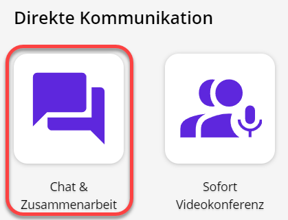
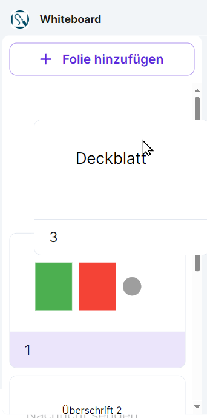
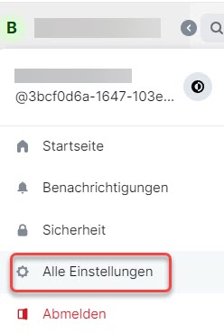
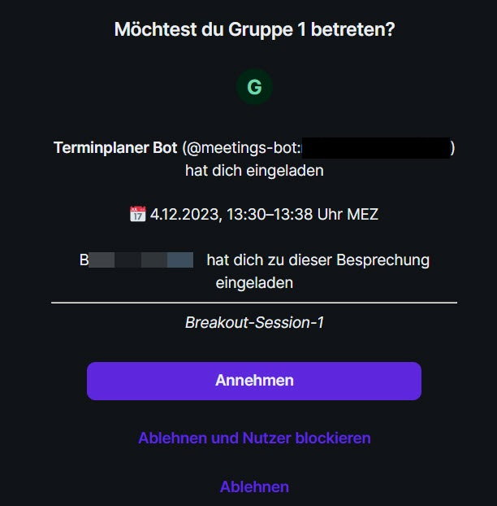
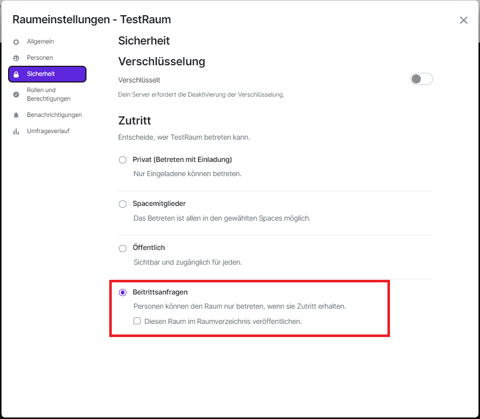
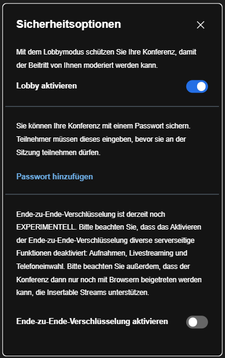
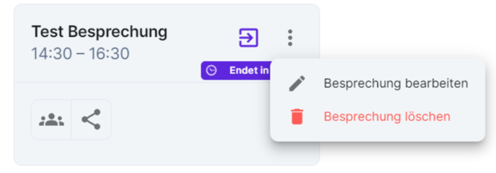

**Chat & Zusammenarbeit** ist ein digitaler Veranstaltungsraum.

Dazu gehören eine Video- und Audiokonferenz-Lösung, eine Chat-Funktion und die Möglichkeit, Bildschirminhalte wie z. B. Präsentationen zu teilen. Es können Dateien ausgetauscht werden. Die gemeinsame Arbeit mit einem Whiteboard (digitale Tafel) und einem Notizbuch ist möglich und es können einfache und erweiterte Abstimmungen durchgeführt werden.

Bitte verwenden Sie einen Chromium-basierten Browser wie z. B. **Microsoft Edge Chromium, Opera oder Google Chrome**. Die Nutzung anderer Internet-Browser wie Mozilla Firefox oder Safari kann zu Funktionalitätseinschränkungen führen. Bitte verwenden Sie einen Laptop oder Computer und keine mobilen Endgeräte auf Basis von iOS sowie Android. Stellen Sie sicher, dass Sie eine stabile Internetverbindung haben. Verwenden Sie am besten ein Headset und keinen Lautsprecher. Stellen Sie sicher, dass in den Browsereinstellungen die richtige Kamera und das richtige Headset ausgewählt sind und die Verwendung dieser zugelassen ist.

Sie finden das Modul ganz unten auf der Startseite des Portals als Teil des Abschnitts **Direkte Kommunikation**.

Öffnen Sie **Chat & Zusammenarbeit** über die entsprechende Schaltfläche.

## Schlüssel einrichten

Sie benötigen eine Verschlüsselung, um geschützt mit anderen Personen kommunizieren zu können.

Gehen Sie zunächst zu dem Videokonferenztool. Klicken Sie oben links auf Ihr Icon und dann auf den Menüpunkt **Sicherheit**.

Scrollen Sie im sich öffnenden Fenster zum Abschnitt Verschlüsselung und klicken Sie dort auf **Schlüsselsicherung einrichten**.

Sie können sich nun entscheiden zwischen einem Schlüssel oder einer Sicherheitsphrase mit optionalem Schlüssel:

### Sicherheitsschlüssel generieren

Sie müssen den Schlüssel zunächst herunterladen oder in die Zwischenablage kopieren, bevor Sie fortfahren. Sichern Sie ihn sich gut ab.

### Sicherheitsphrase setzen

Setzen Sie eine Sicherungsphrase. Auch bei der Sicherheitsphrase können Sie zusätzlich einen Schlüssel sichern.

Zum Abschluss werden Sie aufgefordert, über einen **Single Sign-on** die Einrichtung der Verschlüsselung zu **bestätigen**.

## Überblick

Sie sehen auf der linken Seite Ihren persönlichen Bereich und in der Mitte den Hauptbildschirm, in dem die Veranstaltung stattfindet. Oben rechts können Sie die verschiedenen Module aktivieren.

Von links nach rechts: 

- Breakoutsessions, 
- Meeting-Steuerung, 
- Videokonferenz, 
- Abstimmungen, 
- Whiteboard. 

Die grauen Symbole daneben zeigen 

- den laufenden Anruf oder Videoanruf, 
- Widgets verstecken, 
- Suchen, 
- Threads und 
- die Raum-Informationen.

Wenn Sie am linken Rand auf das Plus-Symbol (+) klicken, eröffnen Sie einen neuen Bereich. Dadurch wird die Organisation erleichtert. Dies funktioniert allerdings nur, wenn Sie einen Account besitzen.

Die aktuell moderierende Person kann auch während des laufenden Meetings die Moderation an Sie oder andere Personen im Meeting abgeben. Sie haben dann die Möglichkeit, Ihren Bildschirm zu teilen und die Moderation zu übernehmen. Manchmal kann es vorkommen, dass Sie beim ersten Mal auf **Fortfahren** klicken müssen, damit es funktioniert.

Sie können während der Veranstaltung die Größe der einzelnen Module anpassen, indem Sie mit der Maus auf den Rahmen der Module klicken und diese ziehen. Dies funktioniert sowohl in die Breite als auch in die Höhe.

Über den Info-Button ganz oben rechts können Sie zusätzlich die Rauminformationen ein- und ausblenden.

## Chat

### 1:1-Chats führen

Sie können mit anderen Personen 1:1-Chats führen. Dies ist unabhängig von geplanten Besprechungen möglich. Ebenso können Sie Räume einrichten, in die Sie mehrere Personen zum Gruppenchat einladen.

Um eine Person zu einem 1:1-Chat einzuladen, klicken Sie auf das **Plus** und wählen Sie **Neue Direktnachricht** aus.

Es öffnet sich ein neues Fenster. Tragen Sie den **Namen der Person** ein, mit der Sie einen 1:1-Chat starten möchten. Der Name erscheint unter **Vorschläge**. Klicken Sie auf den Namen, um die gewünschte Person auszuwählen. Mit **Los** beginnen Sie den Chat.

Die von Ihnen eingeladene Person erhält in ihrer Ansicht auf der linken Seite eine **Benachrichtigung** darüber, dass Sie einen 1:1-Chat gestartet haben.

Die eingeladene Person muss auf **Unterhaltung beginnen** klicken, um die Einladung anzunehmen.

Nun können Sie zu zweit einen privaten Chat führen.

### Gruppenchats erstellen und führen

Es können öffentliche und private Gruppenchats erstellt werden. Hierzu müssen Sie einen sogenannten Raum eröffnen. Im Gegensatz zu den Chats in Besprechungsterminen werden hier Informationen **dauerhaft gespeichert**. Klicken Sie auf das **Plus** rechts neben den Räumen. Wählen Sie nun **Neuer Raum** aus.

Es erscheint ein neues Fenster, in dem Sie den **Raumnamen** und optional ein Thema eingeben können. Außerdem können Sie entscheiden, ob der Raum öffentlich zugänglich sein soll.

Für einen öffentlichen Raum müssen Sie zusätzlich eine Internetadresse festlegen, unter der dieser Raum erreichbar sein soll. Wählen Sie eine Adresse ohne Leerzeichen und Umlaute, wie im Beispiel.

Klicken Sie auf **Raum erstellen**, sobald Sie die gewünschten Einstellungen vorgenommen haben.

Sie können nun über die **Raum-Info** weitere Teilnehmerinnen und Teilnehmer hinzufügen. Klicken Sie hierzu auf das **Informations-Symbol** oben rechts, um die Raum-Info zu öffnen. Klicken Sie dann auf **Personen**.

Daraufhin werden Ihnen die Teilnehmerinnen und Teilnehmer des Raumes angezeigt. Sie können nun über **In diesen Raum einladen** weitere Teilnehmerinnen und Teilnehmer hinzufügen.

## Whiteboard

Im Modul **Chat & Zusammenarbeit** steht Ihnen ein virtuelles **Whiteboard** zur Verfügung. Darauf können Sie geometrische Formen und Text einfügen sowie frei zeichnen. Sie können Ihre Inhalte auf einzelnen Folien anordnen und diese später der Reihe nach als Präsentation darstellen. Die Inhalte können von allen Teilnehmerinnen und Teilnehmern einer Besprechung gemeinsam bearbeitet werden. Dazu muss das Whiteboard-Widget allerdings bei der Einrichtung der Besprechung ausgewählt werden.

### Das Whiteboard aktivieren

Wenn Sie selbst die Moderatorin bzw. der Moderator einer Besprechung sind, in der Sie das Whiteboard verwenden möchten, müssen Sie das Whiteboard-Widget bei der Einrichtung aktivieren. Wie Sie eine Besprechung einrichten, erfahren Sie unter **Ablauf einer Konferenz – Eine Veranstaltung einrichten**.

Im Fenster **Besprechung planen** finden Sie unter **Widgets** alle Widgets aufgeführt, die aktuell für die Besprechung ausgewählt sind. Wenn das Whiteboard hier nicht auftaucht, klicken Sie in den freien Bereich rechts neben den ausgewählten Widgets. Ein Menü öffnet sich. Wählen Sie hier **Whiteboard** aus und schließen Sie die Einrichtung Ihrer Besprechung ab.

### Einführung und Ansicht

Bei der ersten Verwendung des Whiteboards erscheint ein Willkommensfenster. Mit Klick auf **Weiter** erhalten Sie eine kurze **Einführung** in die Funktionen. Sie können diese Einführung überspringen, indem Sie auf die Schaltfläche **Schließen (X)** oben rechts klicken. Später können Sie die Einführung jederzeit wieder aufrufen. Klicken Sie dazu auf die Schaltfläche **Hilfe (?)** unten rechts und wählen Sie **Einführung zurücksetzen**.

Je nach Bedarf können Sie Whiteboard und Videokonferenz in der Ansicht minimieren, indem Sie auf die Schaltfläche **Minimieren (Minus)** oben rechts im jeweiligen Fenster klicken.

Während der Arbeit auf dem Whiteboard ist es empfehlenswert, das Widget mit der **Schaltfläche Maximieren (zwei diagonale Pfeile)** oben rechts in der Ansicht zu maximieren. Zusätzlich können Sie die Unterhaltungs-Leiste (Chat) auf der rechten Seite mit der Schaltfläche **Schließen (X)** oben rechts ausblenden sowie die Seitenleiste links mit gedrückter Maustaste ganz nach außen ziehen und so ausblenden. So können Sie sich voll auf das Whiteboard konzentrieren und werden nicht von anderen Inhalten abgelenkt.

Sie können das Whiteboard auch ausblenden, wenn Sie es gerade nicht benötigen und sich z. B. ganz auf die Videokonferenz konzentrieren möchten. Klicken Sie dazu auf die Schaltfläche **Verberge Whiteboard** oben rechts in der Werkzeugleiste der Besprechung. Über dieselbe Schaltfläche lässt sich das Whiteboard jederzeit wieder einblenden (**Zeige Whiteboard**).

### Werkzeuge

Unten am Whiteboard finden Sie eine Werkzeugleiste. Hier stehen Ihnen die folgenden Werkzeuge zur Verfügung:

- **Auswählen**: Wählen Sie Elemente (z. B. Formen oder Text) auf der aktuellen Folie aus, um diese zu bearbeiten (siehe unten).
- **Rechteck**: Fügen Sie ein Rechteck ein.
- **Ellipse**: Fügen Sie eine Ellipse ein.
- **Dreieck**: Fügen Sie ein Dreieck ein.
- **Linie**: Fügen Sie eine Linie ein.
- **Text**: Fügen Sie ein Textfeld ein.
- **Stift**: Zeichnen Sie frei, indem Sie die Maus bei gedrückter Maustaste wie einen Stift über das Whiteboard bewegen.
- **Rückgängig**: Machen Sie Ihre letzten Arbeitsschritte rückgängig.
- **Wiederholen**: Stellen Sie rückgängig gemachte Arbeitsschritte wieder her.

### Elemente einfügen und bearbeiten

Um geometrische Formen oder Textfelder einzufügen, wählen Sie zunächst das entsprechende Werkzeug aus. Klicken Sie dann in einen leeren Bereich des Whiteboards, halten Sie die linke Maustaste gedrückt und ziehen Sie das Element auf die gewünschte Größe.

Nachdem Sie ein **Textfeld** erzeugt haben, können Sie sofort den gewünschten Text darin eingeben. Die Schriftgröße wird automatisch an die Größe des Textfeldes angepasst, während Sie tippen.

Sie können Position und Größe von Elementen später jederzeit ändern. Wählen Sie dazu das Werkzeug **Auswählen** und klicken Sie auf das gewünschte Element. Halten Sie zum **Verschieben** die linke Maustaste gedrückt und bewegen Sie das Element an die gewünschte Stelle.

Ausgewählte Elemente werden eingerahmt dargestellt. Um die **Größe** eines Elementes zu ändern, klicken Sie auf eine Ecke des Rahmens. Halten Sie die linke Maustaste gedrückt und ziehen Sie das Element auf die gewünschte Größe.

### Weitere Funktionen für Elemente

Wenn Sie ein neues Element einfügen oder ein vorhandenes Element auswählen, erscheint oberhalb oder unterhalb des Elementes eine weitere kleine Werkzeugleiste mit den folgenden Funktionen:

- **Wähle eine Farbe**: Mit Klick auf diese Schaltfläche öffnet sich eine Farbauswahl. Hier können Sie die gewünschte Farbe für das Element auswählen. Für Textfelder steht diese Funktion nicht zur Verfügung.
- **Element duplizieren**: Diese Schaltfläche erzeugt eine Kopie des ausgewählten Elementes.
- **Element löschen**: Mit Klick auf diese Schaltfläche entfernen Sie das ausgewählte Element vom Whiteboard.

### Folien hinzufügen und anordnen

Sie können auf dem Whiteboard mehrere Folien anlegen, die sich beliebig anordnen und später als Präsentation wiedergeben lassen. Klicken Sie dafür zunächst auf die Schaltfläche **Folienübersicht öffnen** oben links. Sie können die Folienübersicht mit derselben Schaltfläche jederzeit wieder schließen ( **Folienübersicht schließen** )

In der Folienübersicht werden alle aktuell vorhandenen Folien untereinander dargestellt und nach der eingestellten Reihenfolge durchnummeriert.

Klicken Sie oben auf die Schaltfläche **Folie hinzufügen** , um eine neue Folie anzulegen. Diese wird unterhalb der letzten Folie eingefügt und automatisch zur Bearbeitung geöffnet.

Die **Reihenfolge** der Folien können Sie bequem per **Drag-and-Drop** ändern (z. B. wenn Sie nachträglich ein Deckblatt hinzufügen und an den Anfang verschieben möchten). Klicken Sie in der Folienübersicht auf eine Folie, halten Sie die linke Maustaste gedrückt und schieben Sie die Folie nach oben oder unten an die gewünschte Position. Lassen Sie nun die Maustaste wieder los.

### Präsentation starten

Wenn Sie mit den Inhalten und der Folienreihenfolge zufrieden sind, können Sie diese als **Bildschirmpräsentation** wiedergeben. Als Moderatorin oder Moderator können Sie eine solche Präsentation auch für andere Teilnehmerinnen und Teilnehmer vorbereiten und die Bearbeitung sperren, wenn Sie während der Besprechung Inhalte veranschaulichen möchten, ohne dass gemeinsam daran gearbeitet wird.

Klicken Sie auf die Schaltfläche **Präsentation starten** oben rechts.

Während der Präsentation steht Ihnen eine kleine senkrechte Werkzeugleiste mit den folgenden Funktionen zur Verfügung:

- **Präsentation beenden**: Hiermit können Sie die Präsentation jederzeit wieder beenden.
- **Vorherige Folie** und **Nächste Folie**: Blättern Sie zwischen den Folien des Whiteboards vor und zurück. Alle Nutzerinnen und Nutzer können selbstständig in der Präsentation blättern.
- **Bearbeitung freigeben** und **Bearbeitung sperren**: Standardmäßig ist die Bearbeitung von Folien während der Präsentation gesperrt. Sie können die Folien jedoch zur Bearbeitung freigeben und bei Bedarf später erneut sperren.

### Inhalte importieren und exportieren

Inhalte, die auf dem Whiteboard bearbeitet wurden, können jederzeit im PDF- oder NWB-Format exportiert werden. So können Sie Ihre gemeinsame Arbeit sichern und später wieder darauf zurückgreifen. Zuvor exportierte NWB-Dateien können Sie auch ins Whiteboard importieren, z. B. um diese in einer anderen Besprechung erneut zu verwenden oder weiter zu bearbeiten.

Um Ihre Whiteboard-Inhalte zu exportieren, klicken Sie auf die Schaltfläche **Einstellungen** oben links und wählen Sie **Exportieren**.

Öffnen Sie im Fenster **Inhalt exportieren** das Dropdown-Menü, um das gewünschte Dateiformat auszuwählen. Klicken Sie dann auf **Herunterladen**.

Je nachdem, welchen Internetbrowser Sie verwenden, kann der nächste Schritt unterschiedlich aussehen. Möglicherweise werden Sie zunächst gefragt, ob Sie die Datei direkt öffnen oder einen Speicherort dafür auswählen möchten (**Speichern unter**). Andere Browser öffnen sofort den Datei-Explorer, in dem Sie zum gewünschten Speicherort auf Ihrer Festplatte navigieren können, oder speichern die Datai automatisch in einem Standardordner (meist der Ordner **Downloads**). Schlagen Sie bei Schwierigkeiten in der Anleitung Ihres Browsers nach.

")

Um zuvor exportierte Whiteboard-Inhalte zu importieren, klicken Sie auf die Schaltfläche **Einstellungen** oben links und wählen Sie **Importieren**. Der Datei-Explorer öffnet sich. Navigieren Sie zum Speicherort der gewünschten Datei und importieren Sie diese mit einem Doppelklick. Sie können die Datei auch mit einem einfachen Klick auswählen und dann auf **Öffnen** klicken.

### Weitere Funktionen

Über die Schaltfläche **Einstellungen** können Sie neben dem Import und Export von Dateien noch auf folgende Optionen zugreifen:

- **Raster**: Schalten Sie das Raster auf dem Whiteboard aus oder wieder ein.
- **Entwicklerwerkzeuge**: Blenden Sie am rechten Bildschirmrand eine Entwickleransicht ein. Diese Funktion ist für fortgeschrittene Nutzerinnen und Nutzer gedacht. Je nachdem, welche Berechtigungen Sie haben, wird Ihnen die Funktion möglicherweise nicht angezeigt.

Oben rechts auf dem Whiteboard finden Sie die Schaltfläche **Zeiger der Mitwirkenden anzeigen** bzw. **ausblenden**. Hier können Sie auswählen, ob Sie die Mauszeiger anderer Nutzerinnen und Nutzer während der Bearbeitung auf dem Whiteboard sehen möchten.

Neben dieser Schaltfläche sehen Sie ein kleines Bild oder Kürzel für die ersten fünf Nutzerinnen und Nutzer, die aktuell auf dem Whiteboard aktiv sind. Wenn mehr als fünf Nutzerinnen und Nutzer an der Besprechung teilnehmen und Sie die übrigen Personen anzeigen lassen möchten, klicken Sie auf die Zahl neben den angezeigten Personen.

## Spaces

### Bessere Organisation für 1:1-Chats und Räume

Chat-Gruppen und Räume können in sogenannten Spaces thematisch zusammengefasst werden. Zum Anlegen und Anzeigen der Spaces benutzen Sie das senkrechte Panel am linken Rand des Programmfensters. Dort gelangen Sie jeweils in die verschiedenen Spaces. Auf dem kleinen Pfeil links neben **Startseite** können Sie das senkrechte Panel ausklappen oder verbergen.

### Neuen Space erstellen

Um einen neuen Space zu erstellen, klicken Sie auf **+ Neuen Space erstellen**.

Beim Erstellen eines neuen Spaces können Sie zwischen einem öffentlichen und einem privaten Space wählen. Der öffentliche Space steht allen Nutzerinnen und Nutzern des Zusammenarbeitsmoduls ohne zusätzliche Einladung zur Verfügung. Sie können die Zugriffsrechte und damit das Umwandeln von öffentlichem zu privatem Space (oder umgekehrt) auch im Nachhinein noch anpassen.

## Bildschirm individualisieren

Sie können das Erscheinungsbild dieses Modul individualisieren. Klicken Sie in der linken Seitenleiste ganz oben auf Ihr Namenskürzel oder Ihr Profilbild um das **Benutzermenü** zu öffnen. Klicken Sie auf **Alle Einstellungen**.

Es öffnet sich das Fenster mit allen Einstellungen. Navigieren Sie auf der linken Seite zu **Erscheinungsbild**. Sie können hier beispielsweise zwischen einem hellen und einem dunklen Design wählen, den Kontrast erhöhen oder die Schriftgröße ändern.

Ihre Einstellungen werden automatisch gespeichert. Sie können das Fenster jederzeit schließen.

## Breakout Sessions

### Was sind Breakoutsessions?

Für das Arbeiten in Kleingruppen gibt es die Funktion **Breakoutsessions**, die während einer Videokonferenz zur Verfügung steht. Moderatorinnen und Moderatoren können hier Gruppenräume einrichten und Sie zu einer Gruppe hinzufügen. Sie erhalten dann links oben auf Ihrem Bildschirm automatisch eine Einladung zur Gruppe.

Klicken Sie auf den Gruppennamen, der mit einem roten Ausrufezeichen markiert ist. Sie werden gefragt, ob Sie der Gruppe beitreten möchten. Wählen Sie **Annehmen**.

Sie sind nun im Gruppenraum. Dieser sieht genauso aus wie ein normaler Konferenzraum. Er hat jedoch einen separaten Namen und ist nur für eingeladene Teilnehmerinnen und Teilnehmer zugänglich.

In diesem Raum können die gleichen Funktionen genutzt werden wie in anderen Räumen, soweit Moderatorinnen und Moderatoren sie zugelassen haben. Sie können die Ergebnisse Ihrer gemeinsamen Arbeit über die entsprechenden Funktionen in den Modulen exportieren.

### Sessions erstellen und verwalten

Um Breakoutsessions zu verwalten, müssen Sie sich in einer laufenden Videokonferenz befinden. Ein Klick oben rechts auf das Symbol für Breakoutsessions öffnet ein Fenster, in dem Sie nach bereits geplanten Breakoutsessions innerhalb eines vorgegebenen Zeitraumes suchen können. Um selbst eine Breakoutsession zu organisieren, klicken Sie auf **+ Breakoutsession planen**.

Nun können Sie den Zeitrahmen und die Anzahl der Gruppen festlegen. Sie können Teilnehmerinnen und Teilnehmer automatisch auf die Gruppen verteilen lassen oder dies selbst vornehmen. Auch können Sie Namen für die Gruppen eingeben. Klicken Sie auf **Breakoutsession erstellen**, sobald Sie alle gewünschten Einstellungen vorgenommen haben.

**Hinweis:** Breakoutsessions sind nur möglich, wenn sich genügend Teilnehmerinnen und Teilnehmer in der Videokonferenz befinden, um die gewünschte Anzahl an Gruppen zu bilden.

## Abstimmungen

Mit dem Abstimmungs-Widget haben Sie die Möglichkeit, vielseitige Abstimmungen in vielfältigen Situationen direkt in einer Besprechung durchzuführen. Sie können es nutzen, um personenbezogene Abstimmungen umzusetzen. Zusammen mit dem Abstimmungsgruppen-Widget können Sie es außerdem verwenden, um Gruppenzugehörigkeiten in der Abstimmung und den Ergebnissen sichtbar zu machen.

### Abstimmungs-Widget

#### Allgemein

Beim Erstellen eines Termins stehen Ihnen mehrere Widgets zur Verfügung. Für das Durchführen einer Abstimmung ist mindestens das Widget **Abstimmungen** auszuwählen. Optional könnten Sie zum Beispiel eine **Videokonferenz** in Ihrem Termin aktivieren. Wenn das Widget **Abstimmungsgruppen** ausgewählt wird, müssen Gruppen angelegt werden, um eine Abstimmung mit Gruppen durchführen zu können.

Nach Betreten des Termins stehen Ihnen über die Widgets-Auswahl oben rechts die aktivierten Widgets zur Verfügung. Nach einem Klick auf **Zeige Abstimmungen** öffnet sich das Widget Abstimmungen.

Von dort aus kann das Abstimmungs-Widget auch in die rechte Seitenleiste gelegt werden. Dazu reicht es aus, über die 3 Punkte in der oberen rechten Ecke des Widgets die Option **Nicht mehr anheften** zu wählen.

**Hinweis:** Die Funktion Abstimmungsgruppen-Widget des Abstimmungs-Widgets können Sie vollumfänglich nutzen. Unabhängig davon, ob das Abstimmungs-Widget im Zentrum eines Termins mit Videokonferenz oder in der rechten Seitenleiste verwendet wird.

Wenn Sie das Abstimmungs-Widget zum ersten Mal öffnen, enthält es noch keine Abstimmung und weist Sie entsprechend mit einer Meldung darauf hin. Am unteren Rand des Widgets können Sie durch einen Klick auf den Button **+ Neue Abstimmung** eine neue Abstimmung erstellen.

Im nächsten Dialog können Sie alle für die Abstimmung wichtigen Informationen in die **Eingabefelder** ( **Titel** , **Beschreibung** , **Frage** , usw.) einrichten. Pflichtfelder sind mit einem Sternchen gekennzeichnet. Erst wenn alle Pflichtfelder ausgefüllt sind, wird der Button **Speichern** aktiv. Der Button **Abbrechen** ist immer aktiv und ein Klick darauf (oder auf das graue Kreuz **(X)** in der oberen rechten Ecke) schließt den Dialog **Neue Abstimmung erstellen**.

#### Die Optionen der Abstimmung im Überblick

Nehmen Sie hier in allen Pflichtfeldern die relevanten Eingaben vor, stellen Sie eine passende Dauer für die Abstimmung ein und treffen Sie eine Entscheidung darüber, ob die Namen der Stimmberechtigten in den Ergebnissen auftauchen sollen und ob die Ergebnisse während der Abstimmung sichtbar sein sollen. Wenn alle Angaben erfolgt sind, klicken Sie auf den Button **Speichern** , um Ihre Abstimmung zu sichern. Sie ist nun im Bereich **Nicht gestartete Abstimmungen** verfügbar.

##### Titel

Dieses Pflichtfeld gibt Auskunft darüber, wie die Umfrage heißt.

##### Beschreibung

Die Beschreibung soll die Stimmberechtigten mit allen nötigen Informationen versorgen, die sie für die Abgabe ihrer Stimme brauchen. Schreiben Sie in dieses Pflichtfeld einen kurzen Text mit den relevanten Daten.

##### Frage

Die Frage ist der Kernpunkt Ihrer Abstimmung und daher ebenfalls ein Pflichtfeld. Sie sollte sich aus der Beschreibung ergeben und so formuliert sein, dass sie mit **Ja** oder **Nein** beantwortet werden kann.

##### Antworttyp

Wählen Sie hier zwischen zwei Antworttypen: **Ja** oder **Nein** und **Ja** oder **Nein** oder **Enthaltung** . Diese Auswahl ist ebenfalls ein Pflichtfeld.

**Hinweis:** Diese Pflichtfelder sind standardmäßig leer und haben auch keinen Standardwert. Erst wenn Sie hier Einträge vornehmen und Entscheidungen treffen, wird die Schaltfläche **Speichern** aktiv.

##### Dauer in Minuten

Hier können Sie die Zeit in Minuten festlegen, die den Stimmberechtigten für die Abgabe ihrer Stimme zur Verfügung steht. Diese Option ist standardmäßig auf 1 Minute eingestellt und kann bei Bedarf angepasst werden.

##### Abstimmungstyp

Es stehen Ihnen zwei Abstimmungstypen zur Verfügung: **Offene Abstimmung:** In dieser Abstimmung zählen nur die Ergebnisse, es werden keine Namen der Stimmberechtigten erfasst. **Namentliche Abstimmung:** Bei dieser Variante werden die Stimmberechtigten mit ihren Benutzernamen in den Auswertungen ((Live-)Ergebnisse und PDF- Dokumentation) aufgeführt. So bleibt das Ergebnis nachvollziehbar.

##### Live-Ergebnisse

Mit dieser Option können Sie festlegen, ob die Stimmberechtigten während der Abstimmung sehen können, wie die bisher abgegebenen Stimmen verteilt sind. **Hinweis:** Bitte bedenken Sie, dass die Live-Ergebnisse die Antwort einzelner Teilnehmerinnen und Teilnehmer beeinflussen können.

#### Eine Abstimmung bearbeiten oder löschen

Vor dem Starten einer Abstimmung ist es möglich, die jeweilige Abstimmung zu bearbeiten oder zu löschen.

Zum Bearbeiten einer Abstimmung klicken Sie auf das Drei-Punkte-Menü in der oberen rechten Ecke der vorbereiteten Abstimmung. Es öffnet sich der Dialog **Abstimmung bearbeiten** und es stehen die zuvor beschriebenen Optionen zur Verfügung.

Jede vorbereitete Abstimmung kann über das Drei-Punkte-Menü in der oberen rechten Ecke der vorbereiteten Abstimmung auch gelöscht werden.

**Hinweis:** Eine gelöschte Abstimmung kann nicht wiederhergestellt werden. Sie muss neu angelegt werden.

#### Eine Abstimmung durchführen

Starten Sie eine Abstimmung um diese durchzuführen. Alle vorbereiteten Abstimmungen finden Sie im Bereich **Nicht gestartete Abstimmungen.** Klicken Sie auf den Button **Starten** der Abstimmung, die Sie durchführen möchten. Im nächsten Dialog wird Ihnen eine Vorschau Ihrer Abstimmung angezeigt, in der Sie ein letztes Mal prüfen können, ob alles richtig eingestellt ist.

Wenn Sie noch Änderungen vornehmen möchten, klicken Sie auf **Abbrechen** und bearbeiten Sie Ihre Abstimmung, wie weiter oben beschrieben.

Ist alles so, wie es sein soll? Dann klicken Sie in der Vorschau Ihrer Abstimmung ebenfalls auf den Button **Starten** , um die Abstimmung zu aktivieren.

**Hinweis:** Sobald eine Abstimmung gestartet wird, ist es nicht mehr möglich, diese zu bearbeiten oder vor Ablauf der festgelegten Dauer zu beenden.

Nach dem Starten ist die Abstimmung für die eingestellte Dauer aktiv. Sie wird nun allen Teilnehmerinnen und Teilnehmern Ihrer Videokonferenz angezeigt. Alle können den Titel, die Details der Abstimmung und die Beschreibung sehen. Stimmberechtigte Teilnehmerinnen und Teilnehmer sehen darüber hinaus die Abstimmungsoptionen.

**Hinweis:** In der Abstimmung sind alle **Teilnehmerinnen und Teilnehmer** Ihrer Besprechung mit den Nutzerrollen **Assistent:in** und **Moderator:in** stimmberechtigt. Um Stimmrechte zu verteilen und zwischen Teilnehmerinnen und Teilnehmern mit und ohne Stimmrecht zu unterscheiden, können Sie über den Button **Raum-Info** oben rechts eine Übersicht aller Personen in dieser Besprechung aufrufen.

Während einer aktiven Abstimmung sind die ausgewählten Antwortoptionen aktiv klickbar und die eingestellte Dauer wird am rechten Rand Ihrer Abstimmung in farbigen Bannern angezeigt und sekündlich heruntergezählt. Die Farben wechseln je nach verbleibender Zeit: **Grün:** es ist noch mehr als eine Minute verbleibende Zeit verfügbar **Gelb:** es ist weniger als 30 Sekunden verbleibende Zeit verfügbar **Rot:** es ist weniger als 10 Sekunden verbleibende Zeit verfügbar

Sobald eine stimmberechtigte Person eine Antwort abgegeben hat, sind die Live-Ergebnisse verfügbar. Dafür müssen Sie die Option **Sichtbar** unter **Live-Ergebnisse** aktiviert haben. Durch einen Klick auf den Button **Live-Ergebnis** können diese angezeigt werden.

Die Live-Ergebnisse enthalten ein Diagramm aller Antwortoptionen ( **Ja, Nein** oder **Enthaltung** ) sowie eine Legende und eine Liste der Benutzernamen aller Stimmberechtigten, die an der Abstimmung teilgenommen haben. Nach Ende einer Abstimmung können in den Ergebnissen ungültigen Stimmen auftauchen. Diese kommen zustande, wenn Stimmberechtigte nicht abgestimmt haben. Hat eine stimmberechtigte Person keine Antwort gegeben, wird dies als ungültige Stimme gewertet und im Diagramm entsprechend ausgewiesen.

#### Eine Abstimmung auswerten

Nach Ablauf der Dauer einer Abstimmung wird diese automatisch in den Bereich **Abgeschlossene Abstimmungen** verschoben. Klicken Sie auf **Ergebnis ansehen** um auf die Ergebnisse zuzugreifen.

Darüber hinaus ist nach Durchführung der ersten Abstimmung der Bereich **Dokumentation** für die erstellende Person von Abstimmungen verfügbar. Klicken Sie auf PDF Dokumenation generieren und laden Sie anschließend die Datei herunter. Es kann sein, dass die Dokumentation der Ergebnisse im PDF-Format nur den Moderatorinnen und Moderatoren zur Verfügung steht.

Die PDF-Dokumentation kann für alle Abstimmungstypen abgerufen werden. Je nachdem, ob eine offene- oder eine namentliche Abstimmung durchgeführt wurde, bietet die PDF-Dokumentation einen anderen Detailgrad:
- **Offene Abstimmungen** werden mit einer übersichtlichen Ergebnistabelle ausgewertet, die alle Informationen und Optionen der Umfrage enthält.

**Namentliche Abstimmungen** werden in der PDF-Dokumentation zusätzlich zu den Informationen der offenen Abstimmung mit einer vollständigen **Liste aller Stimmberechtigten inklusive gewählter Antwortoption** ausgewiesen.  **Hinweis:** Im Falle mehrerer durchgeführter Abstimmungen werden **alle Abstimmungen in *einer* PDF-Datei** ausgewiesen. Dabei beginnt jede Abstimmung auf einer neuen Seite, um die Übersicht zu erhalten. Zum aktuellen Zeitpunkt ist es nicht möglich, pro Abstimmung eine eigene Datei zu erhalten.

Wählen Sie über die Schaltfläche **Mehr Einstellungen** den Zeitraum (in Wochen), für den der Download verfügbar ist. Oder deaktivieren Sie die Download-Möglichkeit unmittelbar.

## Ablauf einer Konferenz

### Einführung

Die Teilnehmerinnen und Teilnehmer erhalten die Einladung zu jeder einzelnen digitalen Veranstaltung von den Moderatorinnen und Moderatoren auf einem gängigen Weg (z. B. per Mail) zugeschickt oder werden direkt in **Chat &amp; Zusammenarbeit** eingeladen. Die E-Mail beinhaltet den Link zum digitalen Veranstaltungsraum.

Nach dem Klick auf den Link zur Veranstaltung geben die Teilnehmerinnen und Teilnehmer ihre Namen an und gelangen in den digitalen Veranstaltungsraum. Hier kann die Veranstaltung verfolgt und mittels verschiedener Funktionen gemeinsam bearbeitet werden. Dazu gehören z. B. die Videokonferenz, der Chat, ein Whiteboard, der Dateiaustausch und Abstimmungen. Verschiedene Funktionen, wie z. B. das Whiteboard, bieten zusätzlich die Möglichkeit, die erarbeiteten Ergebnisse zu sichern.

Teilnehmerinnen und Teilnehmer können jederzeit alle für sich relevanten Inhalte sehen, diese jedoch nur bearbeiten, wenn Moderatorinnen und Moderatoren dies erlauben.

### Eine Veranstaltung einrichten

#### Planen im Terminplaner

Klicken Sie auf das Modul **Chat &amp; Zusammenarbeit** ,um zu dem **Terminplaner** zu gelangen.

Danach gelangen Sie zu einer Übersicht mit Ihren vorhandenen Besprechungen. Diese finden Sie unter dem Punkt **Räume**. Um eine neue Besprechung zu planen, klicken Sie auf den Terminplaner.

Klicken Sie auf **Besprechung planen**.

In diesem Fenster erstellen Sie die Veranstaltung. Wählen Sie einen Namen, Start- und Endzeit und welche Widgets in der Konferenz aktiv sein sollen.

Klicken Sie auf **Besprechung erstellen**, um die Konferenz zu erstellen.

Möchten Sie, dass ein Termin regelmäßig in einem bestimmten zeitlichen Intervall stattfindet, können Sie einen Serientermin einrichten. Der Termin wird wie ein regulärer Einzeltermin erstellt, mit der Ausnahme, dass Sie das Dropdown-Menü **Die Besprechung wiederholen** nutzen und die gewünschten Parameter einstellen.

Nun erscheint die Veranstaltung unter **Räume**.

Im **Terminplaner** sehen Sie alle **Besprechungen**, die für den ausgewählten Tag geplant sind, auch die erstellte **Besprechung** ist hier zu sehen.

#### Einstellungen anpassen

Klicken Sie in Ihrem erstellten **Raum** auf das **Drei-Punkte-Menü**, um in die Raumoptionen zu gelangen.

In den Raumoptionen wählen Sie **Einstellungen**.

#### In eine Veranstaltung einladen

Nachdem die Veranstaltung erstellt wurde, können die Gäste eingeladen werden. Es gibt verschiedene Varianten um Teilnehmerinnen und Teilnehmer einzuladen.

Sobald die Besprechung geplant ist, können Sie vor Beginn der Besprechung Teilnehmerinnen und Teilnehmer über den **Terminplaner** hinzufügen.

Sie können zum Einladen auch das **Raumoptionen-Menü** verwenden. Das **Raumoptionen-Menü** öffnet sich durch einen Klick auf das Symbol mit drei Punkten direkt neben dem Namen der Besprechung. Wenn Sie auf **Einladen** klicken, öffnet sich ein Fenster, indem Sie Teilnehmerinnen und Teilnehmer suchen und einladen können oder klicken Sie auf **Raumlink kopieren**, um den Link in der Zwischenablage zu speichern und anschließend an Gäste weiterzuleiten.

Über die **Raum-Info** können Teilnehmerinnen und Teilnehmer jederzeit zu einer Besprechung hinzugefügt werden. Die **Raum-Info** öffnen Sie, nachdem Sie den Raum betreten haben, mit einem Klick auf das Icon rechts oben.

Anschließend öffnen Sie mit einem Klick auf **Personen** eine Übersicht über die anwesenden Gäste.

Mit einem weiteren Klick auf **In diesem Raum einladen** öffnet sich ein neues Fenster. Dort können Sie entweder Teilnehmerinnen und Teilnehmer über den Nutzernamen hinzufügen oder mit einem Klick auf **Teile diesen Raum** einen **Raum-Link** weiterleiten, mit dem Gäste beitreten können.

### Besprechungsraum

Unterhalb des Textfelds **Nachricht senden** können Sie Textnachrichten mit anderen austauschen.

In der unteren rechten Ecke stehen Ihnen verschiedene Optionen zur Verfügung, darunter Abstimmungen, Emojis und die Möglichkeit, Sprachnachrichten zu versenden sowie Dateien bereitzustellen.

- Sie können **Breakoutsessions** einrichten und betreten, um zusätzliche Besprechungsräume für Gruppenarbeit zu schaffen.
- Die **Meeting-Steuerung** erlaubt es Ihnen, die Konfigurationen als Moderatorin oder Moderator durchzuführen.
- Nutzen Sie die **Videokonferenz-Funktion**, um Besprechungen per Video abzuhalten.
- Mit **Abstimmungen** können Sie Umfragen in der Besprechung erstellen.
- Das **Whiteboard** ist ein Tool, mit dem Sie gemeinsam arbeiten und PDF-Dateien präsentieren können.
- In der **Suche** können Sie nach Begriffen suchen.
- **Threads** helfen Ihnen dabei, Ihre Konversationen nach Themen zu organisieren und leicht nachzuverfolgen.
- In der **Raum-Info** finden Sie alle Informationen über einen Raum.

### Sicherheitsoptionen

In diesem Abschnitt werden die Einstellungen der Sicherheitsoptionen beschrieben. Dazu gehören die **Zutrittseinstellungen** und die **Verschlüsselung** eines Konferenzraums.

Die **Sicherheitsoptionen** einer Videokonferenz dürfen nur von der Moderatorin oder dem Moderator eingestellt werden. Die Einstellungen finden Sie nach dem Erstellen eines Videokonferenzraums oder innerhalb des Konferenzraums, daher ist es ratsam, sich rechtzeitig vor Beginn der Konferenz einzuloggen.

#### Lobbymodus

Der **Lobbymodus** funktioniert wie ein Warteraum für Personen, die an der Videokonferenz teilnehmen möchten. Die Moderatorin oder der Moderator behält hierbei den Überblick über die Anwesenden und hat somit eine Art "Hausrecht". Wenn der Lobbymodus aktiviert ist, können nur Personen in den Raum gelassen werden, die von der Moderatorin oder vom Moderator freigegeben wurden.

Ein Passwort für Teilnehmerinnen und Teilnehmer ist nicht erforderlich. Es kann jedoch eingeschaltet werden.

**Achtung**: Wenn die Moderatorin bzw. der Moderator die Videokonferenz verlässt, kann niemand mehr in die Konferenz eintreten, auch nicht die Moderatorin bzw. der Moderator selbst.

Es gibt zwei Möglichkeiten den Lobbymodus zu aktivieren.

Die erste Möglichkeit erlaubt es, die Sicherheitsoptionen vor dem Betreten des Konferenzraums einzustellen. Dies erfolgt über die **Raumoptionen (Drei-Punkte-Menü)** des Videokonferenzraums. Klicken Sie auf **Einstellungen**. Ein Popup-Fenster öffnet sich und auf der linken Seite finden Sie die Option **Sicherheit**.

Hier können Sie die Sicherheitseinsellungen des Videokonferenzraumes vornehmen. Um den Lobbymodus zu aktivieren, wählen Sie **Beitrittsanfragen** und schließen Sie das Fenster, indem Sie auf das **×** oben rechts klicken.

Die zweite Möglichkeit erlaubt es, die Sicherheitsoptionen nach dem Betreten des Konferenzraums einzustellen. Dies erfolgt über die Schaltfläche **Weitere Einstellungen (Drei-Punkte-Menü)** auf der Symbolleiste. Klicken Sie dann auf **Sicherheitsoptionen**.

Ein Popup-Fenster öffnet sich. Aktivieren Sie die Schaltfläche **Lobby aktivieren**. Die Schaltfläche wird violett und zeigt damit an, dass der Lobbymodus aktiv ist.

### Mit Passwort sichern

Klicken Sie auf **Passwort hinzufügen**, wenn ein Passwort festgelegt werden soll. Dieses darf maximal 10 Zeichen lang sein. Klicken Sie dann auf **Hinzufügen**. Um das Popup-Fenster zu verlassen klicken Sie auf das **×** oben rechts.

**Hinweis**: Das Passwort sollte nur privat und nicht öffentlich weitergegeben werden.

Ab diesem Moment müssen Sie darauf warten, bis die Anfrage von der Moderatorin bzw. von dem Moderator angenommen wird oder geben Sie das Passwort ein.

Die Moderatorin bzw. der Moderator bekommt eine Meldung für jede Teilnehmerin und jeden Teilnehmer, der/die angenommen werden soll. Je nach Einstellung hat die Moderatorin oder der Moderator zwei oder drei Möglichkeiten. Teilnehmerinnen und Teilnehmer in den Konferenzraum zulassen, ablehnen oder mit ihnen chatten. Das letztgenannte ist nur nach der zweiten Einstellmöglichkeit möglich.

")

")

Wenn die Moderatorin oder der Moderator die Option **Chat** wählt, bekommt die Teilnehmerin oder der Teilnehmer eine Nachricht in der Lobby bevor er/sie hineingelassen wird.

**Hinweis**: Es gibt eine Meldung pro Teilnehmerin bzw. Teilnehmer. Das bedeutet, dass die Moderatorin bzw. der Moderator jede Person einzeln zulassen muss.

#### Verschlüsselung

Es gibt zwei Möglichkeiten, um die Verschlüsselung des Konferenzraums einzustellen. Die erste Möglichkeit erfolgt über die **Raumoptionen (drei-Punkte-Menü)** unter **Sicherheit** (siehe oben). Aktivieren Sie den Schalter.

**Hinweis**: Beachten Sie, dass dieser Schalter nicht aktiviert werden kann, wenn VPN oder verschlüsselte Verbindungen aktiv sind.

Um eine Ende-zu-Ende-Verschlüsselung zu aktivieren, klicken Sie auf die Schaltfläche **Weitere Einstellungen (Drei-Punkte-Menü)** auf der Symbolleiste im Konferenzraum. Anschließend wählen Sie **Sicherheitsoptionen** (siehe oben) und aktivieren Sie den Schalter **Ende-zu-Ende-Verschlüsselung aktivieren**.

Wenn die Ende-zu-Ende-Verschlüsselung aktiviert ist, wird dies durch ein Symbol auf dem Hauptfenster des Konferenzraums bestätigt.

### Einer Konferenz beitreten

Wenn Sie nicht die Moderatorin oder der Moderator sind, müssen Sie lediglich der Veranstaltung beitreten.

Im ersten Schritt müssen Sie sich anmelden.

Wenn Sie direkt in das Zusammenarbeitsmodul eingeladen wurden, tauchen am linken Bildschirmrand über **Personen** die Einladungen auf.

Durch Klick auf die Einladung können Sie diese entweder annehmen oder ablehnen. Nach der Annahme gelangen Sie automatisch in den Raum.

Falls Sie ohne Zugang einen Link zugesendet bekommen haben, verfahren Sie so: Klicken Sie wenige Minuten vor Beginn der Veranstaltung auf den Link in der Einladung um direkt in den digitalen Veranstaltungsraum zu gelangen.

Am besten benutzen Sie ein geeignetes Headset mit Mikrofon und einen Laptop oder PC. Es ist ebenfalls möglich, über Tablet und Smartphone an einer digitalen Veranstaltung teilzunehmen. Nach Klick auf den Einladungslink sehen Sie als erstes einen Startbildschirm:

Klicken Sie auf **Beitreten** und geben Sie Ihren Namen ein.

Durch Klick auf **Starten** gelangen Sie in den digitalen Veranstaltungsraum.

Wenn die Moderatorin oder der Moderator ein Passwort für die Konferenz vergeben hat, steht es in Ihrer Einladung. Geben Sie es bei Aufforderung ein. Es kann sein, dass Sie auch noch nach der Aktivierung für Mikrofon und Kamera in Ihrem Browser gefragt werden – bestätigen Sie dies.

Wenn Sie der **Konferenz beitreten**, bevor die Moderatorin oder der Moderator anwesend ist, befinden Sie sich zunächst **im Warteraum**. Sie werden automatisch in die Videokonferenz geholt, sobald die Moderatorin oder der Moderator die Veranstaltung beginnt. Sie sehen dann zunächst diesen Bildschirm:

Falls der Lobbymodus aktiv ist, müssen Sie warten, bis Ihre Anfrage angenommen wurde.

### Meeting-Steuerung und Breakoutsessions

Als **Moderatorin** oder **Moderator** können Sie **Breakoutsessions** einrichten und bestimmte **Steuerungsfunktionen** übernehmen. Mit den Breakoutsessions erhalten Sie **zusätzliche Räume**, in denen Teilnehmerinnen und Teilnehmer der Besprechung in Gruppen arbeiten können.

## Steuerungsfunktionen

- Aktuelle Besprechung **bearbeiten**
- Besprechung **löschen**
- **Zeiten** der Besprechung **anpassen**.

### Erklärung der Symbolleiste und Tastenkürzel

Hier finden Sie die grundlegenden Funktionen in der Videokonferenz erklärt:

- Stummschalten
- Kamera stoppen
- Bildschirmfreigabe starten/stoppen
- Hand heben
- Anwesende
- Kachelansicht ein-/ausschalten
- Persönliche Einstellungen
- weitere Einstellungen
- Konferenz verlassen

#### Symbolleiste

Von links nach rechts finden Sie folgende **Schaltflächen unten auf dem Bildschirm**. Die kleinen **Pfeile** an einigen Schaltflächen öffnen jeweils ein **Dropdown-Menü** mit zusätzlichen Optionen.

- **Stummschalten** und **Ton-Einstellungen**: Schalten Sie Ihr Mikrofon ein und aus. Wählen Sie aus, welche Audiogeräte (Mikrofon und Lautsprecher) für die Konferenz verwendet werden sollen.
- **Kamera stoppen** und **Kameraeinstellungen**: Schalten Sie Ihre Kamera ein und aus. Wählen Sie aus, welche Kamera für die Konferenz verwendet werden soll und stellen Sie Hintergründe ein. Sie können den Hintergrund auch unscharf darstellen lassen.
- **Bildschirmfreigabe starten**: Teilen Sie Inhalte auf Ihrem Bildschirm mit den Teilnehmerinnen und Teilnehmern der Konferenz.
- **Hand heben** und **Reaktionen**: Klicken Sie auf die Schaltfläche, um zu signalisieren, dass Sie etwas sagen möchten. Mit dem Pfeil können Sie eine Auswahl von Reaktionen öffnen (Daumen hoch, Klatschen, Lachen, Überrascht, Buhen, Stille), um die Konversation schnell und einfach zu kommentieren.
- **Anwesende**: Zeigt alle Anwesenden in der Konferenz an.
- **Kachelansicht ein-/ausschalten**: Stellt die Videos von Teilnehmerinnen und Teilnehmern klein und kachelförmig angeordnet dar, sodass Sie mehrere Personen auf einmal im Blick haben. Schalten Sie die Kachelansicht aus, um nur die aktuell sprechende Person zu sehen.
- **Weitere Einstellungen (Drei-Punkte-Menü)**: Dieses Menü bietet Direktzugriff auf verschiedene Einstellungen und Funktionen. Klicken Sie auf Ihren Namen, um in Ihr Profil zu gelangen. Öffnen Sie die **Qualitätseinstellungen**, wechseln Sie in den **Vollbildmodus**, navigieren Sie zu den **Sicherheitsoptionen**, schalten Sie die **Rauschunterdrückung** ein oder aus, wählen Sie einen **Hintergrund** aus (Sie können den Hintergrund auch unscharf darstellen lassen) und zeigen Sie eine **Sprecherstatistik** an. Ganz unten im Dropdown-Menü gelangen Sie in die allgemeinen **Einstellungen** und können sich die **Tastenkürzel anzeigen** lassen.
- **Konferenz verlassen**: Klicken Sie auf diese Schaltfläche, wenn Sie die Konferenz verlassen möchten.

#### Mouseover

Wenn Sie mit dem Mauszeiger über die Tasten fahren, ohne zu klicken, sehen Sie eine Beschreibung der Funktion.

#### Tastenkürzel

Sie können viele Befehle mit Tastaturkurzbefehlen steuern. Um eine Liste der Tastenkürzel einzusehen, klicken Sie unten in der Videokonferenz auf das **Drei-Punkte-Menü** und dann auf **Tastenkürzel anzeigen**.

Folgende Tastenkürzel gibt es aktuell:

| Funktion                                       | Tastenkürzel |
| ---------------------------------------------- | ------------ |
| Stummschaltung aktivieren oder deaktivieren    | M            |
| Kamera starten oder stoppen                    | V            |
| Video-Miniaturansichten ein- oder ausblenden   | F            |
| Qualitätseinstellungen                         | A            |
| Chat öffnen oder schließen                     | C            |
| Wechsel zwischen Kamera und Bildschirmfreigabe | D            |
| Liste der Anwesenden ein- oder ausblenden      | P            |
| Hand heben                                     | R            |
| Vollbildmodus aktivieren oder deaktivieren     | S            |
| Kachelansicht ein- oder ausschalten            | W            |
| Tastenkombinationen ein- oder ausblenden       | ?            |
| Push-to-Talk (Sprechtaste)                     | Leertaste    |
| Sprechstatistik anzeigen                       | T            |
| Lokales Video fokussieren                      | 0            |
| Video einer anderen Person fokussieren         | 1–9          |
| Daumen hoch senden                             | Alt + T      |
| Klatschen senden                               | Alt + C      |
| Lachen senden                                  | Alt + L      |
| Überrascht senden                              | Alt + O      |
| Buhen senden                                   | Alt + B      |
| Stille senden                                  | Alt + S      |

### Konferenz steuern

#### Kamera und Mikrofon ein- und ausschalten

Wenn Sie Ihre Kamera und Ihr Mikrofon aktivieren oder deaktivieren möchten, klicken Sie auf die entsprechenden Buttons unten in der Mitte neben dem Auflege-Button:

-Aktivieren von Kamera und Mikrofon")

**Achtung**: Die Moderatorin und der Moderator können Ihr Mikrofon und Ihre Kamera ebenfalls deaktivieren. Nur Sie selbst können beides wieder aktivieren.

#### Bildschirm-Teilen-Funktion

Sie können Ihren Bildschirm mit den anderen teilen. Verwenden Sie dafür den **Bildschirm freigeben** Button auf der unteren Symbolleiste.

Wählen Sie anschließend aus den folgenden drei Optionen:

- Gesamter Bildschirm, wenn ein gesamter Bildschirm geteilt werden soll. Wenn Sie mehrere Monitore verwenden, werden Sie gefragt welcher davon freigegeben werden soll.
- Nur ein Anwendungsfenster, wenn lediglich eine bestimmte Anwendung geteilt werden soll (z. B. Powerpoint)

Microsoft Edge-Tab (kann bei anderen Browsern anders heißen), wenn nur ein einzelner Tab Ihres Browsers angezeigt werden soll. Sie können in diesem Auswahlfenster unten links über Audio teilen auch einstellen, dass der Ton Ihres Endgerätes übertragen werden soll – das ist hilfreich, wenn Sie z. B. ein Video oder eine Tondatei für alle vorspielen möchten.

#### Vollbildmodus

Insbesondere wenn andere Teilnehmerinnen und Teilnehmer ihren Bildschirm teilen, ist es hilfreich, nur die Videokonferenz möglichst groß zu sehen. Sie können den Vollbildmodus über die weiteren Einstellungen aktivieren und über die Escape-Taste wieder deaktivieren. Alternativ kann auch die „S“-Taste verwendet werden.

**Achtung**: Sie sehen dann nur noch die Videokonferenz, nicht mehr den digitalen Veranstaltungsraum, das Whiteboard etc.

### Personen verwalten

Als Moderatorin bzw. Moderator stehen Ihnen einige besondere Funktionen zur Verfügung, mit denen Sie Teilnehmerinnen und Teilnehmer verwalten können.

Um eine Übersicht über alle Personen zu öffnen, klicken Sie auf den Raumnamen und wählen Sie im Untermenü **Personen** aus. Daraufhin können Sie die Teilnehmerinnen und Teilnehmer einzeln auswählen.

#### Personen bannen oder entfernen

Wählen Sie die Personen aus, welche Sie bannen oder entfernen möchten, und scrollen sie nach unten. Wählen Sie dann unter **Adminwerkzeuge** die Funktion **Aus dem Raum entfernen** oder **Bannen** aus.

#### Rollen von Personen ändern

Klicken Sie auf **Raum-Info** und anschließend auf **Raumeinstellungen** . Es öffnet sich das Menü für **Raumeinstellungen** . Klicken Sie auf **Rollen und Berechtigungen** . Wählen Sie die teilnehmende Person, dessen Rolle Sie ändern möchten oder suchen Sie die Person über **Benutzer im Raum suchen** . Sie können sich im Dropdown Menü zwischen

- **Teilnehmer*in**,
- **Assistent*in***,
- **Moderator*in** oder
- **Selbstdefiniertes Berechtigungslevel** entscheiden.

Durch die Wahl verändern Sie die Rolle der entsprechenden Person.

Klicken Sie anschließend auf **Anwenden**, um die Änderung zu übernehmen.

### Nutzungshinweise, Datenschutz und Sicherheitsmaßnahmen

#### Nutzungshinweise

Verwenden Sie zur Nutzung des Moduls **Chat &amp; Zusammenarbeit** die neueste Version eines chromiumbasierten Internet-Browsers wie Microsoft Edge, Opera, Chromium oder Google Chrome. Die Nutzung anderer Internet-Browser wie Mozilla Firefox oder Safari, sowie veralteter Versionen, kann zu Funktionalitätseinschränkungen führen. Es werden keine weiteren Plug-Ins, Add-Ons oder Extensions benötigt.

Um an einer Online-Konferenz teilnehmen zu können, wird eine stabile und schnelle Internetanbindung (50Mbit/s), sowie ein Endgerät mit Mikrofon, Lautsprecher oder Kopfhörer und ggf. Kamera empfohlen.

Kollaboration funktioniert auf den verbreiteten mobilen Web-Browsern unter Android ab Version 5.0 und iOS ab Version 12 sowie iPadOS ab Version 13. Für ein optimales Erlebnis nutzen Sie bitte stets die aktuelle Version. Wie oben beschrieben, kann es bei der Nutzung von Safari zu Problemen kommen.

**Hinweis:** Die Apps **Jitsi-Meet** und **Element** sind aufgrund fehlender Funktionen (z. B. Bildschirmfreigabe) für die Moderation und Teilnahme an Meetings nicht geeignet. Um alle Funktionalitäten (z. B. das Freigeben des Bildschirms) nutzen zu können, sollte als Endgerät ein Notebook bzw. PC mit dem Betriebssystem Windows 10, Mac OS oder Linux verwendet werden.

#### Datenschutz und Sicherheitsmaßnahmen

Das Modul **Chat &amp; Zusammenarbeit** wird sicher in deutschen Rechenzentren betrieben und entspricht höchsten Datenschutz- und IT-Sicherheitsstandards. Durch die Nutzung von herstellerunabhängiger Open-Source-Software stellt Kollaboration darüber hinaus die digitale Souveränität deutscher Bildungsinstitutionen sicher.

### Sprache einstellen

Sie können die Sprache über **Weitere Einstellungen & Einstellungen** ändern. Die Standardsprache ist Deutsch.

Klicken Sie im nächsten Menü auf **Mehr** und wählen Sie Ihre Sprache aus:

Diese Sprache ist bei Ihrer nächsten Anmeldung dann voreingestellt.
