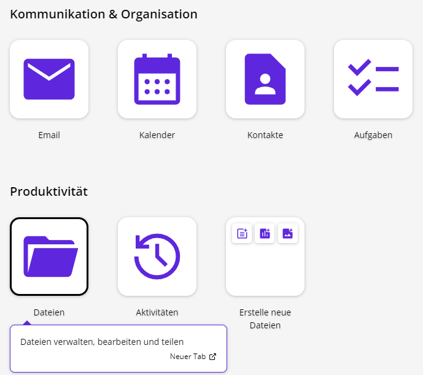
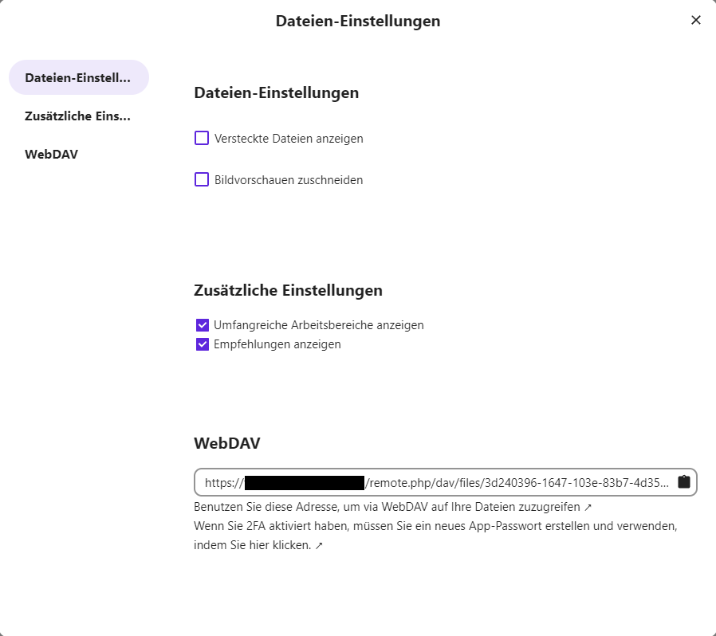
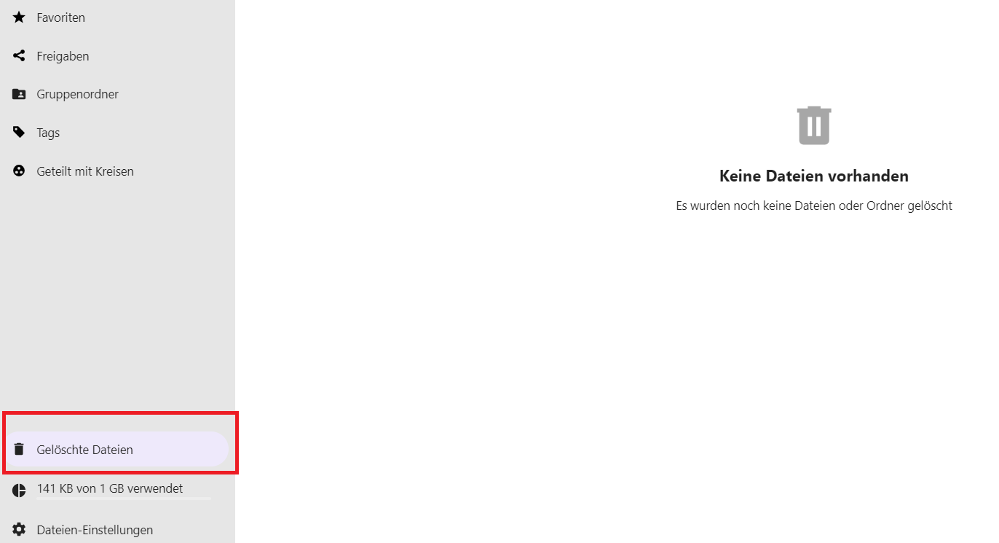
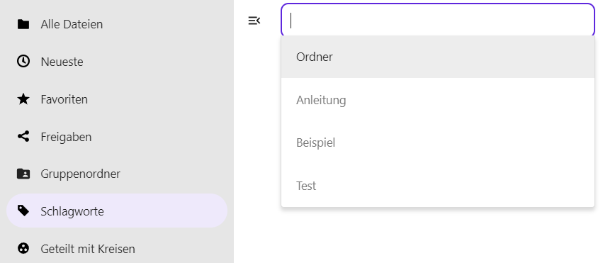

Das Modul **Dateien** finden Sie auf der Startseite des Portals im Abschnitt **Produktivität**.

Nach Auswählen des Moduls erhalten Sie im großen Hauptbereich einen Überblick über vorhandene Dateien und Ordner. Im Menü auf der linken Seite werden Filtermöglichkeiten der Dateien und Ordner angezeigt.

## Einstellungen

Zunächst sollten Sie über **Dateien-Einstellungen** die Anfangsdarstellung des Moduls festlegen. Die Dateien-Einstellungen finden Sie im linken unteren Bereich der Seite.

**Versteckte Dateien anzeigen:** Auch versteckte Dateien (Dateien mit einem führenden Punkt im Dateinamen) werden in der Dateiliste angezeigt.

**Bildvorschauen zuschneiden:** Bei Bildern wird die Miniaturansicht in der Kachel vor dem Dateinamen angepasst.  **Zusätzliche Einstellungen:**

**Umfangreiche Arbeitsbereiche anzeigen:** Oberhalb der Ordner- und Dateiliste können Notizen, Listen oder Links hinzugefügt werden.

**Empfehlungen anzeigen:** Oberhalb der Ordner- und Dateiliste werden die zuletzt genutzten Dateien und Ordner angezeigt, damit Sie schnell wieder darauf zugreifen können.  

**WebDAV:** Hier finden Sie die Adresse für den WebDAV-Zugriff.

## Ordner und Dateien erstellen und hochladen

Durch einen Klick auf die Schaltfläche **+ Neu** öffnet sich ein Dropdown-Menü mit den Optionen, einen neuen Ordner, eine neue Textdatei, ein neues Dokument, eine neue Tabelle, eine neue Präsentation oder ein neues Diagramm zu erstellen. Außerdem finden sich hier die Optionen, eine Datei hochzuladen, einen Vorlagenordner einzurichten, ein neues *diagrams.net*-Diagramm zu erstellen oder eine Beschreibung zum aktuell geöffneten Ordner hinzuzufügen.

**Hinweis:** Beschreibungen können Sie nur hinzufügen, wenn die Option **Umfangreiche Arbeitsbereiche anzeigen** in den **Dateien-Einstellungen** eingeschaltet ist (siehe **Überblick** ).

### Datei hochladen

Um eine Datei hochzuladen, klicken Sie auf **Datei hochladen** und wählen dann eine Datei im Dateiexplorer aus, der sich öffnet. Klicken Sie anschließend auf **Öffnen** und die Datei wird hochgeladen. Sie können die Datei auch mit einem Doppelklick direkt hochladen.

Sie können auch Ordner und Dateien direkt von Ihrem lokalen Dateiexplorer per Drag-and-Drop in die Dateiablage ziehen. Diese werden daraufhin im aktuell geöffneten Ordner hochgeladen.

### Ordner, Datei oder *diagrams.net*-Diagramm erstellen

Um Ordner oder Dateien neu zu erstellen, klicken Sie auf **Neuer Ordner** oder auf die entsprechende Option für den gewünschten Dateityp. Geben Sie daraufhin einen Namen für den Ordner bzw. die Datei ein. Der Ordner bzw. die Datei wird erstellt, sobald Sie auf den Pfeil neben dem Namen klicken oder die Eingabetaste drücken.

Dateien und *diagrams.net*-Diagramme werden nach dem Erstellen automatisch geöffnet.

### Beschreibung hinzufügen

Wählen Sie diese Funktion im Dropdown-Menü aus, um eine Beschreibung zum aktuell geöffneten Ordner hinzuzufügen. Dies kann z. B. hilfreich sein, wenn Sie anderen Nutzerinnen und Nutzern erklären möchten, für welche Inhalte dieser Ordner vorgesehen ist. Oberhalb der Dateiliste öffnet sich ein Textfeld, in dem Sie Ihre Beschreibung eingeben und mithilfe einer Werkzeugleiste mit gängigen Formatierungen versehen können.

**Hinweis:** Beschreibungen können Sie nur hinzufügen, wenn die Option **Umfangreiche Arbeitsbereiche anzeigen** in den **Dateien-Einstellungen** eingeschaltet ist (siehe **Überblick** ). Wenn ein Ordner bereits eine Beschreibung enthält, klicken Sie einfach in das Textfeld, um diese zu bearbeiten.

## Neues *diagrams.net*-Diagramm erstellen

### Einführung

Das Modul *diagrams.net* ist geeignet zum Erstellen von Diagrammen und zum Skizzieren. Es gibt viele verschiedene Integrationen mit anderen Plattformen und Anwendungen, wie zum Beispiel einschließlich Atlassian Confluence Cloud und Jira Cloud. Klicken Sie im Modul Dateien auf **+Neu** und wählen Sie aus dem Dropdown **Neues *diagrams.net* Diagramm**.

### Wozu Diagramme erstellen?

Weder malen Sie mit einem Pinsel, noch übertragen Sie Tabellenkalkulationen, wenn Sie mit *diagrams.net* Diagramme erstellen. Stattdessen platzieren Sie eine Reihe von Diagrammelementen, verbinden Sie diese miteinander, fügen beschreibenden Text hinzu und gestalten die Elemente, um komplexere Informationen visuell zu vermitteln.

### Arten und Beispiele von Diagrammen

Zum Beispiel im Bereich Geschäfts- und Projektmanagement:

- Projektplanung und Kanban-Boards
- Abhängigkeitsdiagramme
- Organisations- und Baumdiagramme
- BPMN-Diagramme für Geschäftsprozesse
- Story Mapping
- Schwimmbahn-Diagramme

Grundrisse im Bereich der Software-Entwicklung:

- UML-Diagramme
- Entity-Relationship-Tabellen für die Datenbankmodellierung
- Mermaid-Diagramme
- Gitflow-Diagramme

C4-Modelle und zugehörige Diagramme IT und Infrastruktur:

- Threat Models
- Netzwerk- und Infrastrukturdiagramme
- Rack-Diagramme
- AWS-Infrastruktur-Diagramme

## Vorlagenordner

Sie können nicht nur herkömmliche Ordner und Dateien erstellen. Über das Dropdown-Menü zum Anlegen neuer Ordner und Dateien können Sie einen Vorlagenordner anlegen. Alle Dateien, die Sie in diesem Ordner ablegen, werden als Vorlagen genutzt.

Legen Sie nun außerhalb des Vorlagenordners eine neue Datei desselben Dateityps an. Sie erhalten ein Vorschaufenster, in dem die von Ihnen angelegten Vorlagendateien zur Auswahl stehen.

## Ordner und Dateien löschen

Um eine Datei oder einen Ordner zu löschen, klicken Sie mit der rechten Maustaste auf die jeweilige Datei bzw. den jeweiligen Ordner und wählen Sie im Dropdown-Menü **Datei löschen** bzw. **Ordner löschen**.

Sollen mehrere Dateien und/oder Ordner gelöscht werden, erfolgt die Auswahl über die Kontrollkästchen vor den Datei- und Ordnernamen. Klicken Sie auch dann mit der rechten Maustaste auf eine der ausgewählten Dateien bzw. einen der ausgewählten Ordner und wählen Sie **Löschen**. Alternativ können Sie auch das Menü **Aktionen** über der Dateiliste verwenden, um das Dropdown-Menü zu öffnen.

Die Dateien und Ordner werden nicht endgültig gelöscht, sondern zunächst in den Papierkorb verschoben. Von dort können gelöschte Dateien wiederhergestellt oder endgültig gelöscht werden. Sie finden den Ordner **Gelöschte Dateien** unten in der linken Seitenspalte.

## Ordner und Dateien verwalten

### Ordner und Dateien favorisieren

Um Ordner und Dateien als Favoriten zu markieren, wählen Sie diese mit der rechten Maustaste aus oder klicken Sie auf das Drei-Punkte-Menü hinter dem Ordner oder der Datei. Ein Dropdown-Menü öffnet sich. Hier können Sie die Datei bzw. den Ordner **Zu den Favoriten hinzufügen**.

Favorisierte Ordner und Dateien erscheinen in der Auflistung aller Ordner und Dateien an oberster Stelle und sind mit einem gelben Stern versehen. Sie finden sie auch bei der Auswahl der Favoriten in der Spalte auf der linken Bildschirmseite.

### Details

Um zusätzliche Funktionen für Dateien und Ordner abzurufen, klicken Sie mit der rechten Maustaste auf die jeweilige Datei bzw. den jeweiligen Ordner und wählen Sie im Dropdown-Menü **Details** . Sie können auch das Drei-Punkte-Menü rechts neben dem Datei- oder Ordnernamen verwenden, um das Dropdown-Menü zu öffnen. Daraufhin öffnet sich auf der rechten Seite eine Spalte, in der Aktivitäten angesehen und Kommentare verfasst oder gelesen werden können. Hier können Sie auch Dateien und Ordner mit anderen Personen teilen sowie eine Verbindung zum Projekte-Modul (OpenProject) herstellen.

### Aktivität

Lassen Sie sich die Aktivitäten am ausgewählten Ordner oder an der ausgewählten Datei anzeigen, um beispielsweise einen Überblick über die letzten Änderungen zu erhalten.

### Kommentare

Es können auch Kommentare zu den ausgewählten Ordnern und Dateien hinterlassen werden. Das ist besonders sinnvoll, wenn die Ordner und Dateien mit anderen Personen geteilt werden.

### Schlagwörter/Tags

**Schlagwörter** oder **Tags** erleichtern Ihnen die Einordnung und das Wiederauffinden von Dateien und Ordnern. Um Tags hinzuzufügen, öffnen Sie zunächst die Detailansicht, wie oben unter **Details** beschrieben. Alternativ können Sie mit der rechten Maustaste auf die gewünschte Datei bzw. den gewünschten Ordner klicken und im Dropdown-Menü **Datei teilen** bzw. **Ordner teilen** auswählen.

Öffnen Sie in der Detailansicht das **Drei-Punkte-Menü** neben dem Ordner- oder Dateinamen und klicken Sie auf **Tags**.

Ein Textfeld erscheint. Wenn Sie in das Textfeld klicken, wird Ihnen eine Dropdown-Liste mit vorhandenen Tags angezeigt, die Sie einzeln per Mausklick auswählen können. Falls bisher noch keine Tags in Ihrem Wiki verwendet wurden, ist die Liste leer.

Alternativ können Sie selbst einen Begriff in das Textfeld eingeben. Während Sie tippen, werden Ihnen bereits passende Vorschläge aus den vorhandenen Tags angezeigt. Wenn der gewünschte Begriff noch nicht vorhanden ist, können Sie ihn nach erfolgter Eingabe mit der Eingabetaste hinzufügen. Neu hinzugefügte Tags werden künftig in der Dropdown-Liste erscheinen.

Sie können alle Ordner und Dateien über die entsprechenden Schlagwörter (Tags) filtern. Nutzen Sie dazu das Filtermenü links auf dem Bildschirm. Klicken Sie dort auf **Schlagwörter**. Klicken Sie dann in das Textfeld oben und wählen Sie ein Schlagwort aus der Dropdown-Liste aus. Sie können auch einen Begriff eingeben, um die Liste zu durchsuchen.

## Ordner und Dateien herunterladen

Ordner und Dateien können heruntergeladen werden. Wählen Sie dazu den Ordner oder die Datei mit der rechten Maustaste aus. Im Kontextmenü finden Sie die Option **Herunterladen**. Je nachdem, welchen Browser Sie verwenden, öffnet sich entweder ein Dateiexplorer oder Sie müssen zunächst auswählen, ob Sie die Datei bzw. den Ordner speichern oder öffnen möchten. Beachten Sie hierzu auch die Anleitung Ihres Browsers.

Ordner werden komprimiert als Zip-Dateien heruntergeladen.

## Ordner und Dateien verschieben oder kopieren

Ordner und Dateien können verschoben oder kopiert werden. Wählen Sie dazu den Ordner oder die Datei mit der rechten Maustaste aus. Klicken Sie dann im angezeigten Menü auf **Verschieben oder kopieren**. Ein Fenster öffnet sich.

Ganz oben im Fenster finden Sie ein Textfeld, in das Sie den Namen des gewünschten Zielordners eingeben können. Weiter unten können Sie auswählen, ob alle Dateien, nur die neuesten Dateien oder nur Ihre Favoriten angezeigt werden sollen. Mit der Schaltfläche **+ Neu** können Sie auch einen neuen Ordner anlegen, in den die gewünschten Inhalte verschoben werden sollen. Wählen Sie aus der Liste unten den gewünschten Zielordner aus. Sie können die Ordner mit Klick auf die entsprechenden Überschriften nach Name, Größe und Änderungsdatum sortieren.

Dateien oder Ordner können auch mit gedrückter linker Maustaste in andere Ordner verschoben werden (Drag-and-drop).

Sie können auch Ordner und Dateien von Ihrem lokalen Dateiexplorer per Drag-and-drop in die Dateiablage kopieren. Diese werden daraufhin im aktuell geöffneten Ordner hochgeladen.

## Ordner und Dateien teilen

Sie können über die Detailansicht (siehe **Dateien – Ordner und Dateien verwalten – Details** ) Dateien und Ordner mit anderen Nutzerinnen und Nutzern teilen. Alternativ können Sie mit der rechten Maustaste auf die gewünschte Datei bzw. den gewünschten Ordner klicken und **Datei teilen** bzw. **Ordner teilen** auswählen.

Unter **Nach Freigabeempfängern suchen** können Sie nun im Textfeld den Namen oder die E-Mail-Adresse der gewünschten Person eingeben. Während Sie tippen, werden Ihnen Vorschläge angezeigt. Bestätigen Sie Ihre Auswahl mit einem Mausklick oder mit der Eingabetaste.

Sie können auch einen Link zur Datei bzw. zum Ordner erzeugen, den Sie dann anderen Nutzerinnen und Nutzern auf verschiedenen Wegen (E-Mail, Chat usw.) zukommen lassen können. Klicken Sie dazu neben **Link teilen** auf die Schaltfläche **Neuen Freigabe-Link erstellen** . Der Link wird dann in Ihre Zwischenablage kopiert. Fügen Sie ihn mit der Tastenkombination **Strg+V** an gewünschter Stelle ein.

Nachdem der Link erzeugt wurde, erscheint unterhalb von **Link teilen** der Text **Nur anzeigen** . Klicken Sie auf diesen Text, um ein Dropdown-Menü zu öffnen. Hier können Sie bei Bedarf auswählen, welche Berechtigungen Sie Nutzerinnen und Nutzern mit dem geteilten Link erteilen möchten. Wählen Sie aus, ob die Datei bzw. der Ordner nur angezeigt oder auch hochgeladen und bearbeitet werden darf. Sie können mit dem Punkt **Dateiablage** auch festlegen, dass die Datei nur hochgeladen werden darf. Unter **Benutzerdefinierte Berechtigungen** stehen Ihnen weitere Optionen zur Verfügung. Hier können Sie beispielsweise ein Passwort für den Zugriff auf die Datei bzw. den Ordner festlegen sowie ein Ablaufdatum für den Link einstellen.

# Dateien

- [Überblick](dateien/ueberblick.md)
- [Ordner und Dateien erstellen und hochladen](dateien/ordner-und-dateien-erstellen-und-hochladen.md)
- [Neues *diagrams.net*-Diagramm erstellen](dateien/neues-diagramm-erstellen.md)
- [Vorlagenordner](dateien/vorlagenordner.md)
- [Ordner und Dateien löschen](dateien/ordner-und-dateien-loeschen.md)
- [Ordner und Dateien verwalten](dateien/ordner-und-dateien-verwalten.md)
- [Ordner und Dateien herunterladen](dateien/ordner-und-dateien-herunterladen.md)
- [Ordner und Dateien verschieben oder kopieren](dateien/ordner-und-dateien-verschieben-oder-kopieren.md)
- [Ordner und Dateien teilen](dateien/ordner-und-dateien-teilen.md)
