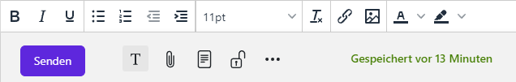
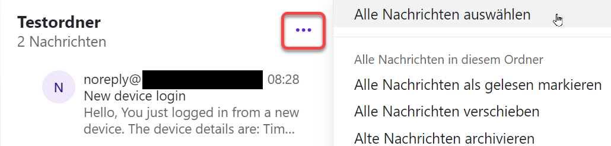
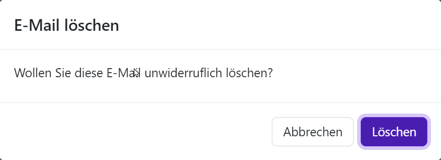
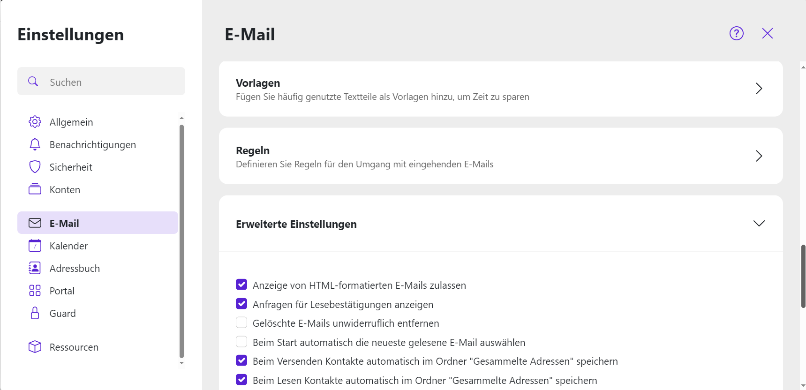
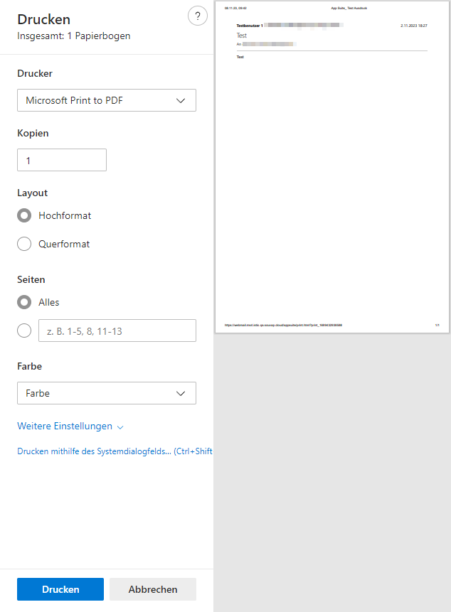
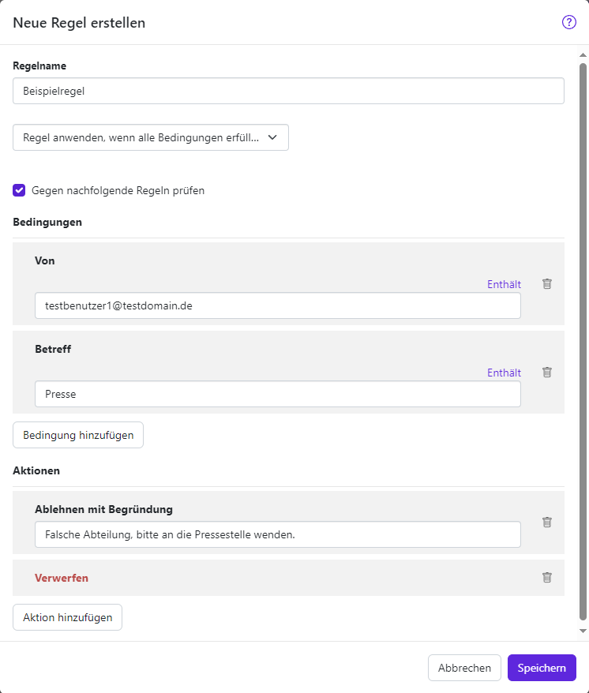
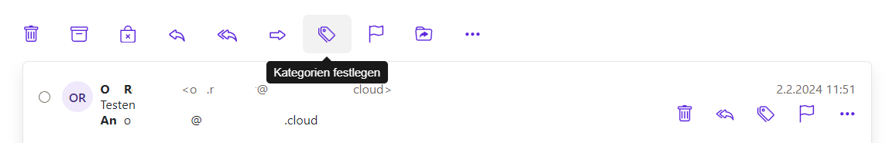
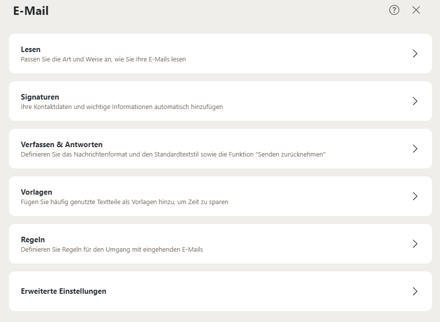

Mit **Kommunikation &amp; Organisation** wird Ihnen ein vollwertiger E-Mail-Dienst zur Verfügung gestellt. Benutzerinnen und Benutzer erhalten Zugriff auf ein personenbezogenes **Postfach**, auf einen persönlichen **Kalender**, auf ein zentrales **Adressbuch** und auf eine **Aufgabenverwaltung**.

Nach Auswählen des **Untermoduls E-Mail** öffnet sich die typische Ansicht eines E-Mail-Clients. Auf der linken Seite befinden sich die Ordner:

- Posteingang: Dieser Ordner speichert standardmäßig alle eingehenden E-Mails
- Entwürfe: Hier finden Sie alle E-Mails, die Sie gespeichert und noch nicht versendet haben
- Gesendet: Dieser Ordner enthält alle E-Mails, die Sie gesendet haben
- Spam: Hier werden alle E-Mails einsortiert, die als Spam-Mails markiert worden sind

Papierkorb: Hier liegen alle E-Mails, die Sie gelöscht haben  Je nach Konfiguration können weitere Ordner vorhanden sein:
- Freigegebene E-Mail-Ordner, die Sie abonniert haben

Ordner von funktionalen E-Mail-Konten, die Ihnen von der Administratorin bzw. dem Administrator zugewiesen wurden  Über die Schaltfläche **Ordnerspezifische Aktionen (Plus)** unter **Meine Ordner** können Sie einen neuen Ordner oder ein weiteres E-Mail-Konto hinzufügen.

Im mittleren Bereich des Fensters werden die E-Mails des aktuell ausgewählten Ordners als Liste angezeigt. Mit einem Doppelklick können sie geöffnet werden.

Im rechten Bereich finden Sie die Vorschau der jeweils ausgewählten E-Mail.

## Verfassen einer E-Mail

Um eine E-Mail zu schreiben, klicken Sie auf **Neue E-Mail**.

Sie gelangen in ein neues Fenster, in dem Sie die E-Mail verfassen und bearbeiten können.

Das erste Feld wird beim Öffnen dieses Fensters automatisch mit Ihrer E-Mail-Adresse gefüllt. Mit Klick auf den Pfeil rechts neben Ihrer E-Mail-Adresse öffnet sich ein Dropdown-Menü, in dem Sie auswählen können, ob Ihr Name angezeigt werden soll. Sie können dort über den Punkt **Namen bearbeiten** auch einen anderen Namen eingeben, der Empfängerinnen und Empfängern angezeigt werden soll.

Im Feld **An** können Sie die E-Mail-Adresse der Empfängerin bzw. des Empfängers händisch eintippen und mit der Eingabetaste übernehmen. Während des Tippens werden Ihnen passende Vorschläge aus dem Adressbuch angezeigt, die Sie mit einem Mausklick oder mit der Eingabetaste auswählen können. Falls Sie die E-Mail-Adresse der Empfängerin bzw. des Empfängers zuvor schon in Ihrem Adressbuch abgespeichert haben oder ein gemeinsames Adressbuch mit der Person nutzen, können Sie stattdessen auch auf das **Adresslisten-Symbol** ganz rechts klicken.

Wählen Sie hier zunächst rechts im Dropdown-Menü aus, welche **Adressliste** durchsucht werden soll. Geben Sie dann die Namen von gewünschten Personen in das Suchfeld ein. Daraufhin tauchen Ergebnisvorschläge weiter unten auf. Wählen Sie hier die gesuchte Person mit einem Mausklick aus und wiederholen Sie den Vorgang, bis Sie alle gewünschten Empfängerinnen und Empfänger ausgewählt haben. Klicken Sie abschließend auf **Wählen**. Die E-Mail-Adressen werden übernommen und das Feld „An“ wird damit ausgefüllt. Sie gelangen zurück in das Fenster **Neue E-Mail**.

Hier haben Sie oben rechts außerdem die Möglichkeit, andere Personen in **CC** (Kopie) oder **BCC** (Blindkopie) zu setzen. Wenn Sie Personen in CC setzen, sieht die Empfängerin bzw. der Empfänger, dass andere eine Kopie der E-Mail bekommen haben. Die E-Mail-Adressen sind dann auch für alle Beteiligten sichtbar. Möchten Sie dies vermeiden (beispielsweise aus Datenschutzgründen), setzen Sie die gewünschten Personen in BCC.

Mit Klick auf AW können Sie das Eingabefeld **Antwort an** einblenden. Dies kann hilfreich sein, wenn die Empfängerin bzw. der Empfänger nicht Ihnen selbst, sondern beispielsweise Ihrer Führungskraft oder Urlaubsvertretung antworten soll. Geben Sie in einem solchen Fall im Feld **Antwort an** die E-Mail-Adresse der Person an, welche die Antwort erhalten soll. Gehen Sie dabei genauso vor wie oben für das Feld **An** beschrieben.

Beschreiben Sie im Feld **Betreff** kurz, worum es in der E-Mail gehen soll. Darunter haben Sie nun ein beliebig langes Textfeld zur Verfügung, in dem Sie Ihre E-Mail schreiben können.

### E-Mail formatieren

Die Werkzeugleiste unten im Fenster ermöglicht es Ihnen, E-Mails ähnlich wie in einem Textverarbeitungsprogramm zu formatieren. Folgende Funktionen stehen Ihnen von rechts nach links zur Verfügung:

- Sie können Wörter fett oder kursiv darstellen sowie unterstreichen
- Sie können Auflistungen oder Nummerierungen einfügen
- Sie können den Einzug vergrößern oder verkleinern
- Sie können die Schriftgröße verändern
- Sie können alle Formatierungen gesammelt entfernen und auf den Standard zurücksetzen
- Sie können Links und Bilder einfügen

Sie können die Text- und Hintergrundfarbe individuell anpassen  Wenn Sie die Werkzeugleiste nicht benötigen, weil Sie z. B. mit Tastenkombinationen arbeiten, können Sie diese mit dem Symbol **Werkzeugleiste ausblenden** (großes **T** neben der Schaltfläche **Senden**) ausblenden.

### Anhänge hinzufügen

Selbstverständlich können Sie auch sämtliche Arten von Dateien an Ihre E-Mail anhängen. Klicken Sie dazu auf die Schaltfläche **Anhänge (Büroklammer-Symbol)** ganz unten.

Wenn Sie eine Datei anhängen möchten, die auf Ihrem Computer gespeichert ist, wählen Sie **Lokale Datei hinzufügen** . Sie gelangen in ein Explorer-Fenster, in dem Sie zum Speicherort der Datei navigieren können. Wählen Sie dort die gewünschte Datei aus und klicken Sie auf **Öffnen**.

Über **Von Dateien hinzufügen** können Sie Dateien anhängen, die Sie im Modul **Dateien** online gespeichert haben. Alternativ können Sie auch nur zu einer solchen Datei verlinken (**Link von Dateien hinzufügen**).

### Weitere Optionen

Über die Schaltfläche **Vorlagen** ganz unten im Fenster können Sie Vorlagen in Ihre E-Mail einfügen. Wenn Sie noch keine Vorlagen gespeichert haben, führt Sie die Schaltfläche in den **Vorlagen-Bereich der E-Mail-Einstellungen** . Hier können Sie zur Zeitersparnis häufig genutzte Textteile als Vorlagen anlegen und verwalten. Auf diese können Sie fortan über die Vorlagen-Schaltfläche zugreifen.

Mit einem Klick auf die Schaltfläche **Optionen (drei Punkte)** weiter rechts können Sie außerdem folgende Einstellungen vornehmen:

- Sie können Ihre Signatur anfügen
- Wenn Sie noch keine Signatur haben, können Sie mit **Signatur bearbeiten** eine anlegen
- Sie können unter dem Punkt **Wichtigkeit** eine Priorität für Ihre E-Mail festlegen
- Sie können Ihre Visitenkarte anhängen
- Sie können eine Lesebestätigung der E-Mail anfordern
- Sie können die E-Mail elektronisch signieren
- Falls vorhanden, können Sie einen öffentlichen Schlüssel anhängen
- Sie können HTML für die E-Mail ausschalten (**Nur Text**). Die E-Mail wird damit als reiner Text ausgegeben und etwaige Formatierungen gehen verloren. Die Werkzeugleiste kann dann nicht mehr genutzt werden. Diese Option ist nur in Ausnahmefällen relevant
- Sie können diese E-Mail als Entwurf speichern und schließen

## E-Mail löschen

Sie können einzelne E-Mails oder ganze Konversationen löschen. Die von Ihnen gelöschten E-Mails werden in den Papierkorb verschoben und können erst dort unwiderruflich entfernt werden.

Sie können alternativ auch in der E-Mail-Liste mit der rechten Maustaste auf die gewünschte E-Mail klicken. Damit öffnet sich ein Dropdown-Menü. Wählen Sie **Löschen**.

### Alle E-Mails eines Ordners löschen

Möchten Sie einen ganzen Ordner leeren, wählen Sie zunächst im Ordnermenü den Ordner aus, dessen E-Mails gelöscht werden sollen. Sie haben 2 Möglichkeiten, den gewünschten E-Mail-Ordner zu leeren:

- Klicken Sie im Ordnermenü mit der rechten Maustaste auf den Ordner und wählen Sie dann im Dropdown-Menü **Alle Nachrichten löschen**.

Klicken Sie oberhalb der E-Mail-Liste neben dem Ordnernamen auf die Schaltfläche **Weitere Optionen für Nachrichten (drei Punkte)** und dann auf **Alle Nachrichten auswählen** . Nun können Sie die Nachrichten mit der Schaltfläche **Löschen (Papierkorb-Symbol)** löschen.  Nach dem Ausführen werden die E-Mails in den Ordner **Papierkorb** verschoben.

### Gelöschte E-Mail wiederherstellen

Wenn Sie zuvor gelöschte E-Mails wiederherstellen möchten, öffnen Sie in der Ordneransicht den Ordner **Papierkorb**. Wählen Sie jetzt die E-Mail aus, die Sie wiederherstellen möchten. Sie können auch mehrere E-Mails auswählen, indem Sie die Strg-Taste gedrückt halten und die einzelnen E-Mails nacheinander anklicken.

Klicken Sie in der Werkzeugleiste auf die Schaltfläche **Verschieben**. Alternativ können Sie mit der rechten Maustaste auf die gewünschten E-Mails klicken und **Verschieben** auswählen.

Wählen Sie im Dialog **Verschieben** den Ordner, in den Sie die wiederhergestellten E-Mails legen möchten. Klicken Sie dann auf die Schaltfläche **Verschieben** . Die E-Mails wurden im gewählten Ordner wiederhergestellt.

### E-Mail endgültig löschen

Wenn Sie einzelne E-Mails endgültig löschen möchten, öffnen Sie zunächst in der Ordneransicht den Ordner **Papierkorb**. Wählen Sie nun eine oder mehrere E-Mails aus und klicken Sie in der Werkzeugleiste auf die Schaltfläche **Löschen (Papierkorb-Symbol)**. Bestätigen Sie im folgenden Dialog Ihre Auswahl mit einem weiteren Klick auf **Löschen**.

### Papierkorb leeren

Wenn Sie sämtliche E-Mails im Papierkorb unwiderruflich löschen möchten, wählen Sie zunächst in der Ordneransicht den Ordner **Papierkorb** . Klicken Sie nun neben dem Ordnernamen auf die Schaltfläche **Aktionen für Papierkorb (drei Punkte)** und dann auf **Papierkorb leeren** . Bestätigen Sie, wenn Sie sämtliche E-Mails im Papierkorb löschen möchten.

## E-Mail-Ordner erstellen

Sie können beliebig viele eigene Ordner anlegen, um Ihre E-Mails zu sortieren. Dafür steht Ihnen der Bereich **Meine Ordner** zur Verfügung, Sie können jedoch auch in den vorhandenen Standard-Ordnern (ausgenommen Papierkorb) Unterordner erstellen.

Wählen Sie in der Ordneransicht den Ordner aus, in dem Sie einen neuen Unterordner anlegen möchten. Klicken Sie neben dem Ordnernamen auf die Schaltfläche **Aktionen (drei Punkte)** bzw. für den Bereich **Meine Ordner** auf **Ordnerspezifische Aktionen (Plus)**. Alternativ können Sie mit der rechten Maustaste auf den Ordnernamen klicken. Wählen Sie dann im Dropdown-Menü **Neuen Ordner hinzufügen**.

Ein Fenster öffnet sich. Hier können Sie den neuen Ordner benennen und auf **Hinzufügen** klicken. Daraufhin wird ein neuer Ordner mit dem soeben vergebenen Namen angelegt.

## E-Mail verschieben oder kopieren

Sie haben verschiedene Möglichkeiten, E-Mails zu verschieben oder zu kopieren:

- Sie können einzelne E-Mails oder ganze Konversationen in einen anderen E-Mail-Ordner verschieben oder kopieren
- Sie können alle E-Mails eines E-Mail-Ordners verschieben

### E-Mails verschieben

Um Ihre E-Mails zu verschieben, wählen Sie zunächst eine E-Mail aus der Liste aus. Sie können auch mehrere E-Mails auswählen, indem Sie die **Strg-Taste** gedrückt halten und die einzelnen E-Mails nacheinander anklicken. Klicken Sie dann in der Werkzeugleiste auf die Schaltfläche **Verschieben**.

Sie können alternativ auch in der E-Mail-Liste mit der rechten Maustaste auf die gewünschte E-Mail klicken. Damit öffnet sich ein Dropdown-Menü. Wählen Sie **Verschieben**.

Wählen Sie im Dialog **Verschieben** den Ordner, in den Sie die ausgewählten E-Mails legen möchten. Klicken Sie dann auf die Schaltfläche **Verschieben**. Die E-Mails wurden in den gewählten Ordner verschoben.

### Alle E-Mails eines Ordners verschieben

Möchten Sie den Inhalt eines ganzen Ordners verschieben, wählen Sie zunächst im Ordnermenü den Ordner aus, dessen E-Mails verschoben werden sollen. Sie haben 2 Möglichkeiten, die E-Mails zu verschieben:

- Klicken Sie im Ordnermenü mit der rechten Maustaste auf den Ordner und wählen Sie dann im Dropdown-Menü **Alle Nachrichten verschieben**
- Klicken Sie oberhalb der E-Mail-Liste neben dem Ordnernamen auf die Schaltfläche **Weitere Optionen für Nachrichten (drei Punkte)** und dann auf **Alle Nachrichten verschieben**

")

")

In beiden Fällen öffnet sich ein Dialog. Wählen Sie hier den gewünschten Zielordner aus und bestätigen Sie Ihre Auswahl mit einem Klick auf **Alle verschieben**. Nach dem Ausführen werden die E-Mails in den Ordner **Papierkorb** verschoben.

## E-Mails kopieren

Um Ihre E-Mails zu kopieren, wählen Sie zunächst eine E-Mail aus der Liste aus. Sie können auch mehrere E-Mails auswählen, indem Sie die **Strg-Taste** gedrückt halten und die einzelnen E-Mails nacheinander anklicken. Klicken Sie dann in der Werkzeugleiste auf die Schaltfläche **Weitere Aktionen (drei Punkte)** und dann auf **Kopieren**.

Wählen Sie im Dialog **Kopieren** den Ordner, in den Sie die ausgewählten E-Mails kopieren möchten. Klicken Sie dann auf die Schaltfläche **Kopieren**. Die E-Mails wurden in den gewählten Ordner kopiert.

## E-Mail als gelesen oder ungelesen markieren

### Einzelne E-Mails als gelesen oder ungelesen markieren

Wählen Sie zunächst eine E-Mail aus der Liste aus, die Sie als gelesen oder ungelesen markieren möchten. Sie können auch mehrere E-Mails auswählen, indem Sie die **Strg-Taste** gedrückt halten und die einzelnen E-Mails nacheinander anklicken. Klicken Sie dann in der Werkzeugleiste auf die Schaltfläche **Weitere Aktionen**. Wählen Sie **Als ungelesen markieren** oder **Als gelesen markieren**.

")

Sie können alternativ auch in der E-Mail-Liste mit der rechten Maustaste auf die gewünschte E-Mail klicken. Damit öffnet sich ein Dropdown-Menü. Wählen Sie **Als ungelesen markieren** oder **Als gelesen markieren**.

")

### Alle Nachrichten eines Ordners als gelesen markieren

Möchten Sie den Inhalt eines ganzen Ordners als gelesen markieren, wählen Sie zunächst im Ordnermenü den gewünschten Ordner aus. Sie haben 2 Möglichkeiten, die E-Mails als gelesen zu markieren:

- Klicken Sie im Ordnermenü mit der rechten Maustaste auf den Ordner und wählen Sie dann im Dropdown-Menü **Alle Nachrichten als gelesen markieren**
- Klicken Sie oberhalb der E-Mail-Liste neben dem Ordnernamen auf die Schaltfläche **Weitere Optionen für Nachrichten (drei Punkte)** und dann auf **Alle Nachrichten als gelesen markieren**

")

")

## Adressen sammeln

### Adressen automatisch sammeln

Sie können einstellen, dass neue E-Mail-Adressen beim Senden oder Lesen von E-Mails automatisch gesammelt werden. Klicken Sie dafür zunächst auf die Schaltfläche **Einstellungen (Zahnradsymbol)** oben rechts neben Ihrem Namenskürzel bzw. Profilbild. Klicken Sie dann auf **Alle Einstellungen**.

Ein neues Fenster öffnet sich. Auf der linken Seite finden Sie ein Menü, in dem der Unterpunkt **E-Mail** vorausgewählt ist. Scrollen Sie im rechten Hauptbereich ganz nach unten und klicken Sie auf den Reiter **Erweiterte Einstellungen** . Setzen Sie hier per Mausklick einen Haken bei den Punkten **Beim Versenden Kontakte automatisch im Ordner "Gesammelte Adressen" speichern** und/oder **Beim Lesen Kontakte automatisch im Ordner "Gesammelte Adressen" speichern**.

### Adressen manuell hinzufügen

Sie können E-Mail-Adressen auch manuell Ihrem Adressbuch hinzufügen. Wählen Sie dazu die gewünschte E-Mail aus. Klicken Sie in der Detailansicht auf den Namen der Absenderin bzw. des Absenders oder der Empfängerin bzw. des Empfängers.

Sie gelangen in ein neues Fenster, das den Austausch mit dieser Person in der letzten Zeit anzeigt. Klicken Sie oben im Fenster auf die Schaltfläche **Zum Adressbuch hinzufügen**.

## E-Mail-Erinnerung anlegen

Sie können Erinnerungen für empfangene E-Mails einrichten, z. B. wenn Sie zu einem bestimmten Termin antworten müssen. Klicken Sie dazu in der Werkzeugleiste auf die Schaltfläche **Weitere Aktionen (drei Punkte)** . Wählen Sie im Menü den Punkt **Erinnerung**.

Sie gelangen in das Fenster **Mich erinnern** . Hier können Sie einen Betreff für die Erinnerung sowie eine Notiz hinzufügen, in der Sie beispielsweise genauer definieren, um was es geht. Auch können Sie hier festlegen, wann Sie die Erinnerung erhalten möchten.

Mit Klick auf **Erinnerung erstellen** wird eine neue Aufgabe angelegt, wie sie auch im **Aufgaben-Modul** verwendet wird. Sie können auch zunächst auf **Weitere Optionen** klicken, um Ihre Erinnerung noch genauer zu konfigurieren. Hier können Sie z. B. einen Status oder eine Priorität für die Aufgabe festlegen sowie Teilnehmerinnen und Teilnehmer hinzufügen. Nähere Angaben hierzu finden Sie im Abschnitt [Neue Aufgaben anlegen](../../aufgaben/neue-aufgaben-anlegen.md).

## E-Mail importieren

E-Mails, die als eml-Datei vorliegen, können Sie importieren. Dies kann z. B. hilfreich sein, wenn Sie E-Mails zuvor aus einem anderen E-Mail-Programm exportiert haben und in Ihre aktuelle Arbeitsumgebung integrieren möchten. Öffnen Sie dafür in der Ordneransicht den E-Mail-Ordner, in den die E-Mail importiert werden soll. Öffnen Sie parallel in einem anderen Fenster den Dateiexplorer und navigieren Sie zum Ordner, in dem die eml-Datei gespeichert ist. Ziehen Sie nun die eml-Datei von dort mit gedrückter Maustaste in die E-Mail-Liste. Die eml-Datei wird in den gewählten E-Mail-Ordner geladen und ist fortan dort aufgelistet und abrufbar.

## E-Mail drucken

Der Inhalt einer oder mehrerer E-Mails kann ausgedruckt werden. Wählen Sie dafür zunächst eine E-Mail aus der Liste aus. Sie können auch mehrere E-Mails auswählen, indem Sie die **Strg-Taste** gedrückt halten und die einzelnen E-Mails nacheinander anklicken. Klicken Sie dann in der Werkzeugleiste auf die Schaltfläche **Weitere Aktionen (drei Punkte)**. Wählen Sie im Menü den Punkt **Drucken**.

")

Sie können alternativ auch in der E-Mail-Liste mit der rechten Maustaste auf die gewünschte E-Mail klicken. Damit öffnet sich ein Dropdown-Menü. Wählen Sie **Drucken**.

")

Sie gelangen in das Fenster **Drucken**. Hier können Sie die Druckvorschau einsehen und bei Bedarf weitere Druckeinstellungen vornehmen:

- Wählen Sie den gewünschten Drucker aus
- Legen Sie fest, wie viele Kopien der E-Mail gedruckt werden sollen
- Wählen Sie zwischen Hoch- und Querformat
- Legen Sie fest, ob die gesamte E-Mail oder nur ein bestimmter Seitenbereich gedruckt werden soll

Wählen Sie zwischen Farbdruck und Schwarzweißdruck  Sie können das Formular mit einem Klick auf **Weitere Einstellungen** erweitern und erhalten so die folgenden Zusatzoptionen:
- Wählen Sie das gewünschte Papierformat
- Wählen Sie die Skalierung, d. h. wie groß die E-Mail gedruckt werden soll
- Wählen Sie, wie viele Seiten der E-Mail auf ein Blatt Druckerpapier passen sollen
- Legen Sie fest, ob Ränder auf den Seiten freigelassen werden und wie groß diese sein sollen

Legen Sie fest, ob Kopf- und Fußzeilen sowie Hintergrundgrafiken gedruckt werden sollen  Klicken Sie abschließend auf **Drucken**. Der Druckauftrag wird daraufhin mit den gewünschten Einstellungen an den Drucker gesendet.

**Hinweis:** Wenn Sie als Drucker **Microsoft Print to PDF** auswählen, wird die E-Mail als PDF-Datei gespeichert.

## E-Mail-Regeln

Eine E-Mail-Regel hilft Ihnen, eingehende E-Mails automatisch zu organisieren. Mithilfe von Regeln können Sie zum Beispiel folgende Aktionen auslösen:

- Bestimmte E-Mails werden automatisch in einem bestimmten E-Mail-Ordner abgelegt
- Bestimmte E-Mails werden automatisch verworfen

Bestimmte E-Mails werden automatisch als gelesen markiert  Abwesenheitsbenachrichtigung und automatische Weiterleitung sind besondere, voreingestellte Formen von E-Mail-Regeln. Näheres hierzu finden Sie im Abschnitt **Weiteres**.

Im Folgenden erfahren Sie, wie Sie Ihre eigenen Regeln definieren können.

### Neue Regel erstellen

Eine Regel enthält folgende Bestandteile:

- einen Namen
- eine oder mehrere Bedingungen

eine oder mehrere Aktionen – die Aktionen werden ausgeführt, wenn eine Bedingung oder alle Bedingungen zutreffen  Um eine Regel zu erstellen, klicken Sie zunächst auf die Schaltfläche **Einstellungen (Zahnradsymbol)** oben rechts neben Ihrem Namenskürzel bzw. Profilbild. Klicken Sie dann auf **Alle Einstellungen**.

Sie gelangen in ein neues Fenster. Hier ist bereits der Menüpunkt **E-Mail** vorausgewählt. Scrollen Sie im rechten Bereich nach unten bis zum Reiter **Regeln** und öffnen Sie diesen mit einem Mausklick. Klicken Sie nun auf **Neue Regel hinzufügen**.

Bestimmen Sie im Fenster **Neue Regel erstellen** zunächst einen **Namen** für die Regel.

### Bedingung hinzufügen

Mithilfe einer Bedingung bestimmen Sie, für welche E-Mails eine Aktion ausgeführt werden soll. Klicken Sie dazu auf **Bedingung hinzufügen** . Wählen Sie im Dropdown-Menü einen E-Mail-Bestandteil aus. Beispielsweise kann die Regel für bestimmte Absenderinnen oder Absender ( **Von** ) gelten. Oder Sie können einen **Betreff** oder **Textbestandteil** von E-Mails angeben, etwa wenn E-Mails mit bestimmten Stichwörtern für Sie nicht relevant sind und Sie diese gar nicht erst in Ihrem Posteingang sehen möchten. Sie können auch mehrere Bedingungen hintereinander auswählen, wenn Sie z. B. E-Mails von einer bestimmten Person filtern möchten, die ein bestimmtes Stichwort enthalten.

Beachten Sie dabei folgende **Hinweise:**

- Wenn Sie einen E-Mail-Bestandteil verwenden möchten, der nicht in der Liste enthalten ist, wählen Sie einen Header. Geben Sie unter **Name** einen Header-Eintrag ein. Sie können die Header-Einträge einer E-Mail lesen, indem Sie sich die Quelldaten anzeigen lassen
- Wenn Sie Personen in BCC berücksichtigen möchten (also Personen, die Blindkopien erhalten), wählen Sie als Bedingung **Envelope** und dann **An** . Envelope umfasst alle Empfängerinnen und Empfänger einer E-Mail, die entweder in An, CC oder BCC angegeben sind

Wenn Sie in der Bedingung das Datum des Empfangs verwenden möchten, wählen Sie **Aktuelles Datum**  Um eine Bedingung zu löschen, klicken Sie neben der Bedingung auf die Schaltfläche **Löschen (Papierkorbsymbol)**.

### Verschachtelte Bedingungen

Sobald Sie mindestens eine Bedingung ausgewählt haben, erhalten Sie die Möglichkeit, unter **Bedingung hinzufügen** die Option **Verschachtelte Bedingungen** auszuwählen. Nun können Sie im Dropdown-Menü wählen zwischen **fortsetzen, wenn irgendeine dieser Bedingungen erfüllt ist** und **fortsetzen, wenn alle diese Bedingungen erfüllt sind** . Sie können nun im umrandeten Kasten neue, untergeordnete Bedingungen hinzufügen. Sobald Sie den Kasten verlassen und darunter weitere Bedingungen hinzufügen, sind diese von den verschachtelten Bedingungen abhängig.

Die Option **fortsetzen, wenn irgendeine dieser Bedingungen erfüllt ist** ist hilfreich, wenn nur eine von mehreren Bedingungen erfüllt sein muss. Ohne diese Funktion müssten Sie für jede der Bedingungen eine eigene Regel hinzufügen. Beispiel: Sie möchten alle E-Mails von einer bestimmten E-Mail-Adresse filtern, die eines von mehreren Stichwörtern erhalten. Sind beispielsweise Anfragen zum Thema Presse für Sie ebenso wenig relevant wie solche zum Thema Marketing, so können Sie automatisch alle E-Mails filtern, die einen dieser Begriffe enthalten.

Wenn Sie **fortsetzen, wenn alle diese Bedingungen erfüllt sind** auswählen, können Sie verhindern, dass Folgebedingungen ohne Ausnahme gelten. Bedingungen, die Sie weiter unten außerhalb des umrandeten Kastens hinzufügen, werden also nur dann berücksichtigt, wenn alle verschachtelten Bedingungen innerhalb des Kastens ebenfalls erfüllt sind.

### Aktion hinzufügen

Wenn Sie alle gewünschten Bedingungen eingestellt haben, klicken Sie auf **Aktion hinzufügen** . Hier bestimmen Sie, was mit den E-Mails passieren soll, die alle Bedingungen erfüllen. Auch hier können Sie wieder mehrere Optionen hintereinander auswählen.

Wählen Sie im Dropdown-Menü eine Aktion. Je nach Aktion werden weitere Schaltflächen und Eingabefelder angezeigt. Verwenden Sie diese Bedienelemente, um die Aktion fertigzustellen. Um eine Aktion zu löschen, klicken Sie neben der Aktion auf die Schaltfläche **Löschen (Papierkorbsymbol)**.

### Beispiel

Sie erhalten von der E-Mail-Adresse testbenutzer1@testdomain.de immer wieder Anfragen zum Thema Presse. Sie sind für solche Anfragen jedoch gar nicht zuständig, denn diese müssen an die Pressestelle gerichtet werden. Geben Sie also als Bedingungen unter **Von** die E-Mail-Adresse und unter **Betreff** (oder auch **Textbestandteil** ) den Begriff „Presse“ ein. Erhalten Sie solche Anfragen häufiger von wechselnden Absenderinnen und Absendern und möchten diese generell ablehnen, lassen Sie die Bedingung **Von** einfach aus. Als Aktion können Sie nun beispielsweise die Option **Ablehnen mit Begründung** auswählen und in der Begründung an die Pressestelle verweisen. Wählen Sie als weitere Aktion **Verwerfen** , um diese E-Mails gar nicht erst in Ihrem Posteingang zu sehen.

Klicken Sie zum Fertigstellen der neuen Regel auf **Speichern**.

## E-Mail Kategorien

Sie können E-Mails verschiedenen Kategorien zuweisen und so besser organisieren.

### Kategorien erstellen

Um E-Mails verschiedenen Kategorien zuzuweisen, müssen zunächst die verschiedenen Kategorien erstellt werden. Klicken Sie dafür im Posteingang auf den Button **Kategorien festlegen** und anschließend auf **Kategorien verwalten**.

Es öffnet sich ein Fenster, in dem bestehende Kategorien bearbeitet und gelöscht werden können. Mit einem Klick auf **Neue Kategorie** können Sie eine neue Kategorie erstellen.

Um die Kategorie zu erstellen, müssen Sie dieser einen Namen, ein Symbol und eine Farbe zuweisen.

### E-Mail einer Kategorie zuweisen

Um E-Mails einer Kategorie zuzuweisen, klicken Sie auf die entsprechende Mail, dann auf **Kategorie festlegen** und anschließend auf die Kategorie. Die Mail ist jetzt dieser Kategorie zugewiesen.

Mit einem Klick auf eine Kategorie, sehen Sie alle Mails, die Sie dieser Kategorie zugewiesen haben.

## Abwesenheitsbenachrichtigung einrichten

Abwesenheitsbenachrichtigungen sind nützlich, wenn Sie für bestimmte Zeiträume z. B. urlaubsbedingt Ihre E-Mails nicht abrufen können. Eine Abwesenheitsbenachrichtigung wird den Absenderinnen und Absendern eingehender E-Mails während Ihrer Abwesenheit automatisch zugestellt. So können Sie Absenderinnen und Absender ganz einfach über Ihre Abwesenheit informieren und Angaben zu Ihrer Vertretung machen.

Um eine Abwesenheitsbenachrichtigung einzurichten, klicken Sie zunächst auf die Schaltfläche **Einstellungen (Zahnradsymbol)** oben rechts neben Ihrem Namenskürzel bzw. Profilbild. Klicken Sie dann auf **Abwesenheitsbenachrichtigung**.

Sie gelangen in ein neues Fenster. Hier ist bereits der Menüpunkt **E-Mail** vorausgewählt. Scrollen Sie im rechten Bereich nach unten bis zum Reiter **Regeln** und öffnen Sie diesen mit einem Mausklick. Klicken Sie nun auf **Abwesenheitsbenachrichtigung**.

Sie gelangen in ein neues Fenster. Um die Details Ihrer Abwesenheitsbenachrichtigung einstellen zu können, müssen Sie diese zunächst aktivieren. Klicken Sie dazu auf die Schaltfläche **Abwesenheitsbenachrichtigung aktivieren/deaktivieren** oben links.

Setzen Sie einen Haken bei **Abwesenheitsbenachrichtigung nur für diese Dauer versenden** , wenn Sie den Zeitraum Ihrer Abwesenheit vorher festlegen möchten. Sie können dann bei **Beginn** und **Ende** jeweils das Datum auswählen, an dem Ihre Abwesenheit beginnt bzw. endet. Klicken Sie dazu in das entsprechende Feld und tippen Sie das Datum entweder von Hand ein oder wählen Sie es aus dem Kalender aus, der sich öffnet.

Lassen Sie den Haken an dieser Stelle weg, wenn die Abwesenheitsbenachrichtigung ab sofort gelten soll und Sie noch nicht genau wissen, wie lange Sie nicht erreichbar sein werden, z. B. bei Krankheit.

Geben Sie nun einen **Betreff** sowie die eigentliche **Nachricht** ein. Informieren Sie Absenderinnen und Absender z. B. über die Dauer Ihrer Abwesenheit und eine eventuelle Vertretung oder Weiterleitung. Sie können hier beliebige weitere Angaben machen, die in Bezug auf Ihre Abwesenheit relevant sind.

Unter **Erweiterte Optionen anzeigen** können Sie bei Bedarf festlegen, wie viele Tage verstreichen sollen, bis die gleiche Absenderin bzw. der gleiche Absender nochmals Ihre Abwesenheitsbenachrichtigung erhält. Falls Sie mehrere E-Mail-Konten eingerichtet haben, können Sie hier außerdem festlegen, von welchem der Konten die Benachrichtigung versendet werden soll.

Klicken Sie abschließend auf **Änderungen übernehmen**.

Wenn eine Abwesenheitsbenachrichtigung aktiv ist, wird in der E-Mail-Anwendung oberhalb der E-Mail-Liste ein Hinweistext angezeigt. Klicken Sie auf diesen Hinweistext, um in das Bearbeitungsfenster zu gelangen und Ihre Abwesenheitsbenachrichtigung zu ändern.

**Tipp:** Die Abwesenheitsbenachrichtigung ist eine besondere Art der E-Mail-Regel. Sie können die Abwesenheitsbenachrichtigung daher auch bei den Einstellungen für **E-Mail-Regeln** bearbeiten. Wie Sie dorthin gelangen, finden Sie im Abschnitt **E-Mail verwalten – E-Mail-Regeln**.

## Einstellungen

Vor der aktiven Nutzung des E-Mail-Programms sollten Sie einige **Einstellungen überprüfen und** auf Ihre Bedürfnisse **anpassen** . Um in die Einstellungen zu gelangen, klicken Sie auf die Schaltfläche **Einstellungen (Zahnradsymbol)** oben rechts neben Ihrem Namenskürzel bzw. Profilbild. Klicken Sie dann auf **Alle Einstellungen**.

Ein neues Fenster öffnet sich. Auf der linken Seite finden Sie ein Menü, in dem der Unterpunkt **E-Mail** vorausgewählt ist. Navigieren Sie per Mausklick zu den gewünschten Unterseiten des Menüs.

Die einzelnen Unterseiten sind in verschiedene, thematisch sortierte Reiter unterteilt. Einer dieser Reiter wird beim Auswählen der jeweiligen Unterseite automatisch geöffnet. Beim Beispiel **E-Mail** ist dies der Reiter **Lesen**.

Klicken Sie zur besseren Übersicht in den oberen Bereich, in dem Sie die Überschrift **Lesen** sowie rechts einen **Pfeil** finden. Der Reiter wird eingeklappt und Sie sehen alle verfügbaren Reiter auf einen Blick. Öffnen Sie mit einem weiteren Mausklick die gewünschten Reiter.

Die wichtigsten Einstellungen werden im Folgenden vorgestellt.

### Allgemein

Hier können Sie unter **Theme** das Design des Programms an Ihre Vorlieben anpassen.

Weiter unten können Sie Ihre **Sprache und Zeitzone** ändern sowie **Erweiterte Einstellungen** vornehmen.

### Benachrichtigungen

Hier legen Sie fest, welche Benachrichtigungen Sie erhalten möchten. So können Sie beispielsweise auswählen, ob bei eingehenden E-Mails ein Ton abgespielt werden soll oder ob vor anstehenden Terminen ein Countdown angezeigt werden soll. Folgende Reiter stehen Ihnen hier zur Verfügung:

- Desktop-Benachrichtigungen
- Infobereich
- E-Mail
- Kalender
- Aufgaben

### Sicherheit

Unter **Ihre Geräte** sehen Sie, welche Ihrer Geräte gerade im Arbeitsplatz angemeldet sind.

Besonders wichtig ist der Punkt **Externe Bilder in E-Mails**. Denn das Laden extern verlinkter Bilder – also Bilder, die in der E-Mail eingebunden sind, aber separat von einem Server heruntergeladen werden müssen – stellt immer ein potentielles Sicherheitsrisiko dar. Empfehlenswert ist deshalb, die Standardeinstellung beizubehalten (**Vor dem Anzeigen externer Bilder fragen**). Unter **Für folgende Absender externe Bilder immer anzeigen** können Sie jedoch die E-Mail-Adressen von Absenderinnen und Absendern eintragen, denen Sie vertrauen.

Unter **Erweiterte Einstellungen** können Sie auswählen, ob und nach welchem Zeitintervall Sie automatisch abgemeldet werden möchten.

### Konten

Verwalten Sie Unter **Ihre Konten** Ihre E-Mail-Konten. Sie können ein bereits eingerichtetes Konto bearbeiten oder löschen. Ebenso können Sie ein neues E-Mail-Konto hinzufügen.

Sie können in diesem Bereich auch **Abonnements** für externe Daten verwalten.

### E-Mail

Hier können Sie zahlreiche Einstellungen dazu vornehmen, wie Ihnen E-Mails angezeigt werden sollen (**Lesen**).

Legen Sie hier auch **Signaturen** an, in der Sie den Empfängerinnen und Empfängern Ihrer E-Mails Ihre zusätzlichen Kontaktdaten mitteilen.

Unter **Verfassen &amp; Antworten** können Sie beispielsweise einen Textstil festlegen, der für Ihre E-Mails automatisch voreingestellt werden soll.

Sie können außerdem zur Zeitersparnis häufig genutzte Textteile als **Vorlagen** anlegen und verwalten. Auf diese können Sie fortan über die Vorlagen-Schaltfläche im E-Mail-Editor zugreifen (Näheres dazu finden Sie unter **Erste Schritte – E-Mail schreiben**).

Unter **Regeln** können Sie eine Abwesenheitsbenachrichtigung einstellen und die automatische Weiterleitung eingehender E-Mails einrichten. Es stehen Ihnen außerdem vielfältige Optionen beim Anlegen individueller Regeln zur Verfügung, wenn Sie beispielsweise E-Mails mit bestimmten Stichwörtern automatisch löschen möchten.

Zuletzt können Sie hier noch **Erweiterte Einstellungen** vornehmen.

### Kalender

Legen Sie unter **Ihre Woche** Ihre übliche **Arbeitszeit** fest und richten Sie die Standardeinstellungen für **Terminerinnerungen** ein.

In diesem Bereich können Sie außerdem **Zusätzliche Zeitzonen** hinzufügen und **Erweiterte Einstellungen** zum Kalender vornehmen.

### Adressbuch

Stellen Sie ein, in welchem Format Namen in Adressbüchern angezeigt werden sollen und ob Sie Adressen aus Adressbüchern mit einem Kartendienst verknüpfen möchten. Unter **Erweiterte Einstellungen** können Sie auswählen, welche freigegebenen Adressbücher Sie abonnieren möchten.

### Portal

Unter **Portal-Widgets** können Sie einstellen, welche Widgets Ihnen auf dem Portal angezeigt werden sollen. Sie können Widgets hinzufügen, bearbeiten, deaktivieren und löschen

Unter **Erweiterte Einstellungen** können Sie auswählen, ob die Ansicht auf Smartphones auf die Widget-Übersicht reduziert werden soll.

### Guard

Hier können Sie den Guard einrichten und nach der Einrichtung weitere **Einstellungen** vornehmen. Der Guard bietet Ihnen beispielsweise Optionen zur Verschlüsselung von E-Mails und zur Verwaltung von Passwörtern.

### Resourcen

Hier errstellen und verwalten Sie Ressourcen.
