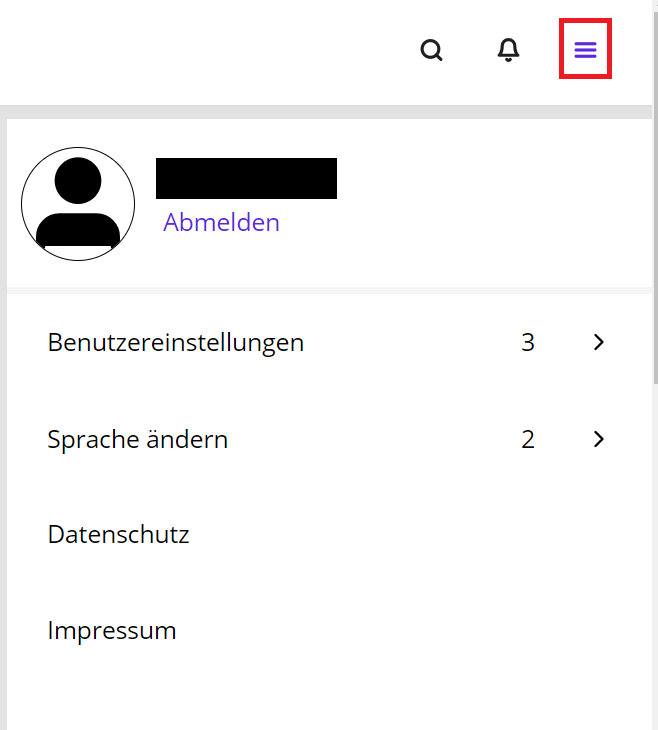
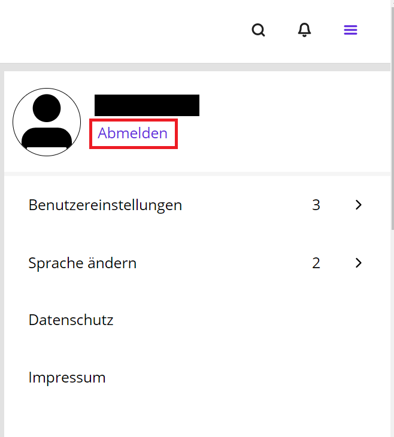

Ihr Arbeitsplatz ist ein für den öffentlichen Sektor entwickelter digitaler Arbeitsplatz bestehend aus webbasierten Open-Source-Modulen mit vielen Funktionen, die Mitarbeiterinnen und Mitarbeitern aus dem öffentlichen Sektor benötigen. Strenge Datenschutzbestimmungen fordern vom Staat, jederzeit die volle Kontrolle über eigene und anvertraute Daten zu behalten. Darum wird Ihr Arbeitsplatz in sicheren Rechenzentren von öffentlich-rechtlichen IT-Dienstleistern sowie in gesicherten Clouds betrieben. Ihr Arbeitsplatz stellt eine echte Alternative zu den Office-Produkten anderer Anbieter auf dem Markt dar.

## Anwendungen

Die Dokumentationen der einzelnen Komponenten finden Sie hier:

| Anwendungsgruppe             | Anwendungsname                        | Komponentendokumentation                                                                    |
| ---------------------------- | ------------------------------------- | ------------------------------------------------------------------------------------------- |
| Kommunikation & Organisation | E-Mail, Kalender, Kontakte & Aufgaben | [OX AppSuite](https://www.open-xchange.com/resources/oxpedia)                               |
| Produktivität                | Dateien                               | [Nextcloud](https://docs.nextcloud.com/)                                                    |
| Produktivität                | Diagramme                             | [CryptPad](https://docs.cryptpad.org/en/) mit [diagrams.net](https://www.diagrams.net/doc/) |
| Produktivität                | Weboffice                             | [Collabora Online](https://help.collaboraoffice.com/)                                       |
| Management                   | Projekte                              | [OpenProject](https://www.openproject.org/docs/user-guide/)                                 |
| Management                   | Wissen                                | [XWiki](https://www.xwiki.org/xwiki/bin/view/Documentation)                                 |
| Direkte Kommunikation        | Chat & Zusammenarbeit                 | [Element](https://element.io/user-guide) mit Nordeck widgets                                |
| Direkte Kommunikation        | Sofort Videokonferenz                 | [Jitsi](https://jitsi.github.io/handbook/docs/category/user-guide/)                         |
| Portal                       | -                                     | [Univention](https://docs.software-univention.de/n/en/index.html)                           |

## Arbeitsplatz aufrufen

Ihr Arbeitsplatz wird über einen Internet-Browser (Mozilla Firefox, Microsoft Edge, Google Chrome oder ein anderer Browser) aufgerufen. Geben Sie einfach in die Adressleiste Ihre Anmelde-Adresse ein.

## Anmeldung

Zur Anmeldung geben Sie Ihren **Benutzernamen** oder Ihre **E-Mail-Adresse** und das Passwort ein. Nach der **Anmeldung** können Sie über das Menü am rechten oberen Bildschirmrand (drei Balken) die **Benutzereinstellungen** verwalten.

## Abmeldung

Auf der Startseite Ihres Arbeitsplatzes und in jedem Modul können Sie sich über das **Hamburger-Menü** (drei Balken) ganz oben rechts abmelden.

# Beteiligung

Diese Dokumentation ist wie openDesk Open Source. Sie können auf [Open CoDE die Originaldateien](https://gitlab.opencode.de/bmi/opendesk/documentation/handbooks) einsehen und sich an der Verbesserung beteiligen.
