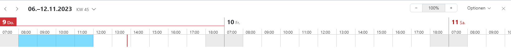
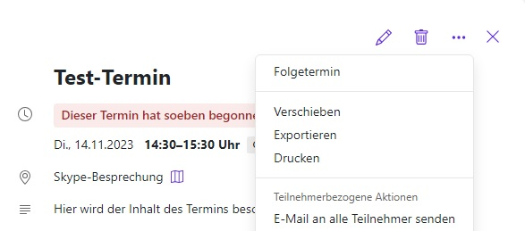

Nach Auswählen des Moduls Kalender öffnet sich die Kalenderansicht des aktuellen Monats. Einmal ist für Sie großflächig die aktuelle Kalenderwoche angezeigt. Im Minikalender links daneben haben Sie außerdem eine Darstellung des aktuellen Monats. So haben Sie direkt einen Überblick über anstehende Termine.

## Kalender freigeben

Sie können Ihren eigenen Kalender für andere Personen freigeben. Öffnen Sie das Hamburger-Menü neben dem freizugebenden Kalender und klicken Sie dann bei den angezeigten Optionen auf **Freigeben/Berechtigungen**.

Nun können Sie bestimmen, wer auf den Kalender zugreifen kann. Sie können Personen einladen und spezifische Rechte für den Kalenderzugriff festlegen.

## Kalender hinzufügen

### Kalender hinzufügen

Sie können beliebig viele Kalender erstellen, zum Beispiel für unterschiedliche Projekte. Sie können diese auch flexibel öffnen.

Einen neuen Kalender erstellen Sie über den Punkt **Neuen Kalender hinzufügen**. Hier können Sie entscheiden, ob es ein persönlicher Kalender oder ein Kalender für andere Zwecke werden soll. Wenn das der Fall ist, können Sie auf **Neuen Ressourcenkalender hinzufügen** oder **Neue Ressourcenkalendergruppe hinzufügen** klicken.

### Persönlichen Kalender hinzufügen

Möchten Sie einen persönlichen Kalender erstellen, wählen Sie **Neuen Kalender hinzufügen** aus. Ein neues Fenster öffnet sich und Sie können den neuen Kalender benennen. In diesem Fenster besteht ebenfalls die Möglichkeit, Ihren persönlichen Kalender in einen öffentlichen Kalender umzuwandeln. Dieses Feld wird also leer gelassen, wenn Sie den Kalender nur für sich selbst erstellen möchten. Durch einen Klick auf **Hinzufügen** wird der neue Kalender erstellt und in Ihre Liste aller Kalender mit aufgenommen.

## Kalenderansicht

In der Kalenderansicht können Sie anpassen, in welchem Umfang Ihr Kalender angezeigt werden soll. Sie können zwischen Tag, Arbeitswoche, Woche, Monat, Jahr und Liste auswählen.

## Eigene, öffentliche und freigegebene Kalender

In der linken Seitenansicht sehen Sie den Mini-Kalender und in der Ordneransicht sind Ihre Kalender dargestellt.

### Mein Kalender

Über das Plus (+) neben **Meine Kalender** können Sie einen neuen Kalender erstellen, in dem Sie **Neuen Kalender hinzufügen** klicken oder für andere Zwecke auf **Neuen Ressourcenkalender hinzufügen** und **Neue Ressourcennkalendergruppe hinzufügen** klicken.

### Öffentliche Kalender

Über **Öffentliche Kalender** werden alle öffentlichen Termine und freigegebene Kalender angezeigt.

## Die Kalender-Werkzeugleiste

### Der Kalender und die Werkzeugleiste

Die Benutzeroberfläche des Kalenders bietet Ihnen die Möglichkeit, einen Überblick über alle geplanten Termine zu bekommen. Über die gekennzeichnete Schaltfläche mit den 9 Punkten (**Alle Applikationen**) ist es Ihnen möglich, die Programme des Hauptmenüs auszuwählen, falls Sie zu einer anderen Anwendung wechseln möchten.

Die **Kalender-Werkzeugleiste** enthält folgende Funktionen:
- Neuer Termin: Anlegen eines neuen Termins
- Heute: Wechsel auf das aktuelle Datum in der Kalenderansicht

Ansicht: Wechsel auf Tag, Arbeitswoche, Woche oder Monat  Die Funktion **Heute** ist jedoch nur verfügbar, wenn Sie als **Ansicht** Tag, Arbeitswoche, Woche oder Monat geöffnet haben.

## Termin einstellen

Hier erfahren Sie, wie Sie Ihre Termine erstellen können. Beispielsweise können Sie Termine mit Videokonferenzen erstellen sowie Termineinladungen beantworten oder ganze Terminserien einrichten.

So können Sie einen neuen Termin anlegen:

Zuerst öffnen Sie in der Ordneransicht einen Kalender, in dem Sie die Berechtigung zum Anlegen von Objekten haben. Danach klicken Sie in der Werkzeugleiste auf **Einladen**.

Zuerst müssen Sie einen **Titel** eingeben.

Um den Beginn und das Ende des Termins festzulegen, müssen Sie unterhalb von **Beginnt am** und **Endet am** folgenden Aktionen ausführen:

- Klicken Sie auf ein Datum. Geben Sie ein Datum ein oder wählen Sie ein Datum aus der Datumsauswahl. Bei ganztägigen Terminen aktivierst du **Ganztägig**
- Klicken Sie auf eine Uhrzeit. Geben Sie die Uhrzeit ein, oder wählen Sie eine Uhrzeit aus der Liste
- Wenn gewünscht, können Sie die Zeitzone für die Start- oder Endzeit festlegen, indem Sie neben einer Uhrzeit auf die Zeitzonen-Schaltfläche klicken. Sie können für die Startzeit und Endzeit unterschiedliche Zeitzonen angeben

Geben Sie bei Bedarf nun den **Ort** und eine **Beschreibung** ein.

Unter **Teilnehmer und Ressourcen** haben Sie die Option, weitere Teilnehmerinnen und Teilnehmer für den Termin einzuladen. Außerdem sehen Sie unter **Teilnehmer** , welche Teilnehmerinnen und Teilnehmer sich bereits in dem Termin befinden. Um weitere Teilnehmerinnen und Teilnehmer in diesen Termin einzuladen, klicken Sie dafür neben dem Feld **Teilnehmer und Ressourcen** auf das Symbol **Kontakt auswählen**.

Nun öffnet sich ein neues Fenster mit Ihren Kontakten. Möchten Sie Kontakte hinzufügen, tippen Sie in das Eingabefeld **Suchen** den entsprechenden Namen des Kontakts ein und wählen ihn anschließend aus. Die ausgewählten Kontakte haben nun einen grauen Hintergrund. Klicke auf **Wählen** um deine gewünschten Kontakte zu dem Termin hinzuzufügen. Sie haben außerdem die Möglichkeit Kontakte zu filtern und in Ihren verschiedenen Adressbüchern nach Kontakten zu suchen. Die Schaltflächen befinden sich jeweils rechts neben dem Eingabefeld **Suchen**.

Wenn Sie die Sichtbarkeit Ihres Termins einstellen möchten, können Sie unter **Sichtbarkeit** auf den rechten Pfeil in der Schaltfläche klicken und **Standard**, **Privat** oder **Geheim** auswählen. Sie können außerdem eine **Erinnerung** für den Termin angeben, sodass die entsprechende Teilnehmerin bzw. der entsprechende Teilnehmer an den Termin erinnert wird. Sie können den gewünschten Kalender auswählen, in dem der Termin erscheinen soll und sie können die **Terminfarbe** auswählen, in der der Termin angezeigt werden soll. Darüber hinaus haben Sie die Option eine Kategorie Ihres Termins anzugeben, welche Ihnen erscheint, wenn Sie auf den rechten Pfeil neben **Kategorie hinzufügen** klicken. Die Kategorien sind voreingestellt und es kann **Predefined**, **Important**, **Business**, **Private** und **Meeting** ausgewählt werden. Um dem Termin Anhänge hinzuzufügen, klicken Sie entweder auf **Anhänge hinzufügen** oder **Von Dateien hinzufügen.**

Haben Sie nun Ihren Termin fertig konfiguriert, müssen Sie ihn noch speichern. Sie speichern den Termin, indem Sie auf **Anlegen** klicken.

**Hinweis**: Termine können auch direkt aus dem Kontaktemodul heraus angelegt werden. Sehen Sie dazu "Kontakt zu einem Termin einladen".

### Termin mit Videokonferenz

Für einen Termin mit mehreren Personen können Sie einen Videokonferenzraum einrichten. Dabei wird ein Link für den geplanten Konferenzraum generiert und ein Raum im Modul **Videokonferenzen** eingerichtet.

### Serientermin einstellen

Möchtest Sie, dass ein Termin regelmäßig in einem bestimmten zeitlichen Intervall stattfindet, können Sie einen Serientermin einrichten. Aktivieren Sie dafür **Wiederholen.** Nun erscheint der aktuelle Wochentag in violetter Schrift.

Möchten Sie die Wiederholungszeit verändern, klicken Sie auf den violetten Wochentag

Es öffnet sich ein neues Fenster. Hier können nun die terminlichen Aspekte des Termins bearbeitet werden. Haben Sie Ihre gewünschten Änderungen vorgenommen, klicken Sie auf **Anwenden**.

### Terminsichtbarkeit einstellen

Sie haben die Möglichkeit, Ihren Termin für andere Nutzerinnen und Nutzer zu verbergen. Wenn Sie möchten, dass andere Nutzerinnen und Nutzer diesen Termin einsehen können, wählen Sie **Standard** aus. Möchten Sie, dass der Termin von anderen Nutzerinnern und Nutzern nicht eingesehen werden kann, wählen Sie **Privat** oder **Geheim** aus.

**Privat:** Nutzerinnen und Nutzer, die nicht am Termin teilnehmen, sehen nur den Zeitpunkt des Termins, nicht den Inhalt.

**Geheim:** Nutzerinnen und Nutzer, die nicht am Termin teilnehmen, wird der Termin nicht angezeigt.

Sie können außerdem eine **Erinnerung** für den Termin angeben, sodass die entsprechende Teilnehmerin bzw. der entsprechende Teilnehmer an den Termin erinnert wird. Sie können den gewünschten Kalender auswählen, in dem der Termin erscheinen soll und Sie können die **Terminfarbe** auswählen, in der der Termin angezeigt werden soll.

Darüber hinaus haben Sie die Option eine Kategorie Ihres Termins anzugeben, welche Ihnen erscheint, wenn Sie auf den rechten Pfeil neben **Kategorie hinzufügen** klicken. Die Kategorien sind voreingestellt und es kann **Predefined**, **Important**, **Business**, **Private** und **Meeting** ausgewählt werden.

Um dem Termin Anhänge hinzuzufügen, klicken Sie entweder auf **Anhänge hinzufügen** oder **Von Dateien hinzufügen.**

### Termin planen

Über **Planung** können Sie vor Erstellen eines Termins bereits die Verfügbarkeit der Personen prüfen, die an Ihrem Termin teilnehmen sollen.

Über das Feld **Teilnehmer hinzufügen** können Sie diese auswählen.

Haben Sie ein offenes Zeitfenster für alle Beteiligten gefunden, halten Sie die linke Maustaste gedrückt und ziehen Sie über den gewünschten Zeitraum im Kalendertag, an dem der Termin stattfinden soll. Klicken Sie nun auf **Termin anlegen**. Die von Ihnen zuvor ausgewählte Zeit wird automatisch in die Felder **Beginnt am** und **Endet am** eingefügt.

Über **Optionen** können Sie in diesem Fenster auch Änderungen vornehmen. So können Sie zum Beispiel über **Kompakt** die Darstellung des ausgewählten Kalendertages verkleinern oder über **Feinraster anzeigen** den Kalendertag auf viertelstündige Blöcke aufteilen. Den Datumsbereich können Sie auf Woche oder Monat einstellen. Sie können ebenfalls bestimmen, ob auch Nichtarbeitszeiten für die Terminauswahl angezeigt werden sollen oder nicht.

### Termineinladung beantworten

Wurden Sie zu einem Termin eingeladen, erhalten Sie eine oder beide der folgenden Benachrichtigungen:

- Der Infobereich informiert Sie über diesen Termin

Sie erhalten eine E-Mail mit der Termineinladung  Termineinladungen können zugesagt, vorläufig zugesagt oder abgelehnt werden. Dieser sogenannte Bestätigungsstatus kann auch zu einem späteren Zeitpunkt noch geändert werden.

#### Terminbeantwortung im Infobereich

Wenn Sie die Termineinladung über den Infobereich beantworten möchten, klicken Sie in der Menüleiste auf das Symbol **Benachrichtigungen**. Der Infobereich wird nun angezeigt. Hier können Sie nun unterhalb der Einladung auf **Bestätigen, Vielleicht** oder **Ablehnen** klicken. Wenn Sie den Termin bestätigt haben, wird er in Ihrem Kalender eingetragen. Sie können den Termin auch im Kalender zusagen oder absagen. Klicken Sie dafür im entsprechenden Tag auf den Termin und beantworten Sie den Termin dort mit **Bestätigen**, **Vielleicht** oder **Ablehnen**.

Wenn Sie auf das Dreipunkte-Menü neben den Antwort-Möglichkeiten klicken, können Sie eine Bemerkung zum Termin eingeben.

#### Terminbeantwortung in der Einladungs-E-Mail

Sie können die Termineinladung auch per E-Mail beantworten. In der App **E-Mail** wird die Termineinladung angezeigt. Sie können in der Detailansicht unterhalb von **Termindetails anzeigen** einen Kommentar einfügen. Auch hier haben Sie die Auswahl zwischen **Bestätigen, Vielleicht** und **Ablehnen**. Wie im Abschnitt „Terminbeantwortung im Infobereich“ beschrieben, wird der Termin in Ihrem Kalender eingetragen, wenn Sie diesen bestätigen.

**Hinweis:** In den Kalender-Einstellungen können Sie bestimmen, ob Einladungs-E-Mails automatisch gelöscht werden sollen, wenn diese von Ihnen bestätigt oder abgelehnt wurden.

## Termin verwalten

Hier erfahren Sie, wie Sie Ihre Termine verwalten. Beispielsweise können Sie Inhalte von Terminen verändern sowie Termine oder ganze Terminserien aus dem Kalender löschen.

### Terminbestätigung ändern

Sie können Ihre Terminbestätigung auch nachträglich ändern. Dabei gibt es folgende Optionen:

- Sie können den Termin kommentarlos bestätigen oder ablehnen

Sie können den Bestätigungsstatus ändern. Dabei können Sie einen Kommentar eingeben, den andere Teilnehmerinnen und Teilnehmer des Termins lesen können.

**Hinweis:** Je nach Konfiguration Ihrer privaten Kalender können Sie eine Terminbestätigung nur ändern, wenn Sie selbst teilnehmende Person des Termins sind.

Sie haben folgende Möglichkeiten, um Ihren Bestätigungsstatus nachträglich zu ändern:

- Klicken Sie in der Kalenderansicht auf den gewünschten Termin und im geöffneten Pop-up auf **Status ändern**

Wählen Sie in der Listenansicht den gewünschten Termin aus und öffnen ihn mit einem Doppelklick. Klicken Sie anschließend in der Werkzeugleiste auf **Status ändern**  Handelt es sich um eine Terminserie, so legen Sie fest, ob die Änderungen nur für einen einzelnen Termin oder für die gesamte Terminserie gelten sollen. Bei Bedarf können Sie im Fenster **Bestätigungsstatus ändern** eine Anmerkung verfassen. Klicken Sie auf eine der Schaltflächen **Ablehnen, Vorläufig** oder **Akzeptieren**.

### Terminerinnerung ändern

Terminerinnerungen können nachträglich verändert werden, indem Sie eine Erinnerung anpassen, entfernen oder eine weitere Erinnerung hinzufügen.

**Hinweis:** Diese Funktion ist nur verfügbar, wenn Sie keine vollständigen Bearbeitungsrechte für den Termin besitzen. Andernfalls können Sie die Terminerinnerung ändern, indem Sie das Terminbearbeitungsfenster verwenden.

Folgende Möglichkeiten haben Sie, um eine Terminerinnerung zu ändern:

- Klicken Sie in der Kalenderansicht auf den gewünschten Termin. Ein Pop-up öffnet sich

Wählen Sie in der Listenansicht den gewünschten Termin aus. Öffnen Sie ihn mit einem Doppelklick. Der Termin wird in einem Fenster angezeigt  Klicken Sie nun auf das Symbol **Weitere Aktionen** und auf **Erinnerung ändern**. Das Fenster **Erinnerungen ändern** öffnet sich. Wählen Sie eine Erinnerung aus. Dadurch öffnet sich das Fenster **Erinnerungen bearbeiten**. Bei Bedarf können Sie jetzt eine vorhandene Erinnerung bearbeiten, löschen oder eine neue Erinnerung hinzufügen.

### Termin als stellvertretende Person anlegen, bearbeiten und verwalten

Je nach den Berechtigungen, die Ihnen eine andere nutzende Person erteilt hat, können Sie in deren Kalender folgende Funktionen ausführen:

- Vorhandene Termine ansehen
- Neue Termine im Namen der nutzenden Person anlegen

Vorhandene Termine im Namen der nutzenden Person bearbeiten, verwalten oder löschen  Sie können ebenfalls als stellvertretende Person Termine anlegen oder bearbeiten. Dafür öffnen Sie in der Ordneransicht unterhalb von **Freigegebene Kalender** den Ordner der nutzenden Person, die Sie zur stellvertretenden Person bestimmt hat. Klicken Sie nun in der Werkzeugleiste auf **Neuer Termin**. Sie werden gefragt, ob Sie diesen Termin als stellvertretende Person im freigegebenen Kalender einer anderen nutzenden Person anlegen wollen. Klicken Sie auf **im Auftrag des Eigentümers**.

Die nutzende Person, für die Sie die Stellvertretung übernehmen, wird per E-Mail darüber informiert, dass Sie einen Termin angelegt, bearbeitet oder gelöscht haben. Wie man Termine anlegt, bearbeitet oder löscht, erfahren Sie im Kapitel **Termin einstellen**.

### Organisatorin oder Organisator ändern

Wenn Sie die organisierende Person eines (Serien-)Termins sind, der mindestens 2 weitere Teilnehmende hat, so können Sie die organisierende Person ändern.

In folgenden Fällen können Sie die organisierende Person nicht ändern:

- Wenn ein Termin externe Teilnehmende hat
- Wenn es sich um einen geänderten Einzeltermin einer Terminserie handelt - **Hinweis:** Diese Funktion ist je nach Konfiguration unter Umständen nicht verfügbar.

Sie haben folgende Möglichkeiten, die organisierende Person eines Termins zu ändern:

- Klicken Sie in der Kalenderansicht auf einen Termin. Klicken Sie dann im Pop-up auf das Symbol **Weitere Aktionen**

Wählen in der Listenansicht einen oder mehrere Termine aus  Klicken Sie dann in der Werkzeugleiste auf das Symbol **Weitere Aktionen** und auf **Organisator ändern**. Haben Sie eine Terminserie ausgewählt, müssen Sie festlegen, ob die Änderungen für den einzelnen Termin oder für die gesamte Terminserie gelten sollen. Im Fenster **Organisator ändern** geben Sie nun die E-Mail-Adresse der neuen Organisatorin oder des neuen Organisators ein.

### Termin löschen

#### Termin löschen

Termine aus Ihren privaten Kalendern können Sie nur löschen, wenn Sie auch die organisierende Person des Termins sind.

**Hinweis:** Wenn Sie einen Termin löschen, ist dieser Termin endgültig gelöscht und kann nicht mehr wiederhergestellt werden.

Sie haben 2 Möglichkeiten, einen Termin zu löschen:

- Klicken Sie in der Kalenderansicht auf den Termin, den Sie löschen möchten. Klicken Sie dann im Pop-up auf **Löschen**

Wählen Sie in der Listenansicht einen oder mehrere Termine aus, die Sie löschen möchten. Klicken Sie dann in der Werkzeugleiste auf **Löschen**  Bestätigen Sie abschließend, dass Sie den Termin löschen möchten.

#### Serientermine löschen

Wenn Sie einen Serientermin gewählt haben, werden Sie gefragt, welche Termine der Terminserie gelöscht werden sollen:

- Wenn Sie den ersten Termin der Terminserie gewählt haben, können Sie entweder nur den ersten Termin oder die gesamte Terminserie löschen
- Wenn Sie einen Termin innerhalb der Terminserie gewählt haben, können Sie entweder nur den gewählten Termin oder den gewählten Termin und alle zukünftigen Termine der Terminserie löschen

Wenn Sie den letzten Termin der Terminserie gewählt haben, können Sie nur den letzten Termin löschen. In diesem Fall werden Sie nicht gefragt, welche Termine gelöscht werden sollen  Wenn Sie gleichzeitig auch die organisierende Person des Termins sind, können Sie die anderen Teilnehmerinnen und Teilnehmer über den Grund für die Löschung informieren, indem Sie eine Nachricht eingeben. Das Eingabefeld wird angezeigt, wenn folgende Bedingungen erfüllt sind:

- Der Termin hat mindestens 2 Teilnehmende

In den Kalender-Einstellungen ist **Benachrichtigung bei Terminänderungen** aktiviert. Die Nachricht wird als E-Mail gesendet.

### Termin in einen anderen Kalender verschieben

Sie können Termine in andere Kalender verschieben. Die einzige Voraussetzung hierfür ist, dass Sie im Zielkalender die Berechtigung zum Anlegen von Objekten haben.

Sie haben folgende Möglichkeiten, Termine zu verschieben:

- Klicken Sie in der Kalenderansicht auf einen Termin. Klicken Sie dann im Pop-up auf das Symbol **Weitere Aktionen (Drei Punkte)**
- Wählen Sie in der Listenansicht einen oder mehrere Termine aus. Klicken Sie dann in der Werkzeugleiste auf das Symbol **Weitere Aktionen (Drei Punkte)**

Klicken Sie auf **Verschieben** . Das Fenster **Verschieben** öffnet sich. Wählen Sie hier den gewünschten Kalender aus. Bei Bedarf können Sie auch einen neuen Kalender anlegen, indem Sie auf **Ordner anlegen** klicken. Klicken Sie abschließend auf **Verschieben**.

### Termin importieren

Wenn eine Datei im iCal-Format vorliegt, können Sie Termine auch importieren.

Wählen Sie in der Ordneransicht den Kalender aus, in den Sie Termine importieren möchten. Klicken Sie neben dem Kalender auf das Symbol **Aktionen** und auf **Importieren** . Im Fenster **Aus Datei importieren** klicken Sie auf **Datei hochladen**.

Wählen Sie nun eine Datei im iCal-Format. Um auch Termine zu importieren, die die gleiche Identifikationsnummer haben wie bereits vorhandene Termine, aktivieren Sie vorab **Vorhandene Termine ignorieren**. Klicken Sie nun auf **Importieren**. Die ausgewählten Termine werden jetzt zu Ihrem Kalender hinzugefügt.

**Achtung**: Alle Teilnehmerinnen und Teilnehmer der importierten Termine werden entfernt. Stattdessen werden Sie als teilnehmende Person hinzugefügt.

### Termin exportieren

Sie können Termine im Format iCalendar exportieren. Dieses Format können Sie zum Beispiel verwenden, wenn Sie Termine mit anderen Kalender-Anwendungen austauschen möchten. Sie können einzelne Termine oder alle Termine eines Kalenders exportieren.

#### Einzeltermin exportieren

Sie haben folgende Möglichkeiten, einzelne Termine zu exportieren:

- Klicken Sie in der Kalenderansicht auf einen Termin. Klicken dann im Pop-up auf das Symbol **Weitere Aktionen**

Wählen Sie in der Listenansicht einen oder mehrere Termine aus. Klicken Sie dann in der Werkzeugleiste auf das Symbol **Weitere Aktionen**  Klicken Sie nun auf **Exportieren**. Es öffnet sich ein Fenster. Hier wählen Sie die Funktion zum Speichern der Exportdatei.

#### Alle Termine exportieren

Wenn Sie alle Termine eines Kalenders exportieren möchten, wählen Sie zunächst in der Ordneransicht einen persönlichen oder einen öffentlichen Kalender aus, von dem Sie die Termine exportieren möchten. Klicken Sie neben dem Ordnernamen auf das Symbol **Aktionen** und auf **Exportieren**. Ein Fenster öffnet sich. Wählen Sie hier die Funktion zum Speichern der Exportdatei.

## Termin drucken

Sie können Termine und Kalender ausdrucken. Folgende Möglichkeiten gibt es:
- Sie können ein Kalenderblatt mit Terminen drucken
- Sie können die Daten von Terminen drucken
- Sie können eine detaillierte oder kompakte Liste von Terminen drucken

### Ein Kalenderblatt drucken

Um ein Kalenderblatt mit Terminen zu drucken, wählen Sie den gewünschten Kalender und in der Menüleiste oben rechts die gewünschte **Ansicht** (Tag, Arbeitswoche, Woche, Monat, Jahr, Liste) aus. Öffnen Sie die **Einstellungen** (Zahnradsymbol) oben rechts neben Ihrem Profilbild bzw. Namenskürzel. Wählen Sie **Drucken**. Es wird eine Druckvorschau angezeigt und Sie können die Druckoptionen des Druckers anpassen.

### Daten von Terminen drucken

Um die Daten von Terminen auszudrucken, haben Sie 2 Möglichkeiten:

- Klicken Sie in der Kalenderansicht auf einen Termin. Klicken Sie dann im Pop-up auf das Symbol **Weitere Aktionen** und dann auf **Drucken**
- Wählen Sie in der Listenansicht einen oder mit gedrückter **Strg-Taste** mehrere Termine aus. Klicken Sie dann in der Werkzeugleiste auf das Symbol **Weitere Aktionen** und dann auf **Drucken** . Hier können Sie noch zwischen der kompakten und der detaillierten Ansicht zum Drucken wählen

