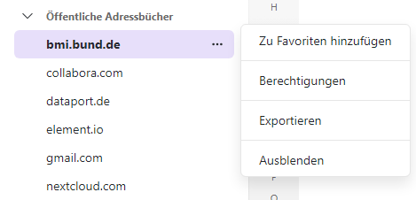
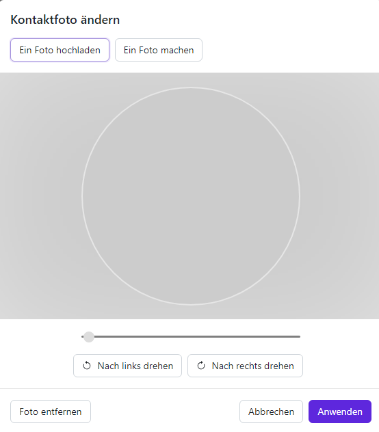
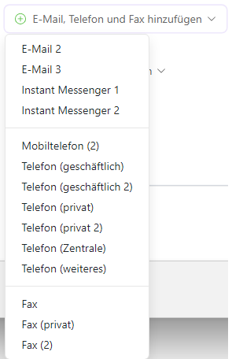
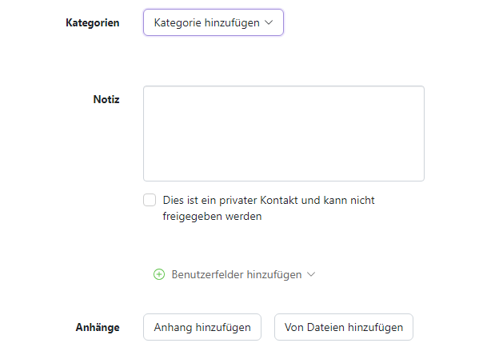
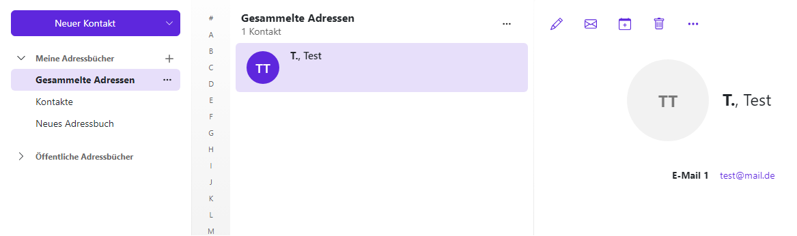
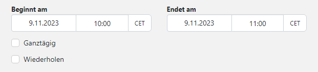
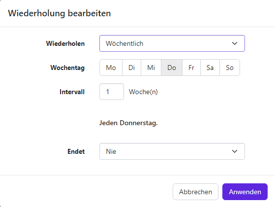
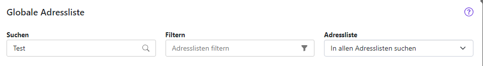
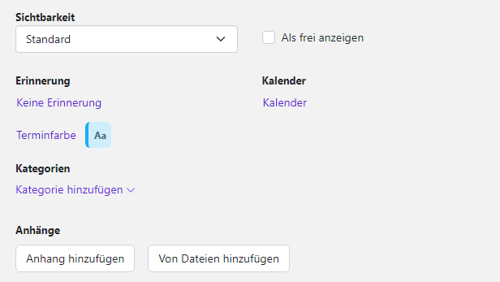

Mit dem Modul Kontakte haben Sie ein Werkzeug, um verschiedene Adressbücher zu verwalten. Die darin gespeicherten Adressen können Sie beim Versenden von E-Mails, bei der Termin- oder Aufgabenplanung und an vielen weiteren Stellen einsetzen.

## Allgemeiner Aufbau des Moduls

1. Adressbuch-Werkzeugleiste

2. Adressbuch-Ordneransicht

3. Adressbuch-Navigationsbereich

4. Adressbuch-Anzeigebereich

## Verteilerliste hinzufügen

### Neue Verteilerliste anlegen

Öffnen Sie als erstes ein Adressbuch in der Ordneransicht. Klicken Sie dann in der Werkzeugleiste auf **Neuer Kontakt** und anschließend auf **Neue Verteilerliste**.

**Hinweis:** Diese Schritte sind nur in Adressbüchern möglich, in denen Sie die Berechtigung zum Anlegen von Objekten haben. Das globale Adressbuch ist hiervon z. B. ausgenommen.

Geben Sie unter **Name** einen Namen für die Verteilerliste ein. Danach geben Sie im Eingabefeld unter der Überschrift **Teilnehmer** die E-Mail-Adresse oder den Namen einer Teilnehmerin oder eines Teilnehmers ein.

- Während der Eingabe werden passende Vorschläge für Sie angezeigt. Um einen Vorschlag zu übernehmen, klicken Sie darauf

Um Kontakte aus einem Adressbuch zu wählen, klicken Sie rechts im Eingabefeld auf das Symbol **Kontakte auswählen**  Falls Sie weitere Kontakte hinzufügen möchten, wiederholen Sie diese letzten Schritte entsprechend. Möchten Sie einen Kontakt entfernen, klicken Sie neben dem Kontakt auf das Papierkorb-Symbol.

Klicken Sie abschließend auf **Liste erstellen**.

### Kontakte oder Verteilerlisten bearbeiten

**Hinweis:** Die folgenden Schritte sind nur in Adressbüchern möglich, in denen Sie die Berechtigung zum Anlegen von Objekten hast. Das globale Adressbuch ist hiervon z. B. ausgenommen.

Wählen Sie zuerst in der Liste einen Kontakt oder eine Verteilerliste aus. Klicken Sie danach in der Werkzeugleiste auf **Bearbeiten**.

Es öffnet sich ein Fenster, in dem Sie die Daten des Kontaktes bzw. der Verteilerliste einsehen und bearbeiten können. Haben Sie alle gewünschten Änderungen vorgenommen, klicken Sie auf **Speichern**.

## Adressbuch hinzufügen

Mithilfe von Adressbüchern können Sie Ihre Kontakte organisieren, zum Beispiel unterteilt in berufliche und private Kontakte. Erfahren Sie, wie Sie Adressbücher anlegen, Kontakte aus externen Adressbüchern anwenden und die Anzeige von freigegebenen Adressbüchern bestimmen können.

### Persönliches Adressbuch hinzufügen

Unter **Meine Adressbücher** können Sie persönliche Adressbücher anlegen. Um ein neues Adressbuch anzulegen, klicken Sie auf das **Plus (+)** neben **Meine Adressbücher.**

Wählen Sie jetzt das **Plus (+)** , um ein neues Adressbuch zu erstellen.

Es erscheint ein neues Fenster, in dem Sie Ihr neues Adressbuch benennen können. Soll das Adressbuch öffentlich einsehbar sein, setzen Sie den Haken bei **Als öffentlichen Ordner hinzufügen.** Klicken Sie abschließend auf **Hinzufügen**.

### Öffentliche Adressbücher

Sie können innerhalb des Moduls **Kontakte** öffentliche Adressbücher einsehen, welche in der Seitenansicht untereinander aufgelistet sind.

Sie haben die Möglichkeit öffentliche Adressbücher zu Ihren Favoriten hinzuzufügen, Ihre Berechtigungen für dieses Adressbuch einzusehen, das Adressbuch zu exportieren und es auszublenden. Klicken Sie dafür auf das Dreipunkt-Menü neben dem entsprechenden Adressbuch und klicken Sie auf die gewünschte Funktion.

## Neuen Kontakt hinzufügen

Das Modul Kontakte ermöglicht die Verwaltung aller Adressbücher und persönlichen Kontakte.

Das Anlegen neuer und das Bearbeiten vorhandener Kontakte und Adressen erfolgt über die Menüleiste.

Über den Menüpunkt **Neuer Kontakt** besteht auch die Möglichkeit, Verteilerlisten zu erstellen.

Wenn Sie einen neuen Kontakt hinzufügen möchten, navigieren Sie links zu **Meine Adressbücher** und wählen Sie ein Adressbuch aus. Klicken Sie nun auf die violette Schaltfläche **Neuer Kontakt**. Anschließend öffnet sich ein neues Fenster. Jetzt haben Sie die Möglichkeit, die gewünschten Kontaktdaten einzugeben.

Wenn Sie einem Kontakt ein Foto hinzufügen möchten, klicken Sie auf das leere Kontaktfoto. Das Fenster **Kontaktfoto ändern** öffnet sich. Wenn Sie ein vorhandenes Foto hochladen möchten, klicken Sie auf **Ein Foto hochladen.** Möchten Sie direkt ein neues Foto mithilfe der Gerätekamera aufnehmen, klicken Sie auf **Ein Foto machen**. Bei Bedarf können Sie den Bildausschnitt festlegen, indem Sie den Regler unter dem Foto verwenden und das Foto verschieben oder drehen.

Wenn Sie auf **Anwenden** klicken, wird das Foto hinzugefügt.

Um ein Foto zu bearbeiten oder zu löschen, klicken Sie zunächst auf das Foto. Damit gelangen Sie in eine Editor-Ansicht, in der Sie das Bild über die entsprechenden Schaltflächen drehen können. Verwenden Sie den horizontalen Regler, um die Zoomstufe zu verändern. Wenn Sie näher an das Bild herangezoomt haben, können Sie im Folgenden den Bildausschnitt verändern, indem Sie auf das Bild klicken und es mit gedrückter Maustaste verschieben. Klicken Sie auf **Anwenden**, sobald Sie mit Ihren Änderungen zufrieden sind, oder wählen Sie **Foto entfernen** , wenn das Bild ganz gelöscht werden soll.

Der Firma bzw. der Abteilung können auch weitere Informationen hinzugefügt werden. Klicken Sie dafür auf **Geschäftsinformationen hinzufügen**. Es erscheint ein Dropdown-Menü und Sie können die Informationen um weitere Punkte ergänzen:

- **Position**
- **Beruf**
- **Raumnummer**
- **Manager**
- **Assistent**

Sollten Sie mehrer E-Mail-Adressen besitzen, können Sie diese ebenfalls hinzufügen. Klicken Sie dafür auf **E-Mail, Telefon, Fax hinzufügen**. Es erscheint ein Dropdown-Menü und Sie können die Informationen um weitere Punkte ergänzen:

- **E-Mail 2**
- **E-Mail 3**
- **Instantmessenger 1**
- **Instantmessenger 2**
- **Mobiltelefon (2)**
- **Telefon (geschäftlich)**
- **Telefon (geschäftlich 2)**
- **Telefon (privat)**
- **Telefon (privat 2)**
- **Telefon (Zentrale)**
- **Telefon (weiteres)**
- **Fax**
- **Fax (privat)**
- **Fax(2)**

Darüber hinaus haben Sie die Option eine Kategorie Ihres Termins anzugeben, welche Ihnen erscheint, wenn Sie auf den rechten Pfeil neben **Kategorie hinzufügen** klicken. Die Kategorien sind voreingestellt und es kann **Predefined**, **Important**, **Business**, **Private** und **Meeting** ausgewählt werden. Möchten Sie nützliche Notizen hinzufügen können Sie im Textfeld Notiz Ihre Angaben machen. Sollte dieser Kontakt als privater Kontakt eingestuft werden, können Sie die Checkbox **Dies ist ein privater Kontakt und kann nicht freigegeben werden** anklicken. Außerdem haben Sie die Möglichkeit Benutzerfelder hinzuzufügen. Das können Sie einstellen, indem Sie auf **Benutzerfelder hinzufügen** klicken. Um dem Termin Anhänge hinzuzufügen, klicken Sie entweder auf **Anhänge hinzufügen** oder **Von Dateien hinzufügen.**

## Kontakt löschen

Möchten Sie einen bereits bestehenden Kontakt löschen, müssen Sie zunächst den gewünschten Kontakt auswählen, sodass dieser violett hinterlegt ist. Anschließend wählen Sie in der oberen Leiste das Icon **Löschen** aus.

Anschließend werden Sie gefragt, ob der Kontakt wirklich gelöschen werden soll. Wenn Sie dies tun möchten, klicken Sie auf **Löschen**.

## Kontakt verschieben oder kopieren

Sie können Kontakte oder Verteilerlisten in ein anderes Adressbuch verschieben oder kopieren. Das globale Adressbuch ist hiervon allerdings ausgenommen.

So verschieben oder kopieren Sie Kontakte in ein anderes Adressbuch:

Wählen Sie in der Liste einen oder mehrere Kontakte oder Verteilerlisten aus, welche Sie kopieren oder verschieben möchten. Klicken Sie anschließend in der Werkzeugleiste auf das Symbol **Weitere Aktionen (Hamburger-Menü)** . Danach können Sie auf **Verschieben** oder **Kopieren** klicken. Jetzt öffnet sich ein Fenster, in welchem Sie ein Adressbuch auswählen. Bei Bedarf können Sie auch ein neues Adressbuch anlegen, indem Sie auf **Ordner anlegen** klicken. Klicken Sie nun auf **Verschieben** beziehungsweise **Kopieren**.

**Tipp:** Sie können die gewählten Kontakte bzw. Verteilerlisten auch per Drag &amp; Drop verschieben, indem Sie diese in der Ordneransicht einfach mit gedrückter Maustaste auf ein Adressbuch ziehen.

## Kontakt als vCard versenden

So können Sie Kontakte oder Verteilerlisten als vCard-Anhang in einer E-Mail versenden:

Zu Beginn wählen Sie in der Liste einen Kontakt, eine Verteilerliste oder mehrere Kontakte oder Verteilerlisten aus. Anschließend klicken Sie in der Werkzeugleiste auf das Symbol **Weitere Aktionen (Hamburger-Menü).** Wenn sie jetzt auf auf **Als vCard senden klicken** , wird eine vCard versendet.

Anschließend können Sie die Angaben der E-Mail vervollständigen. Wie in einer regulären E-Mail können Sie folgende Daten eingeben:

- E-Mail-Adresse, an die der Kontakt versendet werden soll
- Betreff
- Text der E-Mail
- Anhänge

Um die E-Mail mit der vCard abzusenden, klicken Sie auf **Senden**.

## Kontakt zu einem Termin einladen

Sie können direkt aus dem Modul **Kontakte** Termine anlegen und Kontakte oder ganze Verteilerlisten zu diesen Terminen einladen. Wählen Sie zu Beginn einen oder mehrere Kontakte oder Verteilerlisten aus und klicken Sie anschließend in der Werkzeugleiste auf **Zu Termin Einladen**. Wenn Sie einen einzelnen Kontakt auswählen möchten, klicken Sie alternativ oben in der Detailansicht des Kontaktes auf **Einladen**. Als letzten Schritt können Sie die Angaben zum Anlegen des Termins vervollständigen. Nähere Angaben hierzu finden Sie unter [Termin einstellen](../../kalender/termin-einstellen/termin-einstellen.md).

## Neuen Termin anlegen

So können Sie einen neuen Termin anlegen:

Zuerst öffnen Sie in der Ordneransicht einen Kalender, in dem Sie die Berechtigung zum Anlegen von Objekten haben. Danach klicken Sie in der Werkzeugleiste auf **Einladen**.

Zuerst müssen Sie einen **Titel** eingeben.

Um den Beginn und das Ende des Termins festzulegen, müssen Sie unterhalb von **Beginnt am** und **Endet am** folgenden Aktionen ausführen:

- Klicken Sie auf ein Datum. Geben Sie ein Datum ein oder wählen Sie ein Datum aus der Datumsauswahl. Bei ganztägigen Terminen aktivierst du **Ganztägig**
- Klicken Sie auf eine Uhrzeit. Geben Sie die Uhrzeit ein, oder wählen Sie eine Uhrzeit aus der Liste
- Wenn gewünscht, können Sie die Zeitzone für die Start- oder Endzeit festlegen, indem Sie neben einer Uhrzeit auf die Zeitzonen-Schaltfläche klicken. Sie können für die Startzeit und Endzeit unterschiedliche Zeitzonen angeben

- Aktivieren Sie **Wiederholen**, wenn sich der Termin periodisch wiederholen soll. Nun erscheint der aktuelle Wochentag in violetter Schrift. Möchten Sie die Wiederholungszeit verändern, klicken Sie auf den violetten Wochentag. Es öffnet sich ein neues Fenster. Hier können nun die terminlichen Aspekte des Termins bearbeitet werden. Haben Sie Ihre gewünschten Änderungen vorgenommen, klicken Sie auf **Anwenden**.

Möchten Sie den Termin in einer Videokonferenz abhalten, so wählen Sie unter **Konferenz** die Möglichkeit **Videokonferenz** aus. Das System erstellt einen Konferenzraum und generiert den dazugehörigen Link automatisch.

Geben Sie bei Bedarf nun den **Ort** und eine **Beschreibung** ein.

Unter **Teilnehmer** haben Sie die Option, weitere Teilnehmerinnen und Teilnehmer für den Termin einzuladen. Außerdem haben sehen Sie unter **Teilnehmer** , welche Teilnehmerinnen und Teilnehmer sich bereits in dem Termin befinden. Um weitere Teilnehmerinnen und Teilnehmer in diesen Termin einzuladen, klicken Sie dafür neben dem Feld **Teilnehmer und Ressourcen** auf das Symbol **Kontakt auswählen**.

Nun öffnet sich ein neues Fenster mit Ihren Kontakten. Möchten Sie Kontakte hinzufügen, tippen Sie in das Eingabefeld **Suchen** den entsprechenden Namen des Kontakts ein und wählen ihn anschließend aus. Die ausgewählten Kontakte haben nun einen grauen Hintergrund. Klicke auf **Wählen** um deine gewünschten Kontakte zu dem Termin hinzuzufügen. Sie haben außerdem die Möglichkeit Kontakte zu filtern und in Ihren verschiedenen Adressbüchern nach Kontakten zu suchen. Die Schaltflächen befinden sich jeweils rechts neben dem Eingabefeld **Suchen**.

Wenn Sie die Sichtbarkeit Ihres Termins einstellen möchten, können Sie unter **Sichtbarkeit** auf den rechten Pfeil in der Schaltfläche klicken und **Standard**, **Privat** oder **Geheim** auswählen. Sie können außerdem eine **Erinnerung** für den Termin angeben, sodass die entsprechende Teilnehmerin bzw. der entsprechende Teilnehmer an den Termin erinnert wird. Sie können den gewünschten Kalender auswählen, in dem der Termin erscheinen soll und sie können die **Terminfarbe** auswählen, in der der Termin angezeigt werden soll. Darüber hinaus haben Sie die Option eine Kategorie Ihres Termins anzugeben, welche Ihnen erscheint, wenn Sie auf den rechten Pfeil neben **Kategorie hinzufügen** klicken. Die Kategorien sind voreingestellt und es kann **Predefined**, **Important**, **Business**, **Private** und **Meeting** ausgewählt werden. Um dem Termin Anhänge hinzuzufügen, klicken Sie entweder auf **Anhänge hinzufügen** oder **Von Dateien hinzufügen.**

Haben Sie nun Ihren Termin fertig konfiguriert, müssen Sie ihn noch speichern.Sie speichern den Termin, indem Sie auf **Anlegen** klicken.

