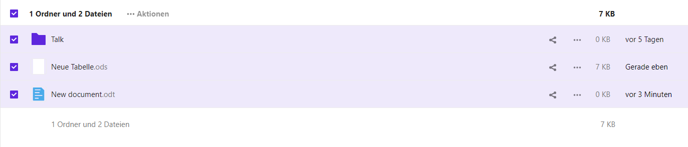

Im Modul **Produktivität** wird ein umfangreiches Programm zum gemeinsamen Arbeiten an Dateien zur Verfügung gestellt.

Nutzerinnen und Nutzer erhalten die Möglichkeit, ihre **Dateien an einem zentralen Ort** abzuspeichern und mit weiteren Nutzerinnen und Nutzern zu teilen. Sowohl die **Echtzeit-Zusammenarbeit** mit mehreren Personen als auch die **Einzelbearbeitung** von Dokumenten wird unterstützt.

Über das Modul **Produktivität** rufen Sie **Dateien** auf. Sie können im **Dateien-Speicher** Ihre Dateien verwalten (erstellen, speichern, bearbeiten und löschen) und mit anderen Nutzerinnen und Nutzern teilen.

Im **Dateien-Speicher** können Sie **Ordner** , **Textdateien** , **Dokumente** , **Tabellenkalkulationen** , **Präsentationen** und **Diagramme** erstellen.

Zusätzlich können Dateien **importiert** und weiter bearbeitet werden. Es werden eine Vielzahl von **Dateiformaten** bei diesem Import unterstützt.

## Neue Dateien schnell erstellen und speichern

### Neue Dateien schnell erstellen

Die Schaltfläche **Erstelle neue Dateien** ist ein Schnellzugriff, um Dateien schnell zu erstellen, ohne zuvor in den Datenspeicher gehen zu müssen. Diese Schaltfläche finden Sie auf der **Startseite** unter **Produktivität**.

Nach Anklicken der Schaltfläche **Erstelle neue Dateien** öffnet sich ein Menü und Sie erhalten einen Überblick über die Untermodule **Präsentation, Tabelle** und **Dokument**. Wenn Sie mit dem Mauszeiger über die einzelnen Module fahren, werden Ihnen Felder zur Erklärung der Module angezeigt.

Der Schnellzugriff ermöglicht es, eine neue Datei zu erstellen, indem die entsprechende Schaltfläche angeklickt wird. Ein Dokument, eine Tabelle oder eine Präsentation wird in einem neuen Fenster geöffnet.

**Hinweis**: Von der Startseite aus können **nur** Dokumente, Präsentationen und Tabellen **schnell** erstellt werden. Wenn Sie einen anderen Dateityp wie z. B. ein Diagramm oder eine Textdatei erstellen möchten, muss dies im Datenspeicher geschehen, indem Sie auf das **Plus-Symbol** klicken. Dort können Sie den gewünschten Dateityp auswählen.

### Dateien herunterladen und speichern

Um eine Datei herunterzuladen, navigieren Sie zunächst in den Ordner, in dem sich diese befindet. Klicken Sie rechts vom Dateinamen auf das **Drei-Punkte-Menü** und wählen Sie im Dropdown-Menü **Herunterladen** aus.

Sie können alternativ auch mehrere Dateien gleichzeitig auswählen und herunterladen, indem Sie links neben den Dateinamen die Kästchen der gewünschten Dateien auswählen und danach den oben beschriebenen Weg über das Dropdown-Menü gehen. Um alle Dateien im Ordner auszuwählen, klicken Sie das Kästchen ganz oben an.

Je nachdem, welchen Internetbrowser Sie verwenden, kann der nächste Schritt etwas unterschiedlich aussehen. Möglicherweise werden Sie direkt in einem neuen Fenster gefragt, wo Sie die Datei bzw. die Dateien speichern möchten (Beispielbild aus Mozilla Firefox). Navigieren Sie dann zu dem gewünschten Ordner auf Ihrem Computer.

In einem anderen Browser wie Microsoft Edge kann auch zunächst oben rechts ein Dialog erscheinen, der Ihnen Optionen zum Speichern bietet.

Klicken Sie in diesem Dialog auf **Speichern** , um die Datei sofort im Standardordner (meist der Ordner **Downloads** ) zu speichern. Alternativ können Sie mit Klick auf **Speichern unter** in einem neuen Fenster zum gewünschten Ordner navigieren. Wenn Sie **Speichern unter** gewählt haben, müssen Sie den Vorgang durch erneutes **Speichern** abschließen. Die Datei ist nun im gewünschten Ordner gespeichert.

## E-Mail aus dem Produktivitäts-Modul versenden

Sie können über das Modul **Produktivität** auch E-Mails versenden. Klicken Sie dafür oben rechts neben Ihrem Profilbild auf das **Personensymbol** . Damit öffnen Sie eine **Suchmaske** und können nach Kontakten suchen, an die Sie eine E-Mail versenden möchten. Sobald Sie die gewünschte Person gefunden haben, klicken Sie auf ihren **Namen**.

Klicken Sie rechts neben dem Namen auf das Dreipunkt-Menü und wählen Sie die zweite Option aus. Es wird jetzt eine leere E-Mail an die von Ihnen erstellte Person erstellt. Vervollständigen Sie die E-Mail und klicken Sie wie gewohnt auf **Senden**.

Sie haben außerdem die Option mit einem von Ihnen ausgewählten Kontakt zu chatten. Klicken Sie dafür ebenfalls auf das Dreipunkt-Menü und wählen Sie die erste Option aus. Es öffnet sich daraufhin ein weiteres Fenster, in dem Sie chatten können.

## Persönliche Benachrichtigungseinstellungen

Über **Persönliche Benachrichtigungseinstellungen** können Sie festlegen, zu welchen Aktivitäten Sie Mail- oder Push-Benachrichtigungen erhalten möchten. Klicken Sie hierzu zunächst oben rechts auf Ihr **Profilbild** und dann auf **Einstellungen**.

Sie gelangen auf eine neue Seite. Navigieren Sie nun im Menü links zum Punkt **Benachrichtigungen**.

### Änderungen in Dateien

Es erfolgt eine Benachrichtigung, wenn Dateien geändert, geteilt oder heruntergeladen werden.

Sie können festlegen, ob Sie die Benachrichtigung als E-Mail oder Push-Nachricht erhalten möchten.

### Änderungen in Kalender, Kontakte und Aufgaben

Es erfolgt eine Benachrichtigung, wenn ein Kalendertermin, eine Aufgabe, ein Kontakt oder ein Adressbucheintrag angelegt oder geändert wurde.

Sie können festlegen, ob Sie die Benachrichtigung als E-Mail oder Push-Nachricht erhalten möchten.

### Andere Aktivitäten

Es erfolgt eine Benachrichtigung über geänderte Gruppenmitgliedschaften, Änderungen des eigenen Passworts oder der eigenen E-Mail-Adresse, Sicherheitsbelange, Kommentare für Dateien, Änderungen an System-Schlagwörtern einer Datei oder dem Fund von Viren.

### Unbearbeitete Benachrichtigungen

Sie können oben auf der Seite wählen, ob und wie oft Sie E-Mail-Erinnerungen für unbearbeitete Benachrichtigungen erhalten möchten.

### Tägliche Aktivitätsübersicht

Ganz unten auf der Seite können Sie aktivieren bzw. deaktivieren, dass Ihnen eine tägliche Aktivitätsübersicht gesendet wird.
