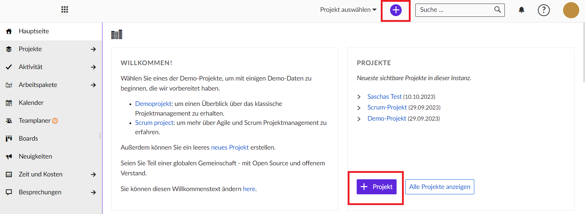
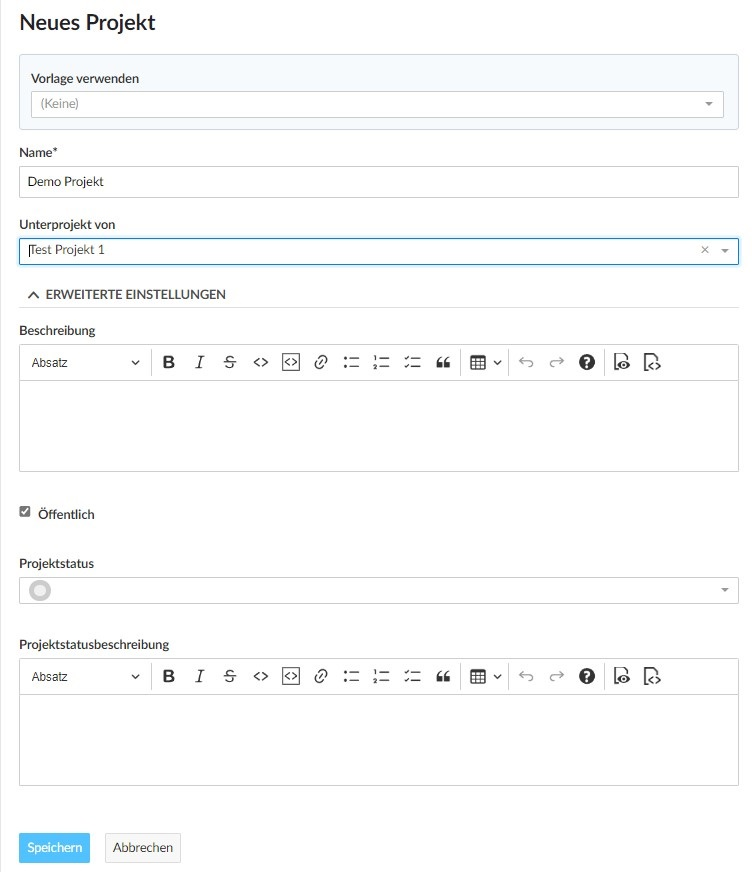
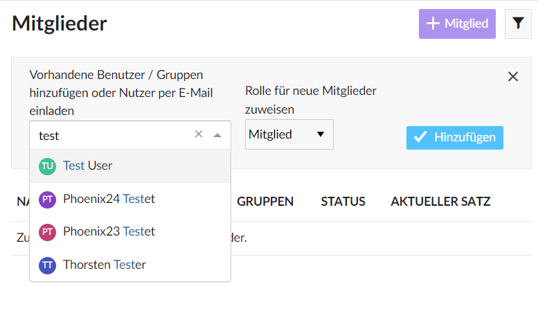
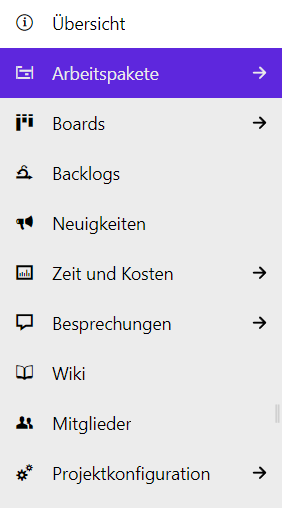
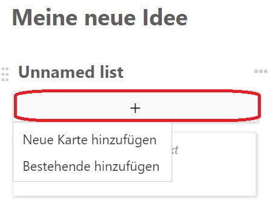
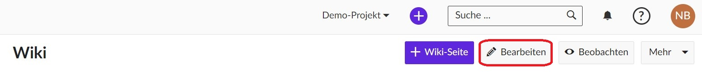
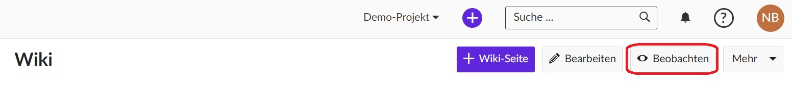
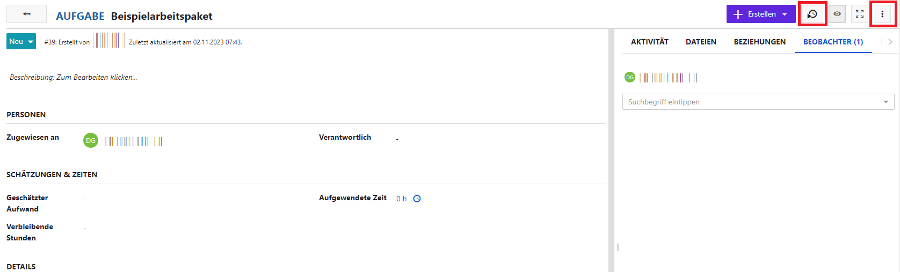
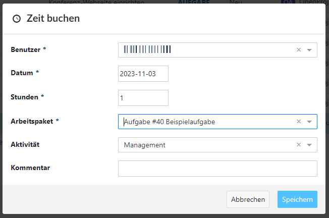
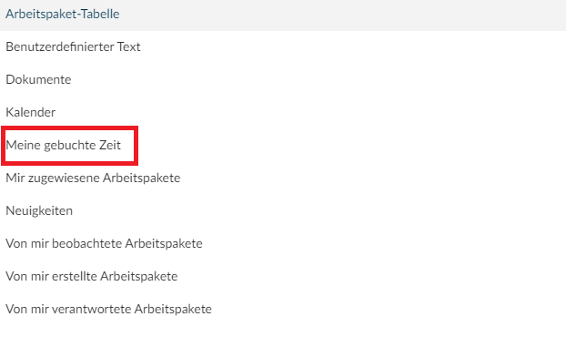

Um mit **Projekte** zu beginnen, gibt es ein paar einfache Schritte zu befolgen:

1. Neues Projekt erstellen

1. Teammitglieder zur Zusammenarbeit einladen

1. Arbeitspakete erstellen

1. Einrichten eines Projektplans

## Self Service

### Meine Seite

#### Überblick

Ihr persönliches Dashboard **Meine Seite** zeigt Ihnen alle wichtigen Informationen zu Ihren Projekten an. Sie sehen zum Beispiel Nachrichten, Ihre Arbeitspakete, gebuchte Zeiten oder einen Kalender. Selbstverständlich kann Meine Seite nach Ihren Bedürfnissen konfiguriert werden.

Gehen Sie rechts oben zu Ihrem Profilbild bzw. Namenskürzel und öffnen Sie das Dropdown-Menü mit einem Klick. Wählen Sie die erste Option **Meine Seite** um Ihr Dashboard zu öffnen. In der Standardeinstellung sehen Sie hier zunächst zwei projektübergreifende Listen aller **Arbeitspakete, die Ihnen zugewiesen wurden** und **Arbeitspakete, die von Ihnen erstellt wurden**.

#### Widgets hinzufügen

Fügen Sie ein Widget zu **Meine Seite** hinzu, indem Sie auf das **Pluszeichen (+)** oben rechts auf der Seite klicken. Nun werden auf Ihrer Seite mehrere Pluszeichen sichtbar. Dies sind die Stellen, an denen Sie neue Widgets hinzufügen können. Entscheiden Sie sich für den gewünschten Ort und klicken Sie auf das Pluszeichen. Ein neues Dialogfenster öffnet sich und Sie können aus der Liste der Widgets das bzw. die gewünschten aussuchen. Durch einen Klick auf den Titel des Widgets wird dieses direkt eingefügt. Zur Auswahl stehen:

- Arbeitspaket-Tabelle
- Benutzerdefinierter Text
- Dokumente
- Kalender
- Meine gebuchte Zeit
- Mir zugewiesene Arbeitspakete
- Neuigkeiten
- Von mir beobachtete Arbeitspakete
- Von mir erstellte Arbeitspakete
- Von mir verantwortete Arbeitspakete

#### Position und Größe der Widgets bearbeiten

**Position**

Ändern Sie die Position eines Widgets auf dem Dashboard mit der Drag &amp; Drop-Funktion. Klicken Sie auf die **Punkte neben dem Titel des Widgets**. Der Mauszeiger verwandelt sich zu einem Anfasser (Hand). Ziehen Sie das Widget nun zur gewünschten Stelle.

**Größe**

Wenn Sie auf die Punkte in der **unteren rechten Ecke eines Widgets** klicken, verwandelt sich der Mauszeiger in einen Doppelpfeil. So können Sie die Größe des Widgets ändern, indem Sie das Widget mit der Maus entsprechend ziehen.

#### Konfigurieren Sie die Ansicht eines Widgets (für Arbeitspaket-Tabellen)

Optimieren Sie die Ansicht eines Arbeitspakets in den Widgets auf **Meine Seite** so, dass nur die von Ihnen benötigten Informationen angezeigt sind. Klicken Sie in einem Arbeitspaket-Widget auf das Drei-Punkte-Menü oben rechts und wählen aus dem Dropdown **Ansicht konfigurieren**. Im nächsten Fenster wählen Sie die Kriterien für Ihre Arbeitspakete aus.

#### Entfernen der Widgets

**Entfernen** Sie ein Widget von **Meine Seite**, indem Sie auf das **Drei-Punkte-Menü** in der oberen rechten Ecke klicken und aus dem Dropdown **Widget entfernen** wählen.

#### Zeit-Widget

Sie können auch ganz bequem Ihre Zeiten auf **Meine Seite** eintragen. Fügen Sie dazu das Widget **Meine gebuchte Zeit** hinzu. In diesem Widget können Sie direkt neue Zeiteinträge erstellen, indem Sie auf den Tag klicken, die Zeiten per Drag&amp;Drop auf ein anderes Datum ziehen und die Zeiten bearbeiten oder löschen.

### Meine Aktivität

Sie gelangen zu einer Übersicht Ihrer Aktivitäten, indem Sie rechts oben auf Ihr Profilbild bzw Ihr Namenskürzel navigieren und dort **Meine Aktivität** aus dem Dropdown auswählen. Sie sehen nun alle Ihre aktuellen Aktionen und Projekte, an denen Sie beteiligt sind.

In der Regel sehen Sie zwei Listen:

- **Projekte** zeigen alle Projekte, in denen Sie Mitglied sind.
- **Aktivität** zeigt alle Ihre Aktivitäten an, die in Projekte aufgezeichnet werden.  

**Hinweis:** Bitte beachten Sie, dass nur Aktivitäten von Projekten angezeigt werden, die das Modul **Aktivität** aktiviert haben. Dieses können Sie in den Projektkonfigurationen unter Module vornehmen.

### Mein Konto

Sie finden unter **Mein Konto** Einstellungen zu Ihrem Account, indem Sie in der rechten oberen Ecke auf Ihr Profilbild navigieren und dort Mein Konto aus dem **Dropdown-Menü** auswählen. Hier sehen Sie nun folgende Unterpunkte:

- **Profil**
- **Einstellungen**
- **Zwei-Faktor-Authentifizierung**
- **Zugriffstokens**
- **Benachrichtigungseinstellungen**
- **E-Mail-Erinnerungen**
- **Profilfoto**

#### Profil

Sie haben die Möglichkeit Informationen zu Ihrem Profil hinzuzufügen. In den Zeilen **Vorname** und **Nachname** sind diese vorausgefüllt und können nicht geändert werden. In der Zeile **E-Mail** können Sie ihre E-Mail-Adresse einfügen oder ändern. Außerdem können Sie je nach Bedarf ein Häkchen bei **E-Mail-Adresse nicht anzeigen** setzen. Klicken Sie auf **Speichern**, um Ihre Profildaten zu speichern.

#### Einstellungen

Ändern Sie unter dem Punkt **Sprache** mittels des Dropdown-Menüs die Sprache Ihrer Oberfläche. Hier können Sie aus verschiedenen Sprachen auswählen. Außerdem können Sie Ihre **Zeitzone** ändern. Es stehen Ihnen auch hier im Dropdown-Menü verschiedene Zeitzonen zur Verfügung. Sie können Ihren **Modus** ändern, indem Sie zwischen **Hell** und **Hell (hoher Kontrast)** entscheiden können. Unter dem Punkt **Kommentare anzeigen** können Sie **Neueste zuerst** oder **Älteste zuerst** wählen. Je nach Bedarf können Sie ein Häkchen bei **Beim Verlassen einer Arbeitspaket-Seite mit ungespeichertem Text warnen** und **Benachrichtigungen erfolgreicher Aktionen automatisch ausblenden** setzen.

Für die angezeigte Farbe der Aufgaben haben Sie unter **BACKLOGS** die Möglichkeit eine Farbe in Form eines Hex-Codes anzugeben und für Ihre Ansicht können Sie das Häkchen bei **Zeige Versionen eingeklappt** aktivieren.

#### Zwei-Faktor-Authentifizierung

Richten Sie für Ihren Account die **Zwei-Faktor-Authentifizierung** ein, indem Sie entweder oben rechts auf die Schaltfläche **+2FA-Gerät** oder unter dem Punkt **2FA-Geräte** auf das **Plus(+)** klicken. Wenn Sie auf auf eine der beiden Schaltflächen geklickt haben, befinden Sie sich auf der Seite mit der Überschrift **Neues 2FA-Gerät hinzufügen** . Dort können Sie ein neues Gerät registrieren und sich ein Passwort erstellen, welches von Zeit und Zeit geändert werden muss. Außerdem können Sie **2FA Backup-Codes** erstellen, indem Sie auf **2FA Backup-Codes generieren** klicken.

#### Zugriffstokens

Generieren Sie einen Zugriffstoken, um Drittanbieter-Anwendungen mit **Projekte** zu verknüpfen. Um ein neues Token zu erstellen, klicken Sie auf **+API-Token**. Sie können außerdem für iCALENDAR, OAUTH, RSS und den DATEISPEICHER einen Token erstellen. Hierbei wird jeweils externen Benutzern dieser Anwendungen einen Zugriff auf Ihre Daten gewährt.

#### Sitzungsverwaltung

Sie können eine Liste der Geräte einsehen, mit denen Sie sich mit Ihrem Konto angemeldet haben. Widerrufen Sie ggfl. Anmeldungen, die nicht von Ihnen getätigt wurden. Klicken Sie dafür am Zeilenende der jeweiligen Sitzungen auf das **Mülltonnen-Symbol**, um diese zu entfernen.

#### Benachrichtigungseinstellungen

Nehmen Sie Einstellungen zu Ihren Benachrichtigungen vor. Sie können jeweils Häkchen aktivieren, um Benachrichtigungen zu Arbeitspaketen und Projekten zu erhalten, an denen Sie beteiligt oder nicht beteiligt sind.

Außerdem können Sie Benachrichtigungseinstellungen für ein bestimmtes Projekt hinzufügen, indem Sie auf **+Einstellung für Projekt hinzufügen** klicken. Dort können Sie in dem Textfeld **Bitte auswählen** den Titel des Projekts eingeben und projektspezifische Benachrichtigungen vornehmen. Klicken Sie anschließend auf **Speichern**, um die Einstellungen beizubehalten.

#### E-Mail-Erinnerungen

Unter E-Mail-Erinnerungen können Sie einstellen, ob und welche Erinnerungs-E-Mails Sie bekommen möchten. Sie können ein Häckchen setzen, dass Sie eine E-Mail erhalten wollen, wenn Sie jemand erwähnt. Sie können außerdem entscheiden, wann Sie diese E-Mails erhalten möchten und wann nicht. Wenn Sie bei **Tägliche E-Mail-Erinnerungen aktivieren** den Haken setzen, bekommen Sie täglich E-Mail-Benachrichtigungen. Geben Sie bitte die gewünschte Zeit für die E-Mail-Benachrichtigung an.

Sie können auch Tage festlegen, an denen Sie E-Mails bekommen möchten bzw. keine E-Mails bekommen möchten. Aktivieren Sie dafür die entsprechenden Wochentage. Wenn Sie tägliche E-Mail-Erinnerungen vorübergehend pausieren möchten, setzen Sie bitte dort das Häkchen.

Einstellungen für E-Mail-Benachrichtigungen anderer Objekte z.B. wenn Neuigkeiten, Kommentare, Dokumente, Nachrichten im Forum, Wiki-Seiten oder Mitgliedschaften hinzugefügt werden, können Sie ebenfalls vorgenommen werden.

#### Profilfoto

Sie haben unter **Profilfoto** einen voreingestellten Gravatar. Sie haben aber die Möglichkeit ihren Gravatar für Ihre E-Mail-Adresse zu ändern. Klicken Sie dafür auf den folgenden Link: [gravatar.com](https://gravatar.com).

Sollten Sie lieber ein selbsterstelltes Profilbild einfügen wollen, können Sie auf die Schaltfläche **Datei auswählen** klicken und aus Ihrem Datenspeicher ein Foto von Ihnen auswählen und dieses hochladen. Klicken Sie anschließend auf **Aktualisieren**, um das Foto zu speichern.

## Abmelden

Nachdem Sie sich wie unter [An- und Abmelden](erste-schritte) beschrieben angemeldet haben, sind die automatisch auch im Modul **Projekte** angemeldet. Um sich von diesem Modul abzumelden, klicken Sie rechts oben auf ihr Profil und wählen Sie die Option **Abmelden.**

## Projekte-Modul öffnen

Die **Projektübersicht** öffnen Sie über Ihre persönliche Startseite. Klicken Sie auf den Module-Button am linken oberen Bildschirmrand. Der nun offene Reiter zeigt eine Übersicht der verschiedenen Module. Klicken Sie auf **Projekte**.

### Modul-Übersicht

### Projekt-Übersicht

## Der Projektmanagement-Lebenszyklus

Das Modul Projekte bietet alle wichtigen Funktionen zur Unterstützung von Projektteams während des gesamten Projektmanagement-Zyklus.

Das Modul Projekte ermöglicht einen reibungslosen Ablauf der Projektarbeit und -kommunikation. Von der Idee bis zum Abschluss und der Dokumentation können Sie alles in Projekte erledigen.

| Projektphase                    | Dokumentationen für                                                                                                                                                                                                                  |
| ------------------------------- | ------------------------------------------------------------------------------------------------------------------------------------------------------------------------------------------------------------------------------------ |
| Projektkonzept und -initiierung | Sammeln von Ideen. Festlegung des Projektumfangs und der zu erbringenden Leistungen. Darunter: Projekt einrichten, erste Ideen dokumentieren, Projektbeschreibung, Mitglieder einladen.                                              |
| Projektdefinition und -planung  | Erstellen einer Projektübersicht mit detaillierten Informationen. Anlegen einer Roadmap oder einen Projektplans                                                                                                                      |
| Projektstart oder -durchführung | Verwalten Sie alle Projektaktivitäten wie Aufgaben, Ergebnisse, Risiken, Funktionen, Bugs oder Änderungswünsche. Verwenden Sie agile Boards mit Ihren Teams, dokumentieren Sie Meetings oder teilen Sie Neuigkeiten.                 |
| Projektleistung und -kontrolle  | Erstellen und verwalten eines Projektbudgets. Verfolgung und Bewertung von Zeit und Kosten. Benutzerdefinierte Berichte für einen genauen, aktuellen Einblick in die Projektleistung und die zugewiesenen Ressourcen.                |
| Projektabschluss                | Dokumentieren Sie Projektergebnisse, Gelerntes, bewährte Praktiken und fassen Sie die wichtigsten Ergebnisse eines Projekts einfach zusammen. Archivieren Sie Projekte, um später auf Inhalte und Gelerntes zurückgreifen zu können. |

### Projektkonzept und Projektinitiierung

| Funktionen                 | Dokumentation für                                                          |
| -------------------------- | -------------------------------------------------------------------------- |
| Erstellen eines Projekts   | Erstellen und Einrichten eines neuen Projekts                              |
| Projektstruktur einrichten | Erstellen Sie eine Hierarchie, um Ihre Arbeit in Projekte zu strukturieren |
| Projekteinstellungen       | Erstellen von ersten Ideen, Aufgaben und Meilensteinen                     |
| Mitglieder hinzufügen      | Teameinladungen verschicken, um gemeinsam an Projekten zu arbeiten         |

#### Projekt erstellen

Sie können ein neues Projekt erstellen, indem Sie auf die violette Schaltfläche namens **+Projekt** klicken. Diese befindet sich direkt auf dem Startbildschirm des Systems im Bereich **Projekte**.

Sie können auch ein neues Projekt erstellen, indem Sie auf das violette **Pluszeichen (+)** in der oberen Menüleiste klicken.

Ein Menü wird geöffnet. Klicken Sie dann auf **+Projekt**.

Eine neue Seite öffnet sich.

Bei der Erstellung eines neuen Projekts können Sie ein von Grund auf neues Projekt erstellen oder ein Projekt aus einer **Vorlage** erstellen. Im letzteren Fall wählen Sie die Vorlage aus dem Dropdown-Menü aus.

Geben Sie Ihrem Projekt einen Namen.

Sie können auswählen, ob Ihr Projekt ein **Unterprojekt** eines anderen Projekts sein soll. In diesem Fall wählen Sie das Projekt aus dem Dropdown-Menü aus.

Unter **Erweiterte Einstellungen** haben Sie die Möglichkeit, Ihrem Projekt eine Beschreibung hinzuzufügen. Des Weiteren können Sie bestimmen, ob es öffentlich zugänglich ist und welchen Status es hat, sowie eine Beschreibung des Status des Projekts eingeben.

Wenn Sie Ihre Projekteinstellungen abgeschlossen haben, klicken Sie auf die hellviolette Schaltfläche **Speichern**.

Wenn Sie erfolgreich ein neues Projekt erstellt haben, werden Sie automatisch zur Projektübersichtsseite weitergeleitet.

**Hinweis**: Wenn Sie ein neues Projekt erstellen, werden Sie standardmäßig als Projektadministrator festgelegt, unabhängig davon, ob Sie ein Projekt kopiert, eine Vorlage verwendet oder ein Projekt von Grund auf neu erstellt haben.

#### Einrichten einer Projektstruktur

Projekte haben eine klare Struktur, diese umfasst Unterprojekte und übergeordnete Projekte. Ein Projekt kann zum Beispiel Organisationseinheiten eines Unternehmens abbilden, um die Vorgänge der verschiendenen Organisationseinheiten von einander zu trennen. Zum Beispiel:

- **Unternehmen (übergeordnetes Projekt)**
  - Marketing (Unterprojekt)
  - Vertrieb
  - HR
  - IT
  - ...

Die Projekte können auch für Teams verwendet werden, die an einem gemeinsamen Thema arbeiten. Zum Beispiel:

- **Einführung eines neuen Produkts**
  - Design
  - Entwicklung
  - ...

Ein Projekt kann sich auch auf einzelne Produkte oder Kunden beziehen. Zum Beispiel:

- **Produkt A**
  - Kunde A
  - Kunde B
  - Kunde C

Projekte werden in diesem Modul verwendet, um die relevanten Module und Plugins zu strukturieren. Der Screenshot unten zeigt ein Entwicklungsprojekt.

**Hinweis**: Sie müssen Mitglied eines Projekts sein, um das Projekt zu sehen und in einem Projekt arbeiten zu können.

#### Projekt-Einstellungen

In den erweiterten Einstellungen der Projektkonfiguration haben Sie die Möglichkeit, zusätzliche Konfigurationsoptionen festzulegen. Um zur Projektkonfiguration zu gelangen, gehen Sie wie folgt vor: Wählen Sie zunächst das gewünschte Projekt aus, klicken Sie dann auf **Projektkonfiguration** und anschließend auf **Informationen**.

Dort können Sie festlegen, ob dieses Projekt als übergeordnetes Projekt betrachtet werden soll, indem Sie die Option **Unterprojekt von** aktivieren. Auf diese Weise können Sie die Struktur Ihrer Projekthierarchie nach Ihren Wünschen anpassen.

Es ist wichtig, eine ausführliche Beschreibung für Ihr Projekt bereitzustellen, und Sie können auch die Standard-Projektkennung einsehen, die in der URL angezeigt wird.

Bitte beachten Sie, dass das Ändern der Projektkennung eines bereits bearbeiteten Projekts erhebliche Auswirkungen auf die Zusammenarbeit haben kann und daher nicht empfohlen wird. Zum Beispiel kann es dazu führen, dass Repositories nicht ordnungsgemäß geladen werden und Deep Links nicht mehr funktionieren, da sich die Projekt-URL ändert, wenn die Projektkennung geändert wird.

Falls gewünscht, können Sie Ihr Projekt auch auf **öffentlich** setzen, was bedeutet, dass darauf ohne Anmeldung bei Projekten zugegriffen werden kann. Vergessen Sie nicht, Ihre Änderungen durch Klicken auf den violetten **Speichern** Button zu sichern. Sie können auch die Autovervollständigung verwenden, um die Projektattribute schnell und einfach auszufüllen.

##### Projekthierarchie ändern

Um die Hierarchie des Projekts zu ändern, navigieren Sie zu den **Projektkonfiguration**, genauer gesagt zu **Informationen**, und passen Sie die Angaben im **Unterprojekt von** Feld an.

Anschließend betätigen Sie den violetten **Speichern** Button, um Ihre Anpassungen zu sichern.

##### Ein Projekt auf öffentlich setzen

Möchten Sie Ihr Projekt öffentlich zugänglich machen, markieren Sie einfach das Kontrollkästchen neben **Öffentlich** in den **Projektkonfiguration** unter Informationen.

Die Einstellung **Öffentlich** ermöglicht allen Benutzern innerhalb Ihrer Projekte-Instanz den Zugriff auf das Projekt.

(Wenn Ihre Instanz **ohne Authentifizierung zugänglich** ist, wird durch diese Option das Projekt auch für die breite Öffentlichkeit sichtbar, unabhängig von registrierten Benutzerinnen und Benutzern.)

##### Projekt kopieren

Um ein bereits existierendes Projekt zu duplizieren, navigieren Sie zu den **Projektkonfiguration** und klicken Sie oben rechts in den **Projektkonfiguration** auf die Option **Kopieren**.

Benennen Sie das neue Projekt, bestimmen Sie, welche Module und Konfigurationseinstellungen Sie duplizieren möchten, und entscheiden Sie, ob Sie die Projektmitglieder per E-Mail über den Kopiervorgang informieren möchten oder nicht. Zudem haben Sie die Möglichkeit, vorhandene Boards (außer dem Subprojekt-Board) sowie die **Projektübersicht** in Ihr neues Projekt zu übernehmen.

**Hinweis**: dass **Budgets** nicht kopiert werden können. Daher sollten Sie diese zuvor aus der Arbeitspaket-Tabelle entfernen. Alternativ können Sie die Budgets auch im Budget-Modul löschen, was gleichzeitig deren Entfernung aus den Arbeitspaketen bewirkt.

Für weitere Anpassungen stehen Ihnen die **erweiterten Einstellungen** zur Verfügung. Hier haben Sie die Möglichkeit, verschiedene Aspekte festzulegen, darunter die URL (Kennung) des Projekts, seine Sichtbarkeit und seinen Status. Zusätzlich können Sie Werte für benutzerdefinierte Felder definieren (im Screenshot nicht dargestellt).

##### Projekt archivieren

Wenn Sie ein Projekt archivieren möchten, begeben Sie sich zu den **Projektkonfiguration** und betätigen Sie **Archivieren**.

**Hinweis:** Diese Option steht immer für Mitglieder der Instanz- und Projektadministration zur Verfügung. Unter Umständen kann sie auch für bestimmte Rollen aktiviert werden, indem die Berechtigung zur Projektarchivierung über die **Einstellungen für Rollen und Berechtigungen** in den Administrations-Einstellungen aktiviert wird.

Nachdem dies getan ist, wird das Projekt nicht mehr in der Liste der auswählbaren Projekte angezeigt. Es bleibt jedoch weiterhin im **Alle Projekte anzeigen** Dashboard verfügbar, sofern Sie den **Aktiv** Filter auf **aus** setzen, indem Sie den Schieberegler nach links verschieben. Hier haben Sie die Möglichkeit, die Archivierung rückgängig zu machen, indem Sie auf die drei Punkte am rechten Ende einer Zeile klicken und **Entarchivieren** auswählen.

##### Ein Projekt löschen

Falls Sie ein Projekt löschen möchten, begeben Sie sich bitte zur **Projektkonfiguration** und betätigen Sie **Löschen**. Dies befindet sich oben rechts auf der Seite.

Es besteht auch die Möglichkeit, ein Projekt über die Projektübersicht zu entfernen.

**Hinweis**: Das Löschen von Projekten ist ausschließlich Systemadministratoren vorbehalten.

#### Mitglieder hinzufügen

Zur Ansicht und Bearbeitung eines Projekts müssen Sie Mitglied eines Projekts sein. Aus diesem Grund ist das Hinzufügen von Teammitgliedern zu einem Projekt erforderlich. Ein **Mitglied** wird als Projektmitglied innerhalb eines Projekts definiert. Projektmitglieder können im Modul **Mitglieder** des Projektmenüs hinzugefügt werden.

**Hinweis**: Sind Sie kein Projektmitglied, erscheint das Projekt nicht in der Projektauswahl oder in der Projektliste.

##### Mitglieder ansehen

Wählen Sie im Projektmenü das Modul **Mitglieder**, um eine Liste aller **Projektmitglieder** und ihrer **Rollen** im Projekt anzuzeigen.

Einen Überblick über die aktuellen Mitglieder dieses Projekts finden Sie in der Mitgliederliste oder im Mitglieder-Widget auf der Übersichtsseite.

##### Bestehende Konten hinzufügen

Wählen Sie zuerst das Projekt aus, zu dem Sie Mitglieder hinzufügen möchten, um bestehende Konten oder Gruppen zu einem Projekt hinzuzufügen. Dies können Sie tun, indem Sie das Modul **Mitglieder** auf der linken Seite des Projektmenüs auswählen. Eine andere Möglichkeit ist, auf **+Mitglied** im Mitglieder-Widget auf der Projektübersichtsseite zu klicken.

Klicken Sie auf die violette Schaltfläche **+Mitglied** oben rechts. Tippen Sie den Namen der Person oder der Gruppe ein, die Sie zum Projekt hinzufügen möchten. Es können mehrere Mitglieder gleichzeitig ausgewählt und hinzugefügt werden. Den neuen Mitgliedern eine Rolle zuweisen (**Mitglied**, **Leser** oder **Projekt-Admin**) und auf die hellviolette Schaltfläche **Hinzufügen** klicken.

**Hinweis**: Klicken Sie auf den Namen des neuen Mitglieds oder drücken Sie die Eingabetaste, bevor Sie auf die Schaltfläche **Hinzufügen** klicken.

##### Neue Mitglieder einladen

Sie können auch Mitglieder zu einem Projekt einladen, die noch kein Konto haben. Dafür gibt es drei Möglichkeiten:

- Über das Mitgliedermodul einladen
- Aus der Kopfleiste einladen
- Mitglieder aus einem Arbeitspaket einladen

###### Einladung von Personen im Mitglieder-Modul

Folgen Sie den Schritten wie im **Bereich Bestehenden Konten hinzufügen** (s. o.). Anstatt eines beliebigen Namens geben Sie die E-Mail-Adresse des neuen Mitglieds ein. Findet Projekte kein bestehendes Konto, wird automatisch die Information **Einladung an... senden** gesetzt. Drücken Sie die **Eingabetaste** oder wählen Sie den Text **Einladung an... senden**. Weisen Sie dem neuen Mitglied eine Rolle zu und klicken Sie auf die violette Schaltfläche **Hinzufügen**.

Der Benutzer wird per E-Mail eine Einladung mit einem **Link** erhalten, um einen Account für Projekte zu erstellen.

###### Einladung von Personen aus der Kopfleiste

In der immer vorhandenen Kopfzeile finden Sie eine violettes Plus-Symbol. Diese Schaltfläche ermöglicht es Ihnen, Projekte und Arbeitspakete zu erstellen sowie Benutzer einzuladen, wo auch immer Sie sich in der Anwendung befinden.

Sobald Sie auf **Nutzer einladen** geklickt haben, erscheint ein Pop-up-Fenster, in dem Sie einstellen können, zu welchem Projekt Sie die neuen Mitglieder hinzufügen und welche Rollen sie erhalten. Klicken Sie auf **Weiter**, wenn Sie alle Daten eingegeben haben. Bevor die Einladung versendet wird, sehen Sie die Angaben zur Kontrolle. Wenn alles in Ordnung ist, klicken Sie auf **Einladung senden**. Eine Bestätigung wird angezeigt. Klicken Sie auf **Fortfahren**. Sie werden sofort zur Mitgliederliste weitergeleitet.

**Achtung**: Wenn Sie das Popup-Fenster im letzten Schritt schließen, werden die Daten **nicht** gespeichert und die Einladung wird **nicht** versendet.

###### Mitglieder aus einem Arbeitspaket einladen

Sie können Mitglieder einladen, indem Sie in der Arbeitspaket-Tabelle arbeiten. Durch Klicken auf die Spalte **Zugewiesen an** öffnet sich ein Dropdown-Menü mit der Option **Einladen**. Damit können Sie wie im Abschnitt [Einladung von Personen aus der Kopfleiste](mitglieder-hinzufuegen.md#c5415) (s. o.) vorgehen und z. B. eine Person einladen, die noch keinen Zugang zu Projekte hat. Das Gleiche gilt für die Buchhaltung oder benutzerdefinierte Felder für Ihr Projekt.

Sie können jetzt mit Ihrem Team in Projekte zusammenarbeiten. Neu eingeladene Personen werden mit einem Briefsymbol neben ihrem Namen angezeigt.

**Achtung**: Das Entfernen eines Mitglieds, das die Einladung noch nicht angenommen hat, aus einem Projekt führt zur Löschung des Kontos, die nicht rückgängig gemacht werden kann.

##### Verhalten von Gruppen als Projektmitglieder

Gruppen haben die folgenden Auswirkungen auf eine Projektmitgliederliste und verhalten sich etwas anders als einzelne Konten:

- Der Gruppenname wird in der Projektmitgliederliste in einer eigenen Zeile angezeigt
- Die Gruppenmitglieder können nicht einzeln aus der Mitgliederliste entfernt werden (kein Löschsymbol)
- Das Hinzufügen einer Gruppe, deren Mitglieder sich bereits in einer Projektmitgliedsliste befinden, fügt die Rolle der Gruppe zu deren Projektrollen hinzu
- Ein Projektmitglied, das Mitglied einer Gruppe ist, kann einzeln weitere Rollen erhalten
- Die Gruppenrolle kann für einzelne Gruppenmitglieder nicht geändert werden

### Projektdefinition und -planung

Erstellen Sie eine Projektübersicht mit detaillierteren Informationen, richten Sie Ihren Projektplan ein, strukturieren Sie Ihre Arbeit, erstellen Sie eine Roadmap.

#### Übersicht der globalen Projekte

##### Übersicht der Projekte

Ihre Arbeit in dem Modul **Projekte** kann in mehreren Projekten organisiert werden, jedes mit einer bestimmten Anzahl von Mitgliedern und deren jeweiligen Rollen in diesem Projekt. Jedes Projekt wiederum kann individuell konfiguriert werden. In Bezug auf die aktivierten Funktionen werden Projekte auch als Module bezeichnet. Diese Unterscheidung zwischen den Projekten bietet Ihnen viel Flexibilität bei der Einrichtung Ihrer Arbeit und der Kontrolle darüber, was die Benutzerinnen und Benutzer in jedem einzelnen Projekt sehen und/oder bearbeiten dürfen.

Um mehr über die Erstellung und Verwaltung von Projekten zu erfahren, besuchen Sie bitte unseren separaten Abschnitt **Projekte verwalten**.

#### Strukturierung der Arbeit

Auf dieser Seite erhalten Sie eine Einführung in die **Arbeitspakete**. Im Folgenden wird erklärt, was ein **Arbeitspaket** ist und wie Sie **Arbeitspakete** erstellen und bearbeiten können.

**Was ist ein Arbeitspaket?**

Ein Arbeitspaket in Projekte kann im Grunde alles sein, was Sie in Ihren Projekten benötigen, um den Überblick zu behalten. Es kann z. B. eine Aufgabe, ein Meilenstein oder eine Projektphase sein. Diese verschiedenen **Arten von Arbeitspaketen** werden **Arbeitspaket-Typen** genannt.

**Erstellen eines Arbeitspakets**

Klicken Sie innerhalb des Moduls Arbeitspakete auf die **violette Schaltfläche + Erstellen** , um ein neues Arbeitspaket zu erstellen. Wählen Sie im Dropdown-Menü aus, welche Art von Arbeitspaket Sie erstellen möchten; z. B. eine Aufgabe oder einen Meilenstein. Um ein neues Arbeitspaket zu erstellen, können Sie auch den **violett gedruckten Schriftzug + Neues Arbeitspaket erstellen** wählen.

Es öffnet sich eine geteilte Bildschirmansicht mit dem Formular für **neue Arbeitspakete** auf der rechten Seite und der Tabelle mit den bereits vorhandenen Arbeitspaketen auf der linken Seite.

In das leere Formular auf der rechten Seite können Sie alle relevanten Informationen für dieses Arbeitspaket eingeben, z. B. den Betreff und eine Beschreibung, ein Fälligkeitsdatum oder ein beliebiges anderes Feld. Die Felder, die Sie ausfüllen können, werden Arbeitspaketattribute genannt. Außerdem können Sie Anhänge mit Kopieren und Einfügen oder mit Drag &amp; Drop hinzufügen.

Klicken Sie auf die violette Schaltfläche **Speichern**, um das Arbeitspaket zu erstellen.

Das Arbeitspaket öffnet sich anschließend in der Tabellenansicht:

Eine weitere Möglichkeit, ein Arbeitspaket zu erstellen, ist die Erstellung über das **Headermenü**. Die aktivierten **Arbeitspakettypen** werden angezeigt, und Sie können den entsprechenden Arbeitspakettyp für die Erstellung auswählen.

Sobald Sie auf den Typ des Arbeitspakets klicken, den Sie erstellen möchten, öffnet sich die Detailansicht des Arbeitspakets. Wählen Sie das Projekt aus, für das Sie das Arbeitspaket erstellen möchten.

Dann folgen Sie den gleichen Schritten wie oben, um die Attribute Ihres Arbeitspakets auszufüllen und es zu speichern.

##### Arbeitspakete öffnen und bearbeiten

Um ein vorhandenes Arbeitspaket aus der Tabelle zu öffnen und zu bearbeiten, wählen Sie das Arbeitspaket in der Tabelle aus und klicken Sie auf das Symbol **Detailansicht öffnen**, um die geteilte Bildschirmansicht zu öffnen. Sie können auch auf den Info-Button im oberen Bereich der Tabellenansicht klicken. Ebenso ist es möglich die Detailansicht per Doppelklick auf das Arbeitspaket zu öffnen.

Wenn Sie in die Liste auf der linken Seite auf ein Arbeitspaket klicken, sehen Sie die entsprechenden Details auf der rechten Seite des geteilten Bildschirms.

Hier kann in ein beliebiges Feld geklickt werden, um Änderungen vorzunehmen. Sie können z. B. den Text der Beschreibung anpassen.

Anschließend klicken Sie auf den Haken unter dem Feld, um die Änderungen zu speichern.

Um den **Status** zu ändern, klicken Sie in der Detailansicht auf den aktuellen Status und wählen Sie den neuen Status des Arbeitspakets im Dropdown-Menü aus.

##### Aktivität in Arbeitspaketen

Um über alle Änderungen eines Arbeitspakets auf dem Laufenden zu bleiben öffnen Sie den **Aktivitäten-Tab** oben in der Detaillansicht.

Dort können Sie alle Änderungen ansehen, die an dem Paket vorgenommen wurden. Sie können am Ende der **Aktivitätenliste** kommentieren und andere Kolleginnen und Kollegen per "@" markieren.

Andere Kolleginnen und Kollegen können per "@" vor dem Nutzernamen markiert werden, um Sie über Änderungen zu informieren. Die getaggten Personen erhalten die Meldung im Projekte-Modul.

#### Roadmap-Planung - Einführung in Gantt-Diagramme

Hier erhalten Sie erste Einblicke in **Gantt-Diagramme**. Sie erfahren wie es Ihnen möglich ist, über **Gantt-Diagramme** einen Projektplan zu ertellen und zu organisieren.

**Gantt-Diagramme** sind im Modul Projekte als eine Art Balkendiagramm definiert, das alle Aufgaben eines Projekts darstellt. Die Aufgaben werden vertikal aufgelistet, die horizontale Achse befasst sich mit der Zeitangabe. Die Länge der Balken ist an die Dauer der jeweiligen Aufgabe angepasst.

##### Was ist ein Gantt-Diagramm?

Mittels **Gantt-Diagrammen** können Sie einen Projektplan erstellen, diesen verwalten und die Informationen mit Ihrem Team teilen. Sie können die für die Umsetzung des Projekts notwendige Arbeitspaketplanung und die erforderlichen Schritte zur Fertigstellung Ihres Projekts visualisieren. Nehmen Sie die Rolle der Projektleitung ein, werden Sie über Verzögerungen informiert und können Maßnahmen einleiten.

Das dynamsiche **Gantt-Diagramm** zeigt die Phasen, Aufgaben und Meilensteine Ihres Projekts, sowie die Beziehungen zwischen ihnen an. Die Elemente **Phase** und **Aufgaben** haben jeweil ein Start- und Enddatum, dadurch sind Sie immer über den akutellen Stand Ihres Projekts informiert. Der **Meilenstein** ist als fester Zeitpunkt definiert und hat demnach das selbe Start- und Enddatum.

##### Aktivieren der Gantt-Diagramm-Ansicht

Um die **Gantt-Diagramm-Ansicht** in Projekte zu öffnen, muss das Modul **Arbeitspakte** in den Projekteinstellungen aktiviert sein. Navigieren Sie in Ihrem Projektmenü zum Modul **Arbeitspakete**. Wählen Sie **Gantt-Diagramm-Ansicht** in der **Arbeitspaket-Tabelle** über die **Gantt-Schaltfläche** in der rechten oberen Ecke aus.

Das **Gantt-Diagramm** das sich darauffolgend öffnet, gibt Ihnen alle Arbeitspakettypen aus. Es spielt keine Rolle obe es sich dabei um Phasen, Meilensteine odere andere Arbeitspakettypen handelt, es werden alle ausgegeben.

Es zeigt Ihnen die Abhängigkeiten zwischen Arbeitspaketen sowie zusätzliche Informationen an.

##### Erstellen eines Projektplans

Zum erstellen eines **Projekplans** öffnen Sie die **Arbeitspaket-Tabelle** und wählen Sie **Gantt-Diagramm** aus. Über **Erstelle neues Arbeitspaket** ist es Ihnen möglich, ein neues Arbeitspaket zu erstellen. Sie können Attribute des Arbeitspakets gleich in der **Arbeitspaket-Tabelle** pflegen.

Wurde Ihr **Arbeitspaket** erstellt, ist es Ihnen möglich auf die entsprechende Zeile des Arbeitspakets zu klicken und dieses im **Gantt-Diagramm** zu erstellen und zu bearbeiten.

Im Diagramm können Sie den Zeitraum auswählen in welchem das Arbeitspaket bearbeitet werden soll. Zusätzlich ist es Ihnen möglich das Paket per Drag and Drop zu verschieben.

##### Projektplan bearbeiten

Es ist Ihnen möglich den Projektplan zu bearbeiten indem Sie in der **Arbeitspakete-Ansicht** Attribute wie Status oder Priorität ändern. Um Start- und / oder Enddatum eines Arbeitspaketes zu ändern, klicken Sie im **Gantt-Diagramm** auf das entsprechende Arbeitspaket und strecken oder verkürzen Sie die Zeitangabe.

Änderungen werden unter der **Aktivität** des Arbeitspakets ergänzt.

### Projektstart oder -durchführung

Verwalten Sie alle Projektaktivitäten der Arbeitspakete wie Aufgaben, Ergebnisse, Risiken, Funktionen, Bugs und Change-Requests. Verwenden Sie agile Boards mit Ihren Teams, dokumentieren Sie Besprechungen und teilen Sie Nachrichten.

#### Über das Modul Projekte

Projekte ist eine kostenfreie Open-Source-Software für klassisches und agiles Projektmanagement, die Ihr Team während eines gesamten Projektverlaufs unterstützt. Die Anwendung ist in mehr als 30 Sprachen verfügbar.

#### Die ersten Schritte

Bevor Sie mit **Projekte** beginnen, befolgen Sie bitte die folgenden Schritte:

1. Melden Sie sich mit Ihren Zugangsdaten an.
1. Legen Sie ein neues Projekt an.
1. Laden Sie Mitglieder ein, um gemeinsam an dem Projekt zu arbeiten.
1. Erstellen Sie neue Arbeitspakete, um die Aufgaben im Projekt zu strukturieren.
1. Richten Sie einen Projektplan ein, um die zeitliche Abfolge und Ressourcen für die Arbeitspakete zu planen.

#### Arbeitspakete erstellen

Arbeitspakete gehören immer zu einem Projekt. Daher müssen Sie zuerst ein Projekt auswählen oder erstellen. Anschließend, navigieren Sie zum Arbeitspakete-Modul in der Projektnavigation.

Es gibt zwei Möglichkeiten, neue Arbeitspakete anzulegen:

- **Aus der Arbeitspaket-Tabelle**: Diese Option bietet Ihnen die Möglichkeit schnell mehrere Arbeitspakete anzulegen.
- **Aus der Splitscreen-Ansicht**: Diese Option bietet Ihnen die Möglichkeit, detaillierte Informationen von Anfang an einzugeben.

##### Ein Arbeitspaket in der Tabellenansicht erstellen

Klicken Sie unterhalb der Tabelle auf die Schaltfläche **+Erstelle neues Arbeitspaket**, um neue Arbeitspakete direkt in der Zeile der Tabellenansicht zu erstellen.

Das neue Arbeitspaket wird in einer grünen Zeile angezeigt. Geben Sie das Thema des Arbeitspakets ein, ändern Sie die Eigenschaften wie Typ oder Status direkt in der Tabelle und drücken Sie die Eingabetaste, um die Änderungen zu speichern.

Klicken Sie auf die Nummer des Arbeitspakets, um die Informationen zu öffnen.

**Achtung**: Sobald Sie das Arbeitspaket erstellt haben, erhalten Sie eine Benachrichtigung, die schnell verschwindet, um die Einstellungen des neuen Arbeitspakets zu öffnen.

##### Ein Arbeitspaket in einem Splitscreen erstellen

Sie können ein Arbeitspaket in der geteilten Bildschirmansicht erstellen, um von Anfang an detaillierte Informationen in das Arbeitspaket einzugeben. Im Arbeitspaket-Modul klicken Sie auf die violette Schaltfläche **+Erstellen** und wählen Sie die Art des Arbeitspakets, das Sie erstellen möchten. Diese sind **Aufgabe**, **Meilenstein** oder **Phase**.

Die Eigenschaften des neuen Arbeitspakets werden in der geteilten Bildschirmansicht geöffnet. Geben Sie alle Informationen ein, z. B. Thema, Beschreibung, Personen, Schätzungen und Zeiten, Details und Kosten. Sie können auch Dateie anhängen.

Zum Abschluss, klicken Sie auf die Schaltfläche **Speichern**.

###### Emojis

**Emojis** können in allen Texteditoren eingefügt werden, auch in der Arbeitspaketbeschreibung. Geben Sie einen **Doppelpunkt** und einen **Buchstaben**, z. B. **:a** in den **Texteditor** ein und Sie erhalten eine Vorschlagsliste von Emojis, die Sie verwenden können.

###### Anhänge zu einem Arbeitspaket hinzufügen

Sie können Bilder direkt hinzufügen, z. B. durch kopieren und in die Beschreibung des Arbeitspakets einfügen. Sie können auch die Symbolleiste oberhalb der Arbeitspaketbeschreibung benutzen und auf das Symbol **Bild einfügen** klicken.

Sie können Dateien auch per **Drag &amp; Drop** im unteren Bereich des Arbeitspaketformulars hinzufügen.

Eine weitere Möglichkeit besteht darin, eine Datei aus einem Ordner auszuwählen und in das Arbeitspaket hochzuladen. In diesem Fall öffnet sich automatisch ein Fenster. Suchen Sie die Datei, wählen Sie sie aus und klicken Sie auf die Schaltfläche **Öffnen**.

**Hinweis**: Die Nextcloud-Integration kann auch verwendet werden, um Dateien in die Cloud hochzuladen oder bereits vorhandene Dateien und Ordner mit einem Arbeitspaket zu verknüpfen.

#### Boards

##### Boards für agiles Projektmanagement

Agile Boards sind wertvolle Werkzeuge für das agile Projektmanagement, das Methoden wie Scrum oder Kanban einsetzt. Diese Boards können in vielfältiger Weise genutzt werden, um alle wichtigen Aspekte Ihrer Projekte zu organisieren und im Blick zu behalten. Dazu gehören Aufgaben, Bugs, Informationen, Features in Entwicklung, Risiken, Ideen und vieles mehr.

Die Struktur der Agile Boards besteht aus einer Tabelle und den zugeordneten Karten. Innerhalb dieser Boards haben Sie die Wahl zwischen einem Basis-Board und verschiedenen Action-Boards.

##### Agile Boards

Die Boards sind eng mit allen anderen Funktionalitäten für das Projektmanagement in Projekte verknüpft, beispielsweise mit Arbeitspaketen oder Gantt-Diagrammen. Dies erleichtert es Teilnehmerinnen und Teilnehmern erheblich, die Boards in ihre täglichen Projektmanagement-Routinen zu integrieren und einen schnellen Überblick über wichtige Themen in ihrem Projekt zu erhalten.

##### Neues Board erstellen

Sie haben die Möglichkeit, in einem Projekt so viele Agile Boards zu erstellen, wie erforderlich, und diese nach Ihren Wünschen anzupassen. Ihr erster Schritt besteht darin, eine neue Board-Ansicht zu generieren.

Falls Sie dies noch nicht durchgeführt haben, aktivieren Sie bitte das **Board-Modul** in Ihrem Projekt. Bitte überprüfen Sie die Einstellungen im Bereich **Rollen und Berechtigungen** innerhalb der Systemverwaltung.

Klicken Sie anschließend auf die violette Schaltfläche **+Board,** um eine frische Board-Ansicht zu erstellen.

##### Basis-Board

Teilnehmerinnen und Teilnehmer können Listen nach ihren Vorlieben erstellen und diese individuell benennen. Darüber hinaus ist es möglich, Arbeitspakete in diesen Listen zu platzieren. Wichtig ist zu beachten, dass beim Verschieben von Arbeitspaketen zwischen den Listen **keine Veränderungen an den Arbeitspaketen selbst** vorgenommen werden. Dies ermöglicht es Ihnen, flexible Boards für verschiedenste Aktivitäten zu erstellen, die Sie verfolgen möchten, wie beispielsweise das Management von Ideen.

##### Geben Sie dem Board einen Titel

Wählen Sie einen informativen Namen für Ihr Board aus, um anderen Teammitgliedern deutlich zu machen, was Ihr Ziel ist.

##### Spalten in einem Board ergänzen

In Projekte sind **Spalten** vielseitig einsetzbar und können in der Regel einen **Status-Workflow, Zuweisungen**, eine **Version** oder **alles**, was Sie in Ihrem Projekt verfolgen möchten, repräsentieren. Sie haben die Freiheit, so viele Spalten zu einem Board hinzuzufügen, wie Sie benötigen.

**Spalten im Aktionsboard**: Die verfügbaren Spalten variieren je nach **Art des gewählten Boards**. Es ist wichtig zu beachten, dass beim Verschieben einer Karte zwischen den Spalten das entsprechende Attribut (z.B. der Status) automatisch aktualisiert wird.

**Spalten im Einfachen Board**: Hier haben Sie die Möglichkeit, jede Art von Spalte zu erstellen und diese nach Ihren individuellen Anforderungen zu benennen. Es ist jedoch wichtig zu bedenken, dass beim Verschieben von Karten zwischen den Spalten die Attribute nicht automatisch aktualisiert werden.

Um eine neue Spalte in Ihrem Board zu erstellen, klicken Sie auf **+  Liste zum Board hinzufügen.**

**Spalten im Einfachen Board**: Geben Sie der Spalte einen beliebigen, aussagekräftigen Namen. **Spalten im Aktions-Board**: Der Name der Spalte hängt von der Art des Aktionsboards ab, die Sie gewählt haben, z.B. **Neu**, **In Bearbeitung**, etc. für Aktionsboard.

##### Spalten entfernen

Um Spalten zu entfernen, klicken Sie auf die drei Punkte neben dem Titel einer Liste und wählen **Liste löschen** aus.

##### Fügen Sie Aufgaben zu einer Spalte hinzu

Sie haben die Möglichkeit, Karten zu einer Liste hinzuzufügen. Eine Karte repräsentiert ein **Arbeitspaket** in Projekte. Diese Karte kann verschiedene Arten von Arbeit innerhalb eines Projekts darstellen, wie beispielsweise eine Aufgabe, ein Bug, ein Feature oder ein Risiko.

Um eine Karte hinzuzufügen, klicken Sie einfach auf das Symbol + unterhalb des Listen-Titels. Sie haben die Option, entweder eine neue Karte zu erstellen oder ein bereits vorhandenes Arbeitspaket als Karte Ihrer Liste hinzuzufügen.

Zum **Hinzufügen einer neuen Karte** geben Sie einen Titel ein und betätigen die Enter-Taste. Um **bestehende Karten hinzuzufügen**, geben Sie entweder den vorhandenen Titel oder die ID ein und drücken Sie ebenfalls Enter.

##### Aufgaben bearbeiten

Sie können Karten auf folgende Weisen aktualisieren:

Sie können Karten innerhalb einer Liste oder in eine andere Liste per **Drag and Drop verschieben**. Beachten Sie bitte, dass das Verschieben von Karten in eine andere Spalte in einem Aktionsboard deren Attribute, wie zum Beispiel den Status, aktualisiert.

Es ist möglich, den Status eines Arbeitspakets nicht nur im Statusboard, sondern auch **direkt in der Karte zu aktualisieren**.

Durch einen **Doppelklick auf eine Karte** gelangen Sie zur **Vollbildansicht** des Arbeitspakets. Um zur Kartenansicht zurückzukehren, verwenden Sie den **Pfeil** am oberen Rand.

Wenn Sie auf **Detailansicht öffnen klicken**, symbolisiert durch das violette **i**, öffnet sich die **geteilte Bildschirmansicht** des Arbeitspakets. Sie können diese Ansicht schließen, indem Sie auf das **x** in der oberen rechten Ecke klicken.

##### Aufgaben löschen

Um eine Karte aus einem **Basis-Board** zu entfernen, bewegen Sie den Mauszeiger über die Karte und drücken Sie auf das **X**.

Karten, die sich in einem **Aktions-Board** befinden, werden automatisch aus der Spalte entfernt, sobald das entsprechende Attribut, wie beispielsweise der Status, geändert wird.

Wenn Sie eine Karte entfernen, bedeutet das nicht, dass das Arbeitspaket gelöscht wird. Sie haben die Möglichkeit, es erneut einer Spalte hinzuzufügen oder über das Arbeitspaket-Modul darauf zuzugreifen.

##### Boards verwalten

Um **neue Boards zu erstellen, bestehende Boards zu öffnen** oder Boards **zu entfernen**, gehen Sie bitte zum Hauptmenüpunkt Boards.

#### Besprechungen

Mit dem Modul Besprechungen können Sie in Projekte Ihre Projektbesprechungen an einer zentralen Stelle verwalten, gemeinsam mit Ihrem Team eine Besprechungsagenda erstellen und Besprechungsprotokolle anlegen, welche alle zentral in dem Bereich Besprechungen dokumentiert werden.

**Hinweis:** Besprechungen sind in Projekte als Modul definiert, welches die Organisation von Besprechungen ermöglicht. Das Modul muss zunächst in der Projektkonfiguration unter dem Menüpunkt **Module** aktiviert werden, um es im Projektmenü sichtbar zu machen.

Wenn Sie links im Projektmenü **Besprechungen** auswählen, erhalten Sie einen Überblick über alle nach Datum sortierten Projekt-Besprechungen. Durch Klicken auf einen der Besprechungsnamen können Sie weitere Details der Besprechung einsehen.

##### Besprechungen erstellen und bearbeiten

Um eine neue Besprechung anzulegen, klicken Sie bitte auf **+ Besprechung** in der oberen rechten Ecke. Geben Sie einen Titel für die Besprechung ein. Wählen Sie die Teilnehmerinnen und Teilnehmer aus der Liste der Projektmitglieder aus. Wenn Sie auf die violette Schaltfläche **Anlegen** klicken, werden Ihre Änderungen gespeichert.

Wenn Sie die Details einer Besprechung ändern möchten, wie z.B. die Zeit oder den Standort, öffnen Sie die Ansicht der Besprechungsdetails durch Klicken auf den Titel in der Übersichtsliste. Klicken Sie dann auf die Schaltfläche **Bearbeiten** (Bleistift-Symbol) neben dem Besprechungsnamen.

Es öffnet sich die Detailansicht der Besprechung, die Sie nun bearbeiten können. Vergessen Sie nicht, Ihre Änderungen zu **speichern**.

##### Teilnehmerinnen und Teilnehmer hinzufügen

Sie können **Teilnehmerinnen und Teilnehmer** zu einer Besprechung hinzufügen, während Sie sich im Bearbeitungsmodus befinden. Der Prozess ist derselbe, egal ob Sie eine neue Besprechung erstellen oder eine bestehende bearbeiten. Zusätzlich können Sie nach der Besprechung notieren, wer tatsächlich daran teilgenommen hat (**Anwesend**).

Sie können die Liste aller Projektmitglieder unter dem Bereich **Teilnehmer** einsehen. Diese Liste variiert von Projekt zu Projekt. Wenn Sie den Haken in der Zeile eines Projektmitglieds setzen, wird die ausgewählte Person automatisch benachrichtigt, sobald eine Agenda oder ein Besprechungsprotokoll erstellt wird. Durch das Entfernen des Häkchens können Sie Projektmitglieder aus der Besprechung entfernen. Klicken Sie auf **Speichern**, um Ihre Änderungen zu sichern.

##### Agenda erstellen und bearbeiten

Nachdem Sie eine Besprechung angelegt haben können Sie eine **Besprechungs-Agenda** ergänzen.

1. Vor Beginn der Besprechung können alle Teilnehmerinnen und Teilnehmer ihre Beiträge zur Agenda hinzufügen, indem sie einfach auf die Schaltfläche **Bearbeiten** klicken. Sie können auch Dateien anhängen und Kommentare speichern.
1. Mit der Symbolleiste können Sie Änderungen am Textformat vornehmen oder Makros bearbeiten und so z. B. Inhaltsverzeichnisse oder Arbeitspaket-Tabellen einfügen.
1. Vergessen Sie nicht Ihre Änderungen zu **speichern**.
1. Alle an der Tagesordnung vorgenommenen Änderungen werden dokumentiert. Wenn Sie auf **Historie** klicken, erhalten Sie einen Überblick über alle Änderungen, einschließlich der Personen, die die Änderungen vorgenommen haben.
1. **Schließen** Sie die Agenda zum Beginn der Besprechung, um weitere Änderungen zu vermeiden und die gleiche Grundlage für alle Teilnehmerinnen und Teilnehmer zu schaffen. Nach dem Schließen der Agenda werden die dort eingetragenen Punkte in das Protokoll übertragen, um die Ergebnisse der Besprechung festzuhalten.

##### Protokolle erstellen und bearbeiten

Die **Protokolle** werden automatisch beim Schließen der Agenda in der Detailansicht der Besprechung erstellt.

Wenn Sie die Agenda schließen, wird diese automatisch in das Besprechungsprotokoll übertragen. Sie können nun mit der Erstellung des Protokolls beginnen. Sie können den Protokoll-Text genau wie in einer Wiki-Seite bearbeiten, den Text formatieren, auf Arbeitspakete verlinken, Dokumente anhängen, Arbeitspaket-Tabellen oder andere Macros verwenden.

Anschließend werden Sie zur Besprechungsansicht weitergeleitet, dort können Sie:

1. Protokolle bearbeiten (Bitte vergessen Sie nicht Ihre Daten zu **speichern**)
1. Änderungsverlauf anzeigen

##### Besprechungen kopieren: Jours Fixes, Weeklys und andere serielle Besprechungen

Wenn Sie wiederkehrende Besprechungen, wie z.B. ein Jour Fixe haben und den Prozess der Erstellung von Besprechungen und Tagesordnungen vereinfachen möchten, können Sie **eine bestehende Besprechung** kopieren. Wählen Sie dazu eine Besprechung aus und öffnen Sie die Detailansicht.

Klicken Sie auf das **Drei-Punkte-Menü** in der oberen rechten Ecke und wählen Sie **Kopieren**.

#### Neuigkeiten

Auf der Seite **Neuigkeiten** können Sie die aktuellsten **Neuigkeiten** zu einem Projekt in umgekehrter chronologischer Reihenfolge sehen. Über Neuigkeiten werden allgemeine Themen an alle Teammitglieder kommuniziert.

Bei **Neuigkeiten** handelt es sich um ein Modul, das die Veröffentlichung und Verwendung von Nachrichteneinträgen ermöglicht.

##### Neuigkeiten kommentieren

In dem **Neuigkeiten**-Modul, das sich im Projekte-Menü links befindet, sehen Sie alle Neuigkeiten zu einem Projekt. Klicken Sie auf den Titel der **Neuigkeit**.

Durch den Klick auf die **Neuigkeit** können Sie weitere Details zu dieser einsehen. Es öffnet sich ein neues Fenster. In diesem befindet sich ein Textfeld, über das es Ihnen möglich ist, die **Neuigkeit** zu kommentieren.

Fügen Sie den von Ihnen gewünschten Text ein und klicken Sie auf **Kommentar hinzufügen**, um Ihre Information oder Meinung zum Thema mit anderen zu teilen.

Ihr Kommentar wird danach mit allen anderen Kommentaren unter dem Thema erscheinen.

##### Neuigkeiten bobachten

Sie können sich dazu entscheiden, bestimmte Neuigkeiten zu beobachten. Als Beobachterin oder Beobachter werden Sie per E-Mail darüber informiert, ob eine Neuigkeit sich verändert hat oder kommentiert wurde.

Um eine **Neuigkeit** zu beobachten, klicken Sie auf **Beobachten** in der rechten Ecke. Wenn Sie keine Benachrichtigungen zu Neuigkeiten mehr erhalten möchten, klicken Sie erneut auf **Beobachten**, um die Funktion zu deaktivieren.

##### Neuigkeiten bearbeiten

Sie können jederzeit nachträglich Änderungen an einer **Neuigkeit** vornehmen. Wählen Sie hierzu den gewünschten Beitrag mit einem Mausklick aus. Klicken Sie auf die **Bearbeiten-Schaltfläche** in der rechten Ecke.

Ihnen stehen nun mehrere Textfelder zur Verfügung, um Änderungen am Titel, der Zusammenfassung und der Beschreibung vorzunehmen. Den ursprünglichen Text finden Sie am Ende Ihrer Seite. Führen Sie Ihre Änderungen durch und klicken Sie auf **Speichern**, um die Bearbeitung abzuschließen.

##### Neuigkeit erstellen

Um eine Neuigkeit zu erstellen, klicken Sie auf **Neuigkeit hinzufügen**. Die Schaltfläche befindet sich in der oberen rechten Ecke.

Dadurch öffnet sich ein neues Fenster. In diesem Fenster ist es Ihnen möglich, den Titel, die Zusammenfassung und die Beschreibung zu bearbeiten. Der Titel und die Zusammenfassung werden in der Projektübersicht zu sehen sein. Sie finden ihn auch auf der Hauptübersicht der Neuigkeiten-Seite. Des Weiteren ist es Ihnen möglich, den Inhalt der Neuigkeit mit den zur Verfügung stehenden Basisformatierungen im Textfeld ansprechend zu gestalten. Es stehen Ihnen Makros, Tabellen und viele weitere unterstützende Funktionen zur Verfügung.

Um die Bearbeitung abzuschließen, klicken Sie auf **Anlegen**.

##### Neuigkeit löschen

Öffnen Sie die **Neuigkeit**, die gelöscht werden soll. Klicken Sie dann auf **Löschen** in der rechten oberen Ecke.

##### Der Aktuelle-Neuigkeiten-Bereich auf der Projekte-Startseite

Es ist Ihnen möglich, die aktuellsten Neuigkeiten in Ihre persönliche Projektübersichtsseite einzubinden. Hierbei handelt es sich um eine benutzerspezifische Einstellung. Klicken Sie dazu auf die **Plus-Schaltfläche** in der rechten oberen Bildschirmecke. Danach wählen Sie mittels eines Klicks auf eine weitere **Plus-Schaltfläche** die gewünschte Position aus. Abschließend wählen Sie Ihr gewünschtes Widget aus.

#### Erstellen und Bearbeiten einer Wiki-Seite

In **Projekte** haben Sie die Möglichkeit, gemeinsam mit Ihrem Team **Wiki-Seiten** zu kreieren und zu aktualisieren, um essenzielle Details Ihres Projekts festzuhalten.

## Neue Wiki-Seite erstellen

Um in **Projekte** eine **Wiki-Seite** hinzuzufügen, gehen Sie zum Wiki-Bereich in Ihrem Projektmenü und klicken Sie auf **+ Wiki-Seite** in der Werkzeugleiste rechts.

**Hinweis**: Wenn Sie das Wiki-Modul nicht im Projektmenü sehen, müssen Sie das Modul erst in Ihrer Projektkonfiguration aktivieren.

Ein Fenster zur Bearbeitung erscheint, in dem Sie den Titel und den Inhalt der **Wiki-Seite** festlegen können.

- Tragen Sie den Namen der Seite ein.
- Verfassen Sie den Inhalt für die Wiki-Seite. Nutzen Sie dabei die Werkzeugleiste oben, um Ihren Text anzupassen.
- Dateien lassen sich einfach per Ziehen &amp; Ablegen hinzufügen. Eine weitere Möglichkeit ist das Kopieren und Einfügen von Dateien ins Textfeld oder das Hinzufügen mittels des Bild-Symbols in der Werkzeugleiste.
- Legen Sie eine übergeordnete **Wiki-Seite** fest.
- Notieren Sie kurz, welche Modifikationen Sie durchgeführt haben.
- Bestätigen Sie Ihre Änderungen oder brechen Sie den Vorgang ab.

##### Wiki-Seite bearbeiten

Um eine Wiki-Seite zu bearbeiten, klicken Sie auf **Bearbeiten** auf der Wiki-Seite oben rechts.

Das Bearbeitungsfenster erscheint, und Sie können Modifikationen an der **Wiki-Seite** durchführen, wie zuvor beim Hinzufügen einer neuen Seite beschrieben.

Denken Sie daran, Ihre Änderungen zu **Speichern.**

##### Wiki-Seitentitel ändern

Um eine Wiki-Seite umzubenennen, wählen Sie einfach die Wiki-Seite aus, die Sie ändern möchten und klicken Sie anschließend auf **Bearbeiten** oben rechts auf der Seite. Klicken Sie in den Titel und geben Sie einfach den neuen Namen der Seite ein.

Bitte vergessen Sie nicht auf den Button **Speichern** zu klicken, um Ihre Änderungen zu sichern.

##### Wiki-Seitenstruktur erstellen

Wenn Sie eine Wiki-Struktur mit verschiedenen Seiten und Unterseiten erstellen möchten, können Sie eine übergeordnete Wiki-Seite anlegen, die dann automatisch im Menü der Wiki-Seite angezeigt wird.

Befinden Sie sich auf einer existierenden **Wiki-Seite** und klicken auf **+ Wiki-Seite** am oberen Rand, so wird die aktuelle Seite automatisch als Hauptseite für die neue festgelegt.

Um die Hauptseite einer **Wiki-Seite** im Nachhinein zu modifizieren, klicken Sie einfach auf den Bearbeiten Button der betreffenden Seite und wählen am Ende des Formulars eine andere Hauptseite aus.

Wählen Sie die Option – Keine Hauptseite –, so erscheint die **Wiki-Seite** als erstes Element in der Wiki-Navigation des Projektmenüs.

Innerhalb des Wiki-Menüs werden die Seiten alphabetisch sortiert dargestellt.

##### Wiki-Seite beobachten

Möchten Sie über Modifikationen einer **Wiki-Seite** informiert werden, steht Ihnen die Beobachten-Funktion zur Verfügung. Gehen Sie zur gewünschten Seite und klicken Sie auf die Schaltfläche **Bearbeiten** oben rechts. Diese Einstellung lässt sich jederzeit wieder ändern.

Ist diese Option eingeschaltet, bekommen Sie nach jeder Änderung an der Seite eine Mitteilung (abhängig von Ihren Benachrichtigungspräferenzen), die einen Verweis zu den vorgenommenen Modifikationen beinhaltet.

## Projektper­for­mance und Projektkontrolle

### Dashboards

#### Startseite der Anwendung

Auf der Startseite der Anwendung erhalten Sie einen Überblick über wichtige Informationen. Von hier aus können Sie auf alle globalen Module in der linken Navigation zugreifen.

Um zur Startseite der Anwendung zu gelangen, klicken Sie auf das Logo in der Kopfzeile der Anwendung.

1. Begrüßungstextblock zur Begrüßung Ihrer Teammitglieder, zum Austausch wichtiger Projektinformationen oder anderer Informationen. Sie können den Willkommenstextblock unter **Verwaltung** → **Systemeinstellungen** → **Allgemein** konfigurieren.
1. Im Block **Projekte** wird Ihr aktuelles Projekt angezeigt. Sie können ein neues Projekt erstellen oder alle Projekte anzeigen.
1. Der Block **Neue Funktionen** zeigt Funktionsankündigungen und Entwicklungen der neuesten Versionen im Modul **Projekte** an.
1. Der Block **Benutzer** zeigt die zuletzt registrierten Benutzerinnen und Benutzer der Instanz an. Sie können neue Benutzerinnen und Benutzer mit der grünen Schaltfläche **+ Benutzer** einladen.
1. Der Block **Mein Konto** verlinkt zu wichtigen Kontoeinstellungen wie dem Benutzerprofil, der Seite „Meine Seite“ und dem Bereich „Passwort ändern“.
1. Der Block **Neueste Nachrichten** zeigt die neuesten Nachrichten aus all Ihren Projekten an. Klicken Sie auf den Link der Nachricht, um die Details zu lesen.
1. Der Block **Community** zeigt Links zu wichtigen Community-Informationen an, wie z. B. Versionshinweise, Forum oder die API-Dokumentation.
1. Der Block **Administration** zeigt Links zu wichtigen Systemadministrations-Ressourcen an. Außerdem wird das Sicherheitsabzeichen der Anwendung angezeigt, wenn es aktiviert ist.
1. Unten auf der Seite finden Sie Links zu den Benutzerhandbüchern, dem Glossar, den Shortcuts und dem Community-Forum.

### Budgets

In **Projekte** können Sie ein Projektbudget erstellen und verwalten, um Ihre verfügbaren und ausgegebenen Kosten in einem Projekt im Auge zu behalten.

Sie können sowohl die geplanten Stückkosten als auch die Arbeitskosten für das Projekt hinzufügen.

Anschließend ordnen Sie einem Budget Arbeitspakete zu. Wenn Sie Zeit oder Kosten für dieses Arbeitspaket erfassen, werden die Kosten auf dieses Budget gebucht und zeigen den Prozentsatz an, der für ein Projektbudget ausgegeben wurde.

#### Ein Projektbudget erstellen

Um ein Budget in Ihrem Projekt erstellen zu können, aktivieren Sie zunächst das Modul **Budgets** in den Projekteinstellungen.

Navigieren Sie dann im Projektmenü links zum Punkt **Budgets** und klicken Sie auf die Schaltfläche **Neues Budget anlegen (+ Budget)** oben rechts auf der Seite.

In der Detailansicht können Sie die Details für Ihr Projektbudget eingeben sowie geplante Stück- und Arbeitskosten hinzufügen.

1. Geben Sie einen Betreff für Ihr Budget ein, damit Sie es leicht identifizieren können.
1. Geben Sie eine detaillierte Beschreibung ein, um weitere Informationen zu Ihrem Budget hinzuzufügen, z. B. Budgetverantwortlicher, Status und mehr.
1. Laden Sie weitere Dateien in Ihre Budgets hoch. Dies geht per Drag &amp; Drop oder durch Klicken auf das Feld und Auswahl einer Datei aus dem Explorer.
1. Geben Sie ein festes Datum ein. Dieses Datum ist die Basis für das Budget, um die geplanten Kosten auf Grundlage der Kostenarten oder des konfigurierten Stundensatzes im Profil der Benutzerin bzw. des Benutzers zu berechnen. Die Stundensätze können für verschiedene Datumsbereiche konfiguriert werden, daher müssen Sie ein festes Datum für ein Budget festlegen, für das die Kosten berechnet werden.

#### Geplante Stückkosten hinzufügen

Sie können geplante Stückkosten zu einem Budget in Ihrem Projekt hinzufügen. Diese Stückkosten müssen zunächst in der Systemverwaltung konfiguriert werden.

1. Geben Sie die Stückzahl der Kostenart ein, die Sie zu Ihren Projektbudgets hinzufügen möchten.
1. Wählen Sie die Kostenart, die Sie für Ihr Budget planen möchten, aus der Dropdown-Liste aus. Der Name des Eintrags wird automatisch entsprechend der Konfiguration der Kostenarten in Ihrer Systemverwaltung festgelegt.
1. Fügen Sie einen Kommentar hinzu, um die Stückkosten genauer zu beschreiben.
1. Die geplanten Kosten für diese Kostenart werden automatisch berechnet, je nachdem, welche Stückkosten für diese Kostenart eingestellt sind. Der Kostensatz wird von dem festen Datum abgeleitet, das Sie für Ihr Budget konfiguriert haben. Sie können auf das **Bearbeitungssymbol (Bleistift)** klicken, wenn Sie die berechneten Kosten für diese Kostenart manuell überschreiben möchten.
1. Klicken Sie auf das **Löschsymbol** , wenn Sie die geplanten Stückkosten löschen möchten.
1. Das **+-Symbol** fügt eine neue Stückkostenart für dieses Budget hinzu.

#### Geplante Arbeitskosten hinzufügen

Sie können auch geplante Arbeitskosten zu einem Budget hinzufügen.

1. Legen Sie die Stunden fest, die für eine Benutzerin bzw. einen Benutzer in diesem Budget geplant werden.
1. Fügen Sie eine Benutzerin bzw. einen Benutzer aus der Dropdown-Liste hinzu.
1. Sie können bei Bedarf einen Kommentar zu den geplanten Arbeitskosten hinzufügen.
1. Der Gesamtbetrag der geplanten Kosten wird auf Grundlage der eingegebenen Stunden und des für diese Benutzerin bzw. diesen Benutzer im Benutzerprofil konfigurierten Stundensatzes berechnet. Sie können die berechneten geplanten Arbeitskosten manuell überschreiben, indem Sie auf das **Bearbeitungssymbol (Bleistift)** neben dem berechneten Betrag klicken. Die Kosten werden dann auf Grundlage des Stundensatzes berechnet, der zum festgelegten Datum für Ihr Budget gilt.
1. Mit dem **Löschsymbol** können Sie die geplanten Arbeitskosten aus dem Budget entfernen.
1. Fügen Sie mit dem **+-Symbol** weitere geplante Arbeitskosten für verschiedene Benutzerinnen bzw. Benutzer zu Ihrem Budget hinzu.
1. Speichern und übermitteln Sie Ihre Änderungen, indem Sie auf die **violette Schaltfläche** klicken.

#### Einem Budget ein Arbeitspaket zuordnen

Mit Arbeitspaketen können Sie Zeit und Kosten auf ein Budget buchen. Um ein Arbeitspaket zu einem Projektbudget hinzuzufügen, navigieren Sie zur **Detailansicht** des jeweiligen Arbeitspakets.

Wählen Sie im Bereich **Kosten** das Budget aus, dem Sie dieses Arbeitspaket zuordnen möchten. In der Dropdown-Liste werden alle Budgets angezeigt, die in Ihrem Projekt angelegt wurden.

Nun werden alle Zeiten und Kosten, die auf dieses Arbeitspaket gebucht werden, auch auf das entsprechende Budget gebucht.

#### Details anzeigen und Budget aktualisieren

Sie können die Details eines Budgets einsehen und Änderungen an Ihrem Budget vornehmen, indem Sie es in der Liste der Budgets auswählen.

Klicken Sie auf die Bezeichnung des gewünschten Budgets, um die Detailansicht zu öffnen.

Sie erhalten einen Überblick über die geplanten, ausgegebenen und verfügbaren Kosten für Ihr Budget. Außerdem wird der Gesamtfortschritt des Budgets angezeigt, d. h. der Gesamtanteil, der bereits ausgegeben wurde. Sie können hier auch den festen Satz einsehen, aus dem die Stück- und Arbeitskosten berechnet werden.

1. Aktualisieren Sie das Budget und nehmen Sie Änderungen vor, z. B. bei den geplanten Stück- oder Arbeitskosten.
1. Kopieren Sie das Budget, um auf Grundlage der Einstellungen dieses Budgets ein neues Budget zu erstellen.
1. Löschen Sie das Budget.
1. In den Budgetdetails sehen Sie alle geplanten Stückkosten.
1. Hier sehen Sie die diesem Budget zugeordneten Arbeitspakete, für die bereits Ist-Stückkosten gebucht wurden.
1. Hier finden Sie die geplanten Arbeitskosten für dieses Budget.
1. Die Ist-Arbeitskosten listen alle dem Budget zugeordneten Arbeitspakete auf, auf die bereits Zeit gebucht wurde.

**Hinweis:** Grundlage für die Berechnung der Kosten sind die Kostenarten und der Stundensatz, die im Benutzerprofil eingestellt wurden.

#### Projektübergreifende Budgets

Budgets sind derzeit auf ein einzelnes Projekt beschränkt. Sie können nicht über mehrere Projekte hinweg geteilt werden. Das bedeutet, dass Sie für die verschiedenen Haupt- und Unterprojekte ein separates Budget einrichten müssen. Sie können jedoch Kostenberichte verwenden, um den Zeit- und Kostenaufwand für mehrere Projekte zu analysieren. Einzelheiten hierzu finden Sie in der Anleitung zu Zeit- und Kostenberichten.

### Zeiterfassung

Anwenderinnen und Anwender können die Zeit oder andere Einheiten die innerhalb eines Projekts aufgewendet wurden, direkt Arbeitspaketen zuordnen. Dadurch können Sie sehen, wieviel Zeit Sie in ein Arbeitspaket investiert haben. Hierfür stehen Ihnen unterschiedliche Möglichkeiten zur Verfügung:
- Zeiterfassung in der Arbeitspaketansicht

Zeiterfassung mittels der **Timer-Schaltfläche**  Zusätzlich zu diesen Möglichkeiten können Sie auch auf **Meine Seite** die Funktion **meine verwendete Zeit** nutzen.

**Hinweis:** Um die Funktionen für die Zeiterfassung zu nutzen, muss das Modul **Zeit und Kosten** in den Projekteinstellungen aktiviert sein.

#### Zeiterfassung in der Arbeitspaketansicht

Um die für eine bestimmte Projekttätigkeit aufgewendeten Stunden zu erfassen, öffnen Sie die Detailansicht des betreffenden Arbeitspakets.

Klicken Sie auf die **3-Punkte-Schaltfläche** in der rechten oberen Ecke oder nutzen Sie die **Timer-Schaltfläche** mit der **Uhr** um Ihre Arbeitszeit wie mit einer Stoppuhr zu messen.

Zusätzlich haben Sie die Möglichkeit Ihre Zeit über die Arbeitspaketansicht zu erfassen. Klicken Sie dazu mit der rechten Maustaste auf die Zeile des Arbeitspakets für das Sie die Zeit erfasssen wollen. Wählen Sie dann **Zeit buchen** aus. Durch dieses Vorgehen gelangen Sie ebenfalls zum Fenster für die Zeiterfassung.

Wählen Sie die Variante in der Arbeitspaketansicht oder die Variante über die **3-Punkte-Schaltfläche** öffent sich ein neues Fenster.

In diesem Fenster ist es Ihnen möglich Ihre Zeit zu buchen. Im Feld **Benutzer** finden Sie Ihren eigenen Namen. Für das Feld **Datum** wählen Sie das Datum aus, an dem Sie für das Arbeitspaket gearbeitet haben. Bei **Stunden** wählen Sie die Anzahl der Stunden aus, die Sie aufgebracht haben. Im Feld **Arbeitspaket** ist es Ihnen außerdem nochmals möglich ein anderes Arbeitspaket auszuwählen. Wählen Sie das gewünschte Arbeitspaket aus. Wählen Sie außerdem die **Aktivität** aus die Sie ausgeführt haben, hier können Sie zwischen **Management**, **Spezifikation**, **Entwicklung**, **Testen**, **Unterstützung** und **Andere** wählen. Ist es Ihnen wichtig eine weitere Information zu Ihrere Arbeit an diesem Paket zu erwähnen, können Sie diese unter **Kommentar** eingeben. Abschließend klicken Sie auf **Speichern**.

Klicken Sie auf die Detailansicht Ihres ausgewählten Arbeitspakets, finden Sie neue Informationen zu den aufgewendeten Stunden für dieses Paket.

#### Zeiterfassung mittels der Timer-Schaltfläche

Sie können Ihre Arbeitszeit auch erfassen indem Sie die **Timer-Schaltfläche** nutzen. Diese funktioniert in Echtzeit wie eine Stopuhr. Um dies zu tun öffnen Sie die Detailansicht des gewünscshten Arbeitspakets. Danach klicken Sie auf **Neuen Timer Starten**.

Daraufhin beginnt der Timer sofort damit Ihre Arbeitszeit zu messen.

Klicken Sie erneut auf die **Timer-Schaltfläche** öffnet sich ein neues Fenster. In diesem ist es Ihnen möglich wie zuvor **Datum**, **Stunden**, **Arbeitspaket** und **Aktivität** auszuwählen. Erneut können Sie auch einen **Kommentar** hinzufügen. Klicken Sie auf **Speichern** um Ihre Eingaben zu übernehmen. Wollen Sie die erfasste Zeit nicht übernehmen klicken Sie auf **Abbrechen** oder **Löschen**.

Wenn Sie den Bereich des Arbeitspakets verlassen, in dem Sie Ihre aktuelle Arbeitszeit messen, können Sie über die Schaltfläche Ihres Benutzerprofils die Zeitmessung beenden oder zum Arbeitspaket zurückkehren.

#### Zeit über Meine Seite erfassen

Sie können im **Meine gebuchte Zeit-Widget** auf **Meiner Seite** Ihre erfasste Zeit und und Ihre Aktivitäten einer Woche betrachten. Bevor Sie dies tun können, müssen Sie das Widget auf **Meiner Seite** über die **Plus-Schaltfläche** hinzufügen.

Haben Sie das Widget ausgewählt können Sie die verbuchten Stunden Ihrere Arbeitswoche sehen und über **Zeit buchen**, weitere Zeiten erfassen.

#### Erfasste Arbeitszeit bearbeiten

Um bereits erfasste Arbeitszeit zu bearbeiten, klicken Sie in der Detailansicht des Arbeitspakets auf **Aufgewendete Zeit**.

Dadurch gelangen Sie zum Zeiterfassungsbericht. Hier ist es Ihnen möglich alle Zeiteinträge des Arbeitspakets zu sehen. Abhängig davon welche Rechte Sie besitzen, können Sie Arbeitszeiten von anderen Nutzerinnen und Nutzern möglicherweise nicht bearbeiten. Klicken Sie auf die **Bearbeiten-Schaltfläche** (Bleistift) neben einem Zeitantrag in der Liste.

Es öffnet sich erneut die Ansicht in der Sie auch Ihre Arbeitszeit erfassen konnten. Hier ist es Ihnen möglich Ihre Änderungen vorzunehmen und zu speichern.

#### Zeiten für andere Personen erfassen und bearbeiten

Mit den entsprechenden Rechten ist es Ihnen in Projekte möglich, Arbeitszeit auch für andere Personen zu erfassen und zu bearbeiten.

Um diese Funktion nutzen zu können, müssen Ihen diese Rechte vom Admin gewährt werden.

Wurden Ihnen diese Rechte zugewiesen ist es Ihnen möglich unter Benutzer auch andere Nutzerinnen und Nutzer einzutragen.

Klicken Sie nachdem Sie die gewünschten Änderungen durchgeführt haben auf **Speichern**.

Wenn Sie sich erneut die Zeiteinträge zu einem Arbeitspaket ansehen, ist es Ihnen möglich zu sehen wer für wen Zeit erfasst hat.

#### Personaleinsatzkosten verfolgen

Um Personaleinsatzkosten verfolgen zu können, muss ein Stundensatz in Ihrem Profil festgelegt werden. Die Personaleinsatzkosten werden dadruch automatisch anhand der gebuchten Stunden und des angegebenen Stundensatzes berechnet.

#### Stundensatz für Personalkosten festlegen

Es kann ein Stundensatz festgelegt werden um die Arbeitskosten pro Nutzerin oder Nutzer zu verfolgen. Dafür werden spezielle Systemadministrationsrechte benötigt. Navigieren Sie zu einem Profil indem Sie auf einen Link (Name einer Nutzerin oder eines Nutzers) in einem Arbeitspaket klicken.

Sie werden auf die Profilseite weitergeleitet. Klicken Sie auf die **Bearbeiten-Schaltfläche** (Bleistift) in der rechten oberen Ecke.

Besitzen Sie die entsprechenden Berechtigungen ist es Ihnen möglich unter der Registerkarte **Stundensatz-Historie**, mittels eines Klicks auf **Aktualisieren** (Bleistift) Stundensätze für ein Projekt oder einen bestimmten Projektzeitraum anzugeben.

### Kosten verfolgen

Sie können Stückkosten für ein Arbeitspaket innerhalb eines Projekts erfassen. Dies erleichtert den Überblick über bestimmte Einheiten, die in einem Projekt ausgegeben werden, z. B. Reisekosten oder Material.

#### Kosten über ein Arbeitspaket buchen

Zuerst müssen Sie in den Projekteinstellungen das Modul **Zeit und Kosten** und das Modul **Budget** aktivieren, um Stückkosten erfassen zu können. Dies erfolgt in der **Projektkonfiguration** unter **Module**.

Wenn diese Optionen bereits aktiviert sind, wählen Sie ein Projekt aus und gehen Sie dann in das Modul **Arbeitspakete**. Öffnen Sie die Detailansicht eines Arbeitspakets. Dies geschieht durch Klicken auf die Nummer oder durch Klicken auf **Detailansicht öffnen** im Kontextmenü.

Wählen Sie dann ein Budget aus dem Dropdown-Menü der Arbeitspaketdetails aus und verknüpfen Sie es mit dem ausgewählten Arbeitspaket.

Sie können auch über das Kontextmenü **Stückkosten buchen**. Damit können Sie die Kosten für das ausgewählte Arbeitspaket erfassen.

Eine neue Seite wird geladen, auf der Sie die Stückkosten erfassen können. Hier können Sie folgende Informationen bearbeiten:
- **Arbeitspaket-ID**: Als Standard wird die ID des Arbeitspakets angezeigt, für das Sie die Option **Stückkosten buchen** gewählt haben. Sie können diese Nummer ändern. In diesem Fall werden die Stückkosten für das jeweilige Arbeitspaket erfasst.
- Das **Datum**, für das die Stückkosten gebucht werden.
- Sie können einen **Benutzer** (Projektmitglied) aus dem Dropdown-Menü auswählen, für den Sie die Stückkosten erfassen.
- Das Feld **Kostentyp** enthält vordefinierte Kostenarten, die von den **Administratorinnen** und **Administratoren** festgelegt werden können z. B. Beratungstage oder Lizenzen. Die Einheiten und die entsprechenden Kosten pro Einheitenkategorie werden für jede dieser Kostentypen separat definiert.
- **Stücke**: Sie können die Anzahl der zu erfassenden Einheiten eingeben.
- Die **Kosten** der Stücke werden nach Eingabe der Stückzahl automatisch berechnet. Sie können die Summe der berechneten Kosten manuell ändern, wenn z. B. ein Rabatt angeboten wird oder eine Sondervereinbarung getroffen wurde. Um die Kosten manuell anzupassen, klicken Sie auf das **Bleistiftsymbol** links neben der Kostensumme.
- Im **Kommentar** feld können Sie weitere Details zur Beschreibung der gebuchten Stückkosten eingeben.

Bitte speichern Sie Ihre Stückkostenbuchung.  **Hinweis**: Administratorinnen und Administratoren haben bestimmte Zugriffsrechte, um neue Kostenarten zu erstellen und Kosten für bestimmte Einheiten zu definieren.

Die **gebuchte Einheiten** sowie die Summe der **Gesamtkosten** werden in der Detailansicht der Arbeitspakete angezeigt.

#### Gebuchte Kosten beabreiten

Um die gebuchten Einheiten für ein Arbeitspaket anzuzeigen und zu bearbeiten, rufen Sie die Detailansicht des Arbeitspakets auf. Hier wird die Gesamtsumme der gebuchten Einheitskosten angezeigt. Klicken Sie auf der Anzahl der gebuchte Einheiten innerhalb eines Arbeitspaketes, um die Details anzuzeigen.

Es öffnet sich ein neues Fenster. Die detaillierten Einträge werden in einem Kostenbericht angezeigt. Klicken Sie auf das **Bleistiftsymbol** neben dem Kosteneintrag, um ihn zu bearbeiten.

Dadurch wird die Detailansicht des Kosteneintrags geöffnet, und Sie können Ihre Änderungen auf dieselbe Weise vornehmen, wie bei der [Buchung von Kosten über ein Arbeitspaket](kosten-verfolgen.md#c8250).

In bestimmten Fällen kann es vorkommen, dass Sie die Kosten manuell ändern möchten, so dass sie von den automatisch berechneten Gesamt- und Stückkosten abweichen. In diesem Fall klicken Sie auf das **Bleistiftsymbol**, um die Kosten manuell einzugeben.

**Hinweis**: Stellen Sie sicher, dass Sie Ihre geänderten Eingaben speichern.

#### Gebuchte Kosten löschen

Wenn Sie die erfassten Kosten löschen möchten, klicken Sie auf das **Mülleimersymbol** neben einem Kosteneintrag im Kostenbericht.

### Zeit- und Kostenberichte

Sie können ganz einfach Berichte für Zeit und Kosten erstellen und filtern, sowie diese Berichte nach Ihren Bedürfnissen gruppieren und speichern.

**Hinweis**: Aktivieren Sie bitte zunächst das Modul **Zeit- und Kosten** in den Projekteinstellungen, bevor Sie die Zeiterfassung nutzen.

| Zeit- und Kostenberichte             | Erfahren Sie, wie Sie Zeit- und Kostenberichte in Projekte öffnen können.                 |
| ------------------------------------ | ----------------------------------------------------------------------------------------- |
| Kostenberichte filtern               | Erfahren Sie, wie Sie Kostenauswertungen filtern können.                                  |
| Kostenberichte gruppieren            | Erfahren Sie, wie Sie Zeit- und Kostenberichte nach Ihren Bedürfnissen gruppieren können. |
| Einheiten für die Anzeige auswählen  | Erfahren Sie, wie Sie die Einheiten für Ihren Bericht auswählen können.                   |
| Zeit- und Kostenberichte exportieren | Erfahren Sie, wie Zeit- und Kostenberichte exportiert werden können.                      |

#### Zeit- und Kostenberichte

##### Auswertungsbericht

Öffnen Sie die Zeit- und Kostenauswertung in Projekte, indem Sie zum Modul **Zeit und Kosten** in der Projektnavigation navigieren.

**Zeit und Kosten** ist ein Plugin zum Filtern von Kostenberichten für einzelne oder mehrere Benutzerinnen und Benutzer über einzelne oder mehrere Projekte. Das Modul muss zunächst in der Projektkonfiguration unter dem Menüpunkt **Module** aktiviert werden, um es im Projektmenü sichtbar zu machen.

#### Kostenberichte filtern

Natürlich können Sie die Ansicht der Kostenberichte ändern und an Ihre Bedürfnisse anpassen: Wählen Sie verschiedene Filter aus und wenden diese auf z.B. Arbeitspakete, Autorin oder Autor, Startdatum oder Zielversion an. Durch Hinzufügen eines Projektfilters können mehrere **Projekte** ausgewählt werden. Abhängig von Ihren Rechten im Projekt können auch mehrere Nutzerinnen und Nutzer bei einer Filterung ausgewählt werden. Auf diese Weise können Sie die Zeit- und Kosteneinträge genau nach Ihrem Bedarf filtern, je nachdem, welche Zeitspanne, Arbeit oder welche Person Sie sehen möchten. Die Ergebnisse werden anschließend im Zeit- und Kostenbericht angezeigt.

##### Filterauswahl

Sie können folgende Kriterien filtern:

- Aktivität
- Aktualisiert am
- Anfangstermin
- Arbeitspaket
- Autor
- Benutzer
- Budget
- Datum der Buchung
- Endtermin
- Erstellt
- Kategorie
- Logged by
- Priorität
- Projekt
- Status
- Thema
- Typ
- Verantwortlich
- Version

#### Kostenberichte gruppieren

Gruppieren Sie Ihre Zeit- und Kostenauswertung. Dazu stehen Ihnen verschiedene Kriterien zur Verfügung, wie z.B. nach Datum, Arbeitspaketen, zugewiesener Person oder einem beliebigen anderen Feld, einschließlich selbstdefinierter Felder. Um Gruppierungskriterien zu den Spalten oder Zeilen des Berichts hinzuzufügen, wählen Sie das Dropdown-Menü auf der rechten Seite, um ein **Gruppierungsfeld** hinzuzufügen:

Die gewählten Kriterien zur Gruppierung werden dann zu den Spalten oder Zeilen des Berichts hinzugefügt. Klicken Sie auf die Schaltfläche **Anwenden**, um Ihre Änderungen für den Bericht zu speichern. Der Bericht wird dann entsprechend den ausgewählten Kriterien in den Spalten und Zeilen angelegt. Selbstverständlich lässt sich die Reihenfolge der Gruppen in den Spalten oder Zeilen per Drag &amp; Drop ändern.

#### Einheiten für die Anzeige auswählen

In der Zeit- und Kostenauswertung können Sie die **Einheiten** auswählen, die Sie anzeigen möchten.

Sie können entweder **Personal** auswählen, wodurch die erfasste Zeit für die Arbeitspakete gemäß den oben genannten Filter- und Gruppierungskriterien angezeigt wird. Abhängig von Ihrem Filter, z.B. wenn Sie nach der zugewiesenen Person filtern, erhalten Sie eine Übersicht ähnlich einem Stundenzettel.

Der **Geldwert** zeigt die Kosten an, die gemäß den obigen Filter- und Gruppierungskriterien erfasst wurden. Dies beinhaltet Arbeitskosten (berechnet nach der erfassten Zeit und dem Stundensatz) sowie gebuchte Stückkosten.

#### Zeit- und Kostenberichte exportieren

Exportieren Sie die **Zeit- und Kostenauswertungen nach Excel.** Filtern Sie zuerst den Bericht nach Ihren Bedürfnissen. Wählen Sie auch die anzuzeigende Einheit (Arbeit, Geldwert, etc.) aus. Bitte beachten Sie, dass die Einstellungen für **Gruppieren nach** nicht auf die exportierte Datei angewendet werden. Klicken Sie auf die graue Schaltfläche **Exportieren als Excel Spreadsheet**. Der Download startet automatisch.

## Projekte beenden

Dokumentieren Sie, was im Projekt erreicht wurde, was Sie dabei gelernt haben und welche Vorgehensweisen sich bewährt haben (Best Practices). Fassen Sie die Hauptergebnisse eines Projektes zusammen. Archivieren Sie Projekte, um später auf Inhalte und Gelerntes zurückgreifen zu können.

### Projekt archivieren

Archivieren Sie Ihr Projekt zu Dokumentationszwecken, um später darauf zurückgreifen zu können.  Um ein Projekt zu archivieren, navigieren Sie zu **Projektkonfiguration** und dem Untermenü **Information** . Dort wählen Sie die Schaltfläche Archivieren, die Sie oben rechts finden:

**Hinweis:** Diese Funktion steht den Administratorinnen und Administratoren von Projekten zur Verfügung. Als Administratorin oder Administrator können Sie in den Berechtigungen auch anderen Rollen die Funktion **Projekte archivieren** freigeben.

Ein archiviertes Projekt kann nicht mehr ausgewählt werden. Sie können es in der Übersicht **Alle Projekte** wiederfinden, indem Sie auf Filter klicken und anschließend den **Schieberegler Aktiv** nach links schieben zum Deaktivieren. Sie können über das Dreipunktmenü am Ende der Zeile das Projekt auch wiederherstellen, indem Sie auf **Entarchivieren** klicken.

#### Projektarchiv

Archivieren Sie Ihr Projekt zu Dokumentationszwecken, um später darauf zurückgreifen zu können.  Um ein Projekt zu archivieren, navigieren Sie zu **Projektkonfiguration** und dem Untermenü **Information**. Dort wählen Sie die Schaltfläche Archivieren, die Sie oben rechts finden:

**Hinweis:** Diese Funktion steht den Administratorinnen und Administratoren von Projekten zur Verfügung. Als Administratorin oder Administrator können Sie in den Berechtigungen auch anderen Rollen die Funktion **Projekte archivieren** freigeben.

Ein archiviertes Projekt kann nicht mehr ausgewählt werden. Sie können es in der Übersicht **Alle Projekte** wiederfinden, indem Sie auf Filter klicken und anschließend den **Schieberegler Aktiv** nach links schieben zum Deaktivieren. Sie können über das Dreipunktmenü am Ende der Zeile das Projekt auch wiederherstellen, indem Sie auf **Entarchivieren** klicken.

