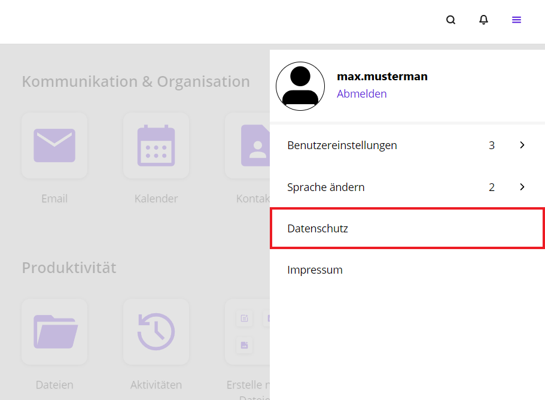

Im Self-Service-Portal können Sie Ihre **Einstellungen** ändern. Mit einem Klick auf das **Hamburger-Menü** bekommen Sie einen Überblick über die Möglichkeiten der Einstellungsänderungen.

## Benutzereinstellungen

Um zu den Benutzereinstellungen zu gelangen, müssen Sie auf das **Hamburger-Menü** klicken. Dieser befindet sich in der Kopfzeile auf der rechten Seite. Eine Seitenleiste öffnet sich. Klicken Sie auf **Benutzereinstellungen**.

In den Benutzereinstellungen haben Sie folgende Einstellungsmöglichkeiten:

- Mein Passwort ändern
- Meine Profildaten bearbeiten
- Meine Passwort-Reset Optionen

## Profildaten bearbeiten

Im Hamburger-Menü finden Sie unter **Benutzereinstellungen** den Unterpunkt **Meine Profildaten bearbeiten**.

**Hinweis**: Es ist möglich, dass Sie sich erneut anmelden müssen. Geben Sie erneut Ihren **Benutzernamen** und Ihr **Passwort** ein.

Daraufhin erhalten Sie die Möglichkeit, Ihre Profildaten zu ändern. Das können beispielsweise Ihr Foto, Ihr Name, Ihre Organisation oder eine Adresse sein.

## Kontozugang schützen

Der Unterpunkt **Mein Passwort-Reset Optionen** gibt Ihnen die Möglichkeit, Ihre Konto-Wiederherstellungsoptionen hinzuzufügen oder zu aktualisieren.

Hierfür müssen Sie erneut Ihren **Benutzernamen** und Ihr **Passwort** eingeben.

Anschließend erhalten Sie die Möglichkeit, Ihre E-Mail-Adresse zu ändern. Geben Sie die von Ihnen gewünschten und benötigten Daten ein und klicken Sie danach auf **Abschicken.**

## Passwort ändern

Unter den **Benutzereinstellungen** können Sie über den Unterpunkt **Mein Passwort ändern** ein neues Passwort wählen.

Geben Sie erst Ihr altes Passwort ein, um im Anschluss ein neues Passwort einzugeben. Wiederholen Sie Ihr neues Passwort und klicken Sie auf **Passwort ändern.**

## Sprache ändern

An Ihrem Arbeitsplatz können Sie die Sprache innerhalb des Portals ändern. Hierzu wählen Sie das **Hamburger-Menü** aus und wählen **Sprache ändern**.

Sie können zwischen **Englisch** oder **Deutsch** wählen.

## Globale Benachrichtigungen

Innerhalb des gesamten Arbeitsbereiches können Sie Benachrichtigungen erhalten. Diese werden am oberen Rand eingeblendet und können über einen Klick auf die Schaltfäche **Schließen** in der rechten oberen Ecke der Benachrichtigungen wieder ausgeblendet werden. Je nach Art der Benachrichtigung muss diese auch über die Schaltfläche **Bestätigen** quittiert werden. Die Farbe und der Inhalt wird durch eine Administratorin oder einen Administrator festgelegt.

## Datenschutz

Während der Nutzung Ihres Arbeitsplatzes werden Daten von Ihnen erfasst und verwendet. Zum Schutz Ihrer Daten gibt es einen Datenschutzhinweis, der sich nach der Datenschutz-Grundverordnung richtet. Sie können Antworten auf Ihre offenen Fragen bekommen und erfahren, welche Gestaltungsmöglichkeiten es im Umgang mit Ihren Daten gibt.

Diese finden Sie unter dem Hamburger-Menü. Rechts öffnet sich eine Seitenleiste.

## Impressum

Im Impressum können Sie nachlesen, wer die presserechtlich Verantwortlichen für die Text-, Wort- oder Bildbeiträge dieser Seite sind.

