Ein Videokonferenzsystem besteht aus einem virtuellen Konferenzraum. In diesem Raum können sich mehrere Teilnehmerinnen und Teilnehmer per Audio, Video und Chat austauschen. Eingerichtet wird der Raum von einer Moderatorin oder einem Moderator. Die Moderation bzw. der Moderator sorgt über Einladungen dafür, dass weitere Teilnehmerinnen und Teilmehmer den Raum betreten können.

Sie finden das Modul ganz unten auf der Startseite des Portals als Teil des Abschnitts **Direkte Kommunikation**.

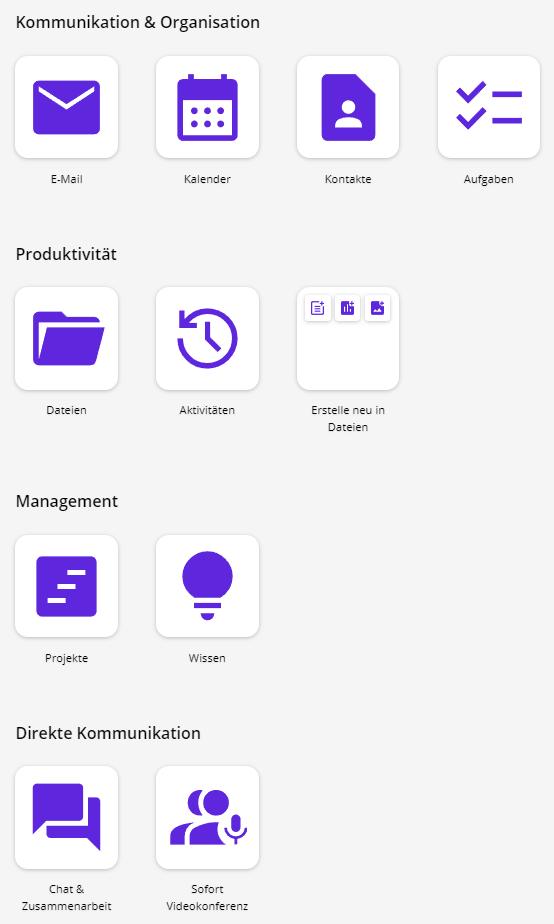

Öffnen Sie **Sofort Videokonferenzen** über die entsprechende Schaltfläche.

## Voraussetzungen und Vorbereitungen

Um an einer Online-Konferenz teilnehmen zu können, wird eine stabile und schnelle **Internetanbindung** sowie ein **Endgerät** mit **Mikrofon, Lautsprechern / Kopfhörern** und ggf.einer **Kamera** benötigt. Dieses Endgerät muss zunächst für die Teilnahme vorbereitet werden:

Wenn noch nicht vorhanden, muss ein kompatibler Internet-Browser installiert werden. Geeignete Browser sind **Google Chrome** oder Chromium-basierte Browser wie **Microsoft Edge Chromium, Chromium** oder **Opera**.

**Wichtig**: Die Nutzung anderer Browser (z.B. Mozilla Firefox, Safari) kann zu Fehlern und Einschränkungen bei allen Teilnehmerinnen und Teilnehmern einer Sitzung führen. Auch die Nutzung von Chromium Browsern auf Apple-Geräten kann zu Fehlern führen.

**Hinweis**:

- Nutzung von VPN-Verbindungen: Eine Verbindung während einer laufenden Landes-VPN-Session ist möglich, mit Ausnahme aus dem Hamburger Landesnetz
- Nutzung aus dem Landesnetz: Eine Nutzung aus den Landesnetzen (Hamburg und Schleswig-Holstein) ist möglich. Ggf. müssen Ausnahmen an den Browser-Proxy-Einstellungen vorgenommen werden. Bitte wenden Sie sich dazu an Ihre lokale IT-Stelle oder an Ihre Dienstleister Support-Einheit

## Voraussetzungen und Vorbereitungen

Um an einer Online-Konferenz teilnehmen zu können, wird eine stabile und schnelle **Internetanbindung** sowie ein **Endgerät** mit **Mikrofon, Lautsprechern / Kopfhörern** und ggf.einer **Kamera** benötigt. Dieses Endgerät muss zunächst für die Teilnahme vorbereitet werden:

Wenn noch nicht vorhanden, muss ein kompatibler Internet-Browser installiert werden. Geeignete Browser sind **Google Chrome** oder Chromium-basierte Browser wie **Microsoft Edge Chromium, Chromium** oder **Opera**.

**Wichtig**: Die Nutzung anderer Browser (z.B. Mozilla Firefox, Safari) kann zu Fehlern und Einschränkungen bei allen Teilnehmerinnen und Teilnehmern einer Sitzung führen. Auch die Nutzung von Chromium Browsern auf Apple-Geräten kann zu Fehlern führen.

## Übersicht über die wichtigsten Symbole

Hier sehen Sie eine Übersicht über alle Symbole, die in dem Konferenzraum vorhanden sind.

Die Symbolleiste ist von links nach rechts folgendermaßen aufgebaut:

- Mikrofon
- Kamera
- Bildschirmfreigabe
- Chat
- Hand
- Anwesende
- Kachelansicht
- 3-Punkte
- Konferenz verlassen

Mit dem **Mikrofonsymbol**, auch als **Stummschalten** genannt, können Sie Ihr Mikrofon ein- und ausschalten. Das können Sie auch vor dem Betreten der Konferenz machen. Wenn das Symbol einen Schrägstrich hat, ist das Mikrofon ausgeschaltet, wenn es keinen hat, ist es eingeschaltet.

**Hinweis**: Das Mikrofon sollte nur auf Aufforderung der Moderatorin oder des Moderators eingeschaltet werden.

Mit dem **Kamerasymbol**, auch als **Kamera stoppen** genannt, können Sie die Kamera ein- und ausschalten. Es kann auch vor dem Betreten der Konferenz ein- oder ausgeschaltet werden. Wenn das Symbol einen Schrägstrich hat, ist die Kamera ausgeschaltet, wenn es keinen hat, ist sie eingeschaltet.

**Achtung**: Zur Gewährleistung der Systemstabilität empfiehlt es sich, die Videofunktion nur bei Bedarf zu aktivieren.

Manchmal dauert es einen kurzen Moment, bis sich das Mikrofon und/oder die Kamera mit dem Browser verbunden hat. In diesem Fall werden die Symbole weiß mit einem sich drehenden Rad.

Der Pfeil neben dem Mikrofon- und Kamerasymbol dient zur Einstellung des Mikrofons bzw. der Kamera. Er wird weiß, wenn er aktiviert ist.

Mit dem **Bildschirmsymbol**, auch als **Bildschirmfreigabe starten** genannt, können Sie Ihren eigenen Bildschirm an alle anderen Teilnehmerinnen und Teilnehmer zeigen. Wenn das Symbol keinen Schrägstrich hat, sind Sie in der Lage, Ihren Bildschirm zu teilen. Wenn das Symbol aber einen Schrägstrich hat, bedeutet das, dass Sie Ihren Bildschirm teilen und dieser dient als Hinweis, um die Bildschirm-Freigabe zu beenden.

Mit dem **Chat-Symbol**, auch als **Chat öffnen** genannt, kann das Chat-Fenster geöffnet oder geschlossen werden. Damit können Nachrichten geschickt werden.

Wenn dieses Symbol aktiviert ist, wird es in der Symbolleiste grau markiert.

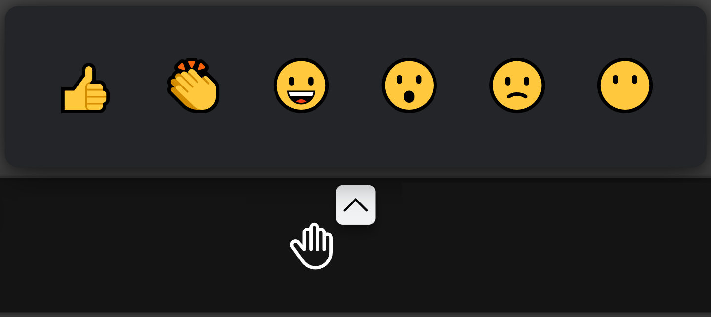

Mit dem **Handsymbol**, auch als **Hand heben** genannt, können Sie der Moderatorin oder dem Moderator ein Hanzeichen geben. Durch erneutes Klicken auf das Symbol wird die Meldung zurückgenommen.

Mit dem Pfeil daneben können Sie verschiedene Reaktionen auslösen: **Daumen hoch, Klatschen, Lachen, Überrascht sein, Buhrufe** und **Stille**. Alle sechs haben integrierte Geräusche.

Mit dem **Teilnehmerinnen und Teilnehmer-Symbol** , auch **Anwesende** genannt, können Sie eine Liste von allen Teilnehmerinnen und Teilnehmern sehen. Um die Liste zu schließen, klicken Sie erneut auf das Symbol. Die Anzahl der Teilnehmerinnen und Teilnehmer wird in einem Kreis auf dem Symbol angezeigt.

Mit dem **Kachelansicht-Symbol**, auch als **Kachelansicht ein-/ausschalten** genannt, können Sie die Teilnehmerinnen und Teilnehmer übersichtlicher anzeigen lassen. Wenn das Kachelansicht-Symbol eingeschaltet ist, sehen Sie alle Teilnehmerinnen und Teilnehmer gleich groß in Ihrem Fenster. Wenn es ausgeschaltet ist, sehen Sie die Person, die gerade redet, am größten auf dem Bildschirm und den Rest der Teilnehmerinnen und Teilnehmer kleiner auf der rechten Seite des Fensters.

Mit der **3-Punkte-Symbol**, auch als **Weitere Einstellung** genannt, können Sie weitere Optionen aufrufen. Hier können Sie z. B. die Qualitätseinstellungen sowie die Sicherheitsoptionen verwalten, u. a.

Mit der roten Schaltfläche kann die Online-Konferenz verlassen werden.

## Teilnehmerinnen und Teilnehmer

### Teilnehmerinnen und Teilnehmer einladen

Neue Teilnehmerinnen und Teilnehmer können über einen Link zu einem Konferenzraum eingeladen werden. Hierzu müssen Sie einfach den **Link** in die **Adresszeile des Browsers kopieren** und der Teilnehmerin oder dem Teilnehmer schicken.

Auch aus der Sitzung heraus können weitere Teilnehmerinnen und Teilnehmer durch die Moderatorin oder den Moderator oder durch andere Konferenzteilnehmerinnen und Konferenzteilnehmer eingeladen werden. Nutzen Sie dazu das **Steuerungssymbol Anwesende:**

Im rechten Fensterbereich werden die anwesenden Personen eingeblendet. Klicken Sie hier auf **Person einladen:**

Im Anschluss öffnet sich das Fenster **Mehr Leute einladen** . Hier können Sie die Linkadresse der Videokonferenz kopieren oder Einladungen zur Videokonferenz an ausgewählte E-Mail-Accounts verschicken.

### Bildschirm freigeben

- Öffne Sie als Erstes das Programm bzw. das Dokument, das allen Teilnehmerinnen und Teilnehmern gezeigt werden soll
- Klicken Sie im Anschluss auf das **Bildschirmfreigabe-Symbol**:

Über das Symbol **Bildschirmfreigabe** **ein- und ausblenden** haben Sie verschiedene Möglichkeiten, um Bildschirminhalte allen Konferenzteilnehmern zu zeigen:

1. gesamten Bildschirminhalt
1. einzelne Programmfenster
1. einzelne Tabs des Browsers  

Im Anschluss mit **Teilen** bestätigen. Den anderen Teilnehmerinnen und Teilnehmern wird im Anschluss der gewählte Bildschirminhalt angezeigt.

**Hinweis:** Die Freigabe eines Anwendungsfensters bzw. eines Browser-Tabs hat den Vorteil, dass die anderen Teilnehmerinnen und Teilnehmer nicht den gesamten Bildschirminhalt angezeigt bekommen und weitere Anwendungsfenster (z.B. ein E-Mail-Programm) unsichtbar bleiben. Der Vorteil beim Teilen des gesamten Bildschirms ist, dass man zwischen mehreren Anwendungen, die gezeigt werden sollen, hin- und herspringen kann.

#### Bildschirmfreigabe beenden

Wenn Sie Ihren Bildschirm teilen, können Sie immer über das Informationsfenster am unteren Bildschirmrand die Bildschirmfreigabe beenden. Klicken Sie dazu **Nicht mehr teilen**.

Sollte das Informationsfenster **nicht zu sehen** sein, können Sie auf das Konferenz-Fenster gehen und hier über die Menüleiste die Übertragung beenden:

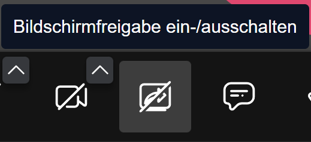

### Konferenzraum betreten

Starten Sie damit, einen geeigneten Internetbrowser zu öffnen. Kopieren Sie den **zugesandten Link** in die **Adresszeile des Browsers** , um die Konferenzseite zu laden.

**Hinweis:** Wird der zugesandte Link direkt in der E-Mail angeklickt und nicht kopiert, öffnet sich evtl. ein nicht geeigneter Browser (z. B. Firefox oder Safari).

Sie müssen die Verwendung von Mikrofon und ggf. Kamera zulassen. Je nach Browser kann diese Auswahl für die Zukunft gespeichert werden (**Entscheidung merken**).

Bei der Erstanmeldung wird zusätzlich der Name abgefragt, der während einer Konferenz den anderen Teilnehmerinnen und Teilnehmern angezeigt wird. Sie können hier außerdem vorab über die entsprechenden Schaltflächen auswählen, ob Mikrofon und Kamera bei Betreten der Konferenz eingeschaltet sein sollen. Haben Sie alle gewünschten Einstellungen vorgenommen, bestätigen Sie mit Klick auf **Konferenz beitreten**.

Sollte der Fall eintreten, dass Sie vor der Moderatorin oder dem Moderator eine Konferenz betreten wollen, sehen Sie die folgende Meldung:

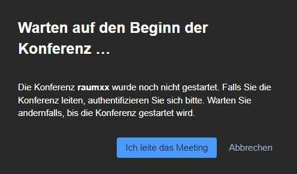

Wenn Sie diese Nachricht bekommen, müssen Sie darauf warten, dass die Moderatorin oder der Moderator den Raum betritt.

Geben Sie im Anschluss ggf. das Passwort für den Konferenzraum ein.

Sollte die Moderatorin oder der Moderator die **Lobby** aktiviert haben, dann warten Sie bitte, bis diese oder dieser Ihnen erlaubt, der Konferenz beizutreten. Alternativ können Sie auch das Passwort (falls bekannt) eingeben.

Ihr Name kann im Konferenzraum nachträglich abgeändert werden. Klicken Sie dazu oben rechts in der Ecke auf den eigenen Namen und nehmen Sie die Anpassung vor.

Weitere Tipps, die Sie beachten sollten, wenn Sie einer Konferenz beigetreten sind:

- **Mikrofon deaktivieren** und nur bei Aufforderung aktivieren. So vermeiden Sie störende Geräusche (Husten, Räuspern, Tippen auf der Tastatur)
- Wortbeiträge über **Meldungen** ([Handzeichen-Symbol](../allgemeine-anleitungen/uebersicht-ueber-die-wichtigsten-symbole-1.md)) ankündigen oder den [Chat](chat.md) benutzen

### Chat

In einem Konferenzraum kann mit allen Teilnehmerinnen und Teilnehmern gechattet werden. Der private Nachrichtenaustausch zwischen einzelnen Konferenzteilnehmerinnen und Konferenzteilnehmern wird zusätzlich angeboten.

#### Öffentlicher Chat

In dem öffentlichen Chat können Sie allen Konferenzteilnehmerinnen und Konferenzteilnehmern Nachrichten senden. Den Chat können Sie über das **Chat-Symbol** öffnen:

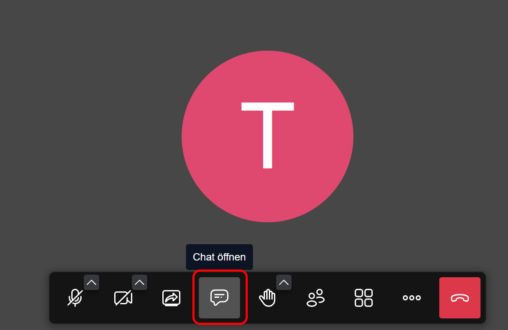

In dem sich anschließend öffnenden Chat-Fenster können Sie jetzt Nachrichten lesen und schreiben:

#### Privater Chat

Wenn Sie wollen, dass **nur eine bestimmte Person** Ihre Nachricht bekommt, können Sie diese über **Private Nachrichten** senden. Wenn Sie auf das violette Icon mit den drei Punkten **in der Kachel der Person** klicken, können Sie eine private Nachricht senden:

Die folgenden Nachrichten, die Sie schreiben, werden nun an nur eine Person gesendet. Wenn Sie wieder in den öffentlichen Chat schreiben möchten, klicken Sie auf das weiße **X**.

### Umfragen

Moderatorinnen und Moderatoren sowie Konferenzteilnehmerinnen und Konferenzteilnehmer können Umfragen erstellen. Öffnen Sie dazu den Chat-Bereich über das **Chat-Symbol:**

Hier können Sie das Register **Umfrage** auswählen und **Fragen mit den entsprechenden Antworten** erstellen. Die Reihenfolge der Antworten kann nachträglich per Drag &amp; Drop geändert werden.

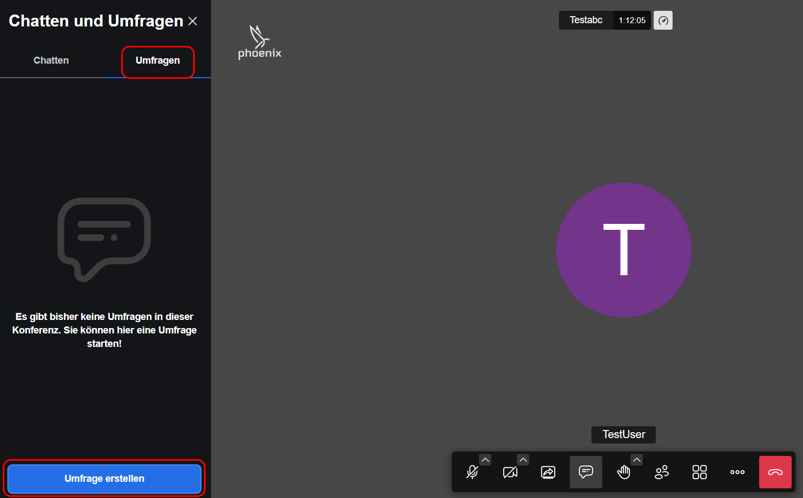

### Persönliche Einstellungen

Jede Konferenzteilnehmerin und jeder Konferenzteilnehmer kann persönliche Einstellungen vornehmen. Wählen Sie dazu das Steuerungssymbol mit den 3 Punkten **Weitere Einstellungen**.

In der aufgeklappten Leiste können Sie verschiedene Vorgänge bestimmen. Über **Qualitätseinstellungen** regulieren Sie Ihre Übertragungsqualität des Videos. Wenn Sie Ihr Mikrofon einschalten und dann auf **Rauschunterdrückung** klicken, werden Hintergrundgeräusche entfernt. Mit **Hintergrund auswählen** können Sie einen Hintergrund aussuchen, der hinter Ihnen im Video zu sehen ist. Über **Einstellungen** können Sie Ihre Geräte, wie Mikrofon, Audioausgabe oder die Kamera auswählen. Sie können auch Ihren Anzeigenamen und Hinweistöne einstellen.

**Hinweis:** Sie haben auch die Möglichkeit, direkt über die Symbolleiste Einstellungen für Ihre Kamera oder Ihr Mikrofon vorzunehmen. Klicken Sie dafür auf die Pfeile bei dem Kamera und Mikrofon Symbol.

## Moderatorinnen und Moderatoren

### Teilnehmerinnen und Teilnehmer einladen

Neue Teilnehmerinnen und Teilnehmer können über einen Link zu einem Konferenzraum eingeladen werden. Hierzu müssen Sie einfach den **Link aus der Adresszeile des Browsers kopieren** und den gewünschten Teilnehmerinnen und Teilnehmern schicken.

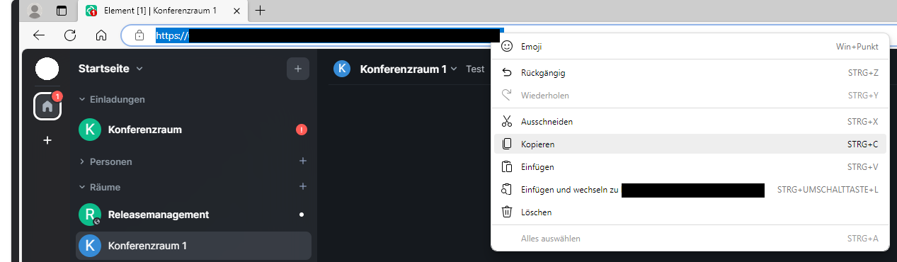

Teilnehmerinnen und Teilnehmer können auch über die grüne Schaltfläche **In diesen Raum einladen** eingeladen werden:

Es öffnet sich ein Fenster mit einer Suchmaske, in die Sie den Namen der gewünschten Person eingeben und dann aus der Liste von Vorschlägen auswählen können. Im Beispiel werden keine Vorschläge angezeigt, da der gesuchte Name nicht existiert.

Wiederholen Sie diesen Vorgang, bis Sie alle gewünschten Personen hinzugefügt haben. Klicken Sie abschließend auf **Einladen**.

Auch aus der Sitzung heraus können Teilnehmerinnen und Teilnehmer durch die Moderatorin oder den Moderator oder durch andere Konferenzteilnehmerinnen und Konferenzteilnehmer eingeladen werden. Nutzen Sie dazu das Steuerungssymbol **Anwesende.**

Im rechten Fensterbereich werden die anwesenden Personen eingeblendet. Klicken Sie hier auf **Person einladen.**

Im Anschluss öffnet sich das Fenster **Mehr Leute einladen** . Hier können Sie die Linkadresse der Videokonferenz kopieren oder Einladungen zur Videokonferenz an ausgewählte E-Mail-Accounts verschicken.

### Konferenzraum vorbereiten

Wenn Sie eine Videokonferenz vorbereiten möchten, können Sie die folgenden Schritte durchgehen:

#### 1. Konferenzraum erstellen

Öffne Sie einen geeigneten Internetbrowser (siehe [Vorraussetzungen und Vorbereitungen](../allgemeine-anleitungen/voraussetzungen-und-vorbereitungen.md)).

Öffnen Sie das Modul **Sofort Videokonferenz** wie unter **Allgemeine Anleitungen – Was ist Sofort Videokonferenz** beschrieben.

- Einen Link zu Ihrem Konferenzraum können Sie erstellen, indem Sie einen Namen des Konferenzraums (zum Beispiel "Konferenzraumname") in das Textfeld vor **Meeting starten** eingeben.
- Der Name ist **frei wählbar** . Vermeiden Sie Namen mit Leerzeichen oder Schrägstrich ("/"). Dies kann zu ungültigen Links führen. Nutzen Sie am besten Raummnamen wie: "Meeting3B" oder "Freitags_Meeting"
- Sie können auch die Eingabe der Raumbezeichnung direkt über das Eingabefeld auf der Startseite eingeben und mit **Raum erstellen** bestätigen.

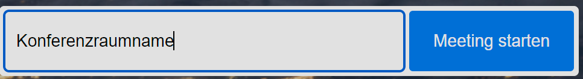

#### 2. Konferenzraum eröffnen

Die Teilnehmerinnen und Teilnehmer sollten den Konferenzraum erst aufsuchen, nachdem Sie diesen bereits betreten haben. Deshalb empfiehlt es sich, den Raum immer kurz vor dem Beginn des Meetings zu öffnen.

#### 3. Raum-Passwort vergeben

Damit der Konferenzraum nur einer ausgewählten Gruppe zugänglich ist, sollte ein Raum-Passwort vergeben werden. Dazu können Sie in der Menüleiste auf **Sicherheitsoptionen** klicken.

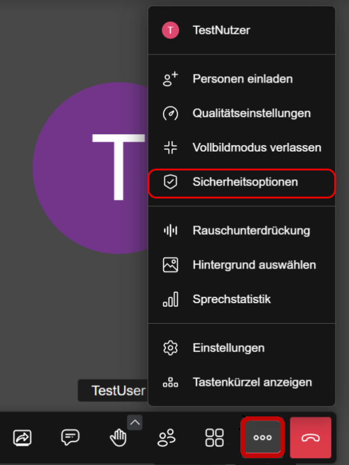

Anschließend öffnet sich das Sicherheitsoptionen-Fenster, es gibt zwei Möglichkeiten Ihre Konferenz zu schützen:

- Wählen Sie **Lobby aktivieren** . So gelangen Teilnehmerinnen und Teilnehmer in einen Warteraum und können erst nach Ihrer Zustimmung dem Meeting beitreten.
- Sie können über **Passwort hinzufügen** ein Raum-Passwort erstellen. Dieses müssen die Teilnehmerinnen und Teilnehmer eingeben, bevor Sie dem Meeting beitreten können.

**Hinweis**: Das Passwort wird nicht dauerhaft gespeichert und muss beim nächsten Betreten des Raumes erneut gesetzt werden.

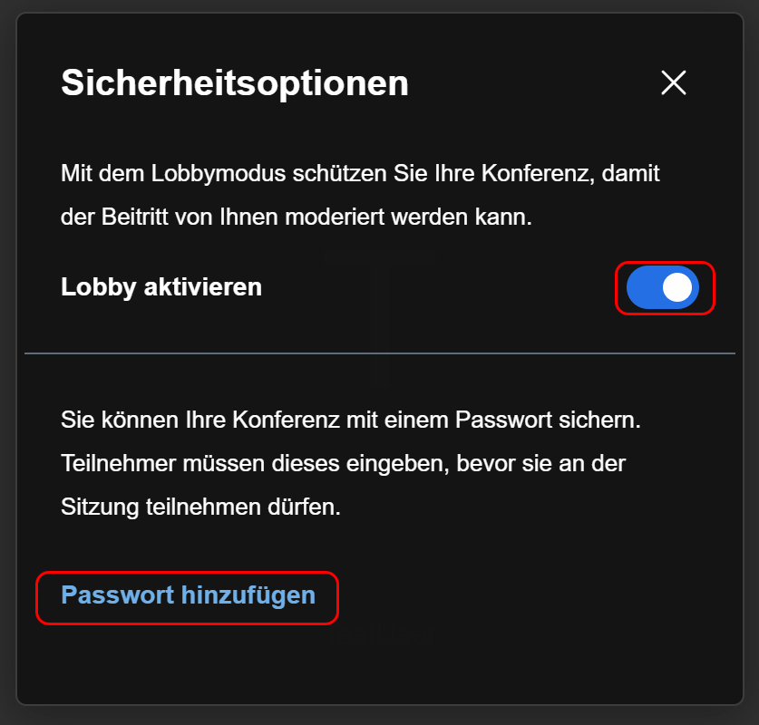

#### 4. Link und Passwort versenden

Wenn Sie die vorherigen Schritte durchgeführt haben, ist Ihr Konferenzraum vorbereitet. Sie können jetzt den Teilnehmerinnen und Teilnehmern Ihren Raumnamen und das von Ihnen festgelegte Passwort senden.

### Konferenz durchführen

Auf dieser Seite finden Sie eine Anleitung für die Durchführung von Konferenzen.

#### Vor der Konferenz

Es ist empfehlenswert, sich als Moderatorin oder Moderator rechtzeitig vor dem Konferenztermin in den Raum einzuloggen, um z. B folgende Dinge vorab zu erledigen:

- Raumpasswort festlegen (siehe [Konferenzraum vorbereiten](konferenzraum-vorbereiten.md))
- eigenes Mikrofon testen
- eine Begrüßungsfolie freigeben (s. u.)
- technische Schwierigkeiten von Teilnehmerinnen und Teilnehmer klären  

**Hinweis:** Teilnehmerinnen und Teilnehmer können den angelegten Konferenzraum erst betreten, wenn eine Moderatorin oder ein Moderator eingeloggt ist. Sobald sich Teilnehmerinnen und Teilnehmer im Raum befinden, sollte man sich als moderierende Person nicht mehr abmelden. Bei der erneuten Anmeldung im Raum, kann es ansonsten zu Problemen mit der Bildschirmfreigabe bzw. mit der Audiofunktion kommen.

Sollen bereits beim Login die Mikrofone aller Teilnehmerinnen und Teilnehmer automatisch stumm geschaltet werden, kann dies folgendermaßen eingestellt werden: 

Gehen Sie auf das **Drei-Punkte-Menü (Weitere Einstellungen)** in der Symbolleiste und dann auf **Einstellungen**.

")

Anschließend gehen Sie im geöffneten Fenster auf **Moderation** und klicken Sie die Haken bei **Alle Personen treten stummgeschaltet bei** und bei **Alle Personen treten ohne Video bei** an:

#### Zu Beginn einer Konferenz

**Eigenes Mikrofon und ggf. eigene Kamera aktivieren:** Durchgestrichene Kamera und Mikrofon bedeuten, dass diese ausgeschaltet sind. Um diese zu aktivieren müssen Sie auf das zugehörige Symbol klicken:

**Hinweise** an alle Teilnehmerinnen und Teilnehmer:

- Bei Nutzung eines nicht geeigneten **Internetbrowsers** (z. B. 	Firefox, Safari) ausloggen und mit kompatiblem Browser (siehe 	Vorraussetzungen und Vorbereitungen) erneut einloggen.
- **Mikrofon deaktivieren** und nur bei Aufforderung aktivieren; bei 	aktivem Mikrofon störende Geräusche (Husten, Räuspern, Tippen auf 	der Tastatur) vermeiden.
- Wortbeiträge über **Meldungen** (Handzeichen-Symbol, s. u.) anzeigen oder den **Chat** benutzen.

Teilnehmerinnen und Teilnehmer können sich selber stumm schalten oder die Kamera beenden. Dazu muss in der Symbolleiste auf das **Mikrofon** und/oder die **Kamera** geklickt werden.  

**Ggf. alle Teilnehmerinnen und Teilnehmer** **stumm schalten**:

- Klicken Sie dazu auf das **Anwesende-Icon** mit den 2 Personen und wählen Sie **Alle stumm schalten**
- Alle Teilnehmerinnen und Teilnehmer werden nun automatisch stumm geschaltet. Alle Teilnehmerinnen und Teilnehmer können im Anschluss jedoch selbstständig wieder das Mikrofon in der Symbolleiste freischalten

**Kachelansicht einschalten:**

Für eine übersichtliche Ansicht aller Teilnehmerinnen und Teilnehmer, aktivieren Sie die Kachelansicht mit den entsprechenden Kachelsymbol.

Die Teilnehmerinnen und Teilnehmer werden nun in einer Übersicht angezeigt.

#### Während der Konferenz

Während der Konferenz können verschiedene Aktionen ausgeführt werden:

**Bildschirm freigeben**:

- Zunächst das Programm bzw. Dokument, das allen Teilnehmerinnen und Teilnehmern gezeigt werden soll, auf dem eigenen Endgerät öffnen
- Im Anschluss das **Bildschirmfreigabe-Symbol** anklicken

Wählen Sie aus, ob der gesamte Bildschirm, ein Anwendungsfenster oder ein Browser-Tab für alle angezeigt werden soll. Bestätigen Sie Ihre Auswahl mit **Teilen.**

- Den Teilnehmerinnen und Teilnehmern wird im Anschluss der gewählte Bildschirminhalt als Vollbild angezeigt. Ein Verändern des Inhalts durch die Teilnehmerinnen und Teilnehmer ist nicht möglich.
- Die Freigabe kann durch das erneute Anklicken des Freigabe-Symbols bzw. über den Button **Nicht mehr teilen** beendet werden:

**Hinweis:** Die Freigabe eines Anwendungsfensters bzw. eines Browser-Tabs hat den Vorteil, dass Teilnehmerinnen und Teilnehmer nicht den gesamten Bildschirminhalt angezeigt bekommen und weitere Anwendungsfenster (z. B. ein E-Mail Programm) unsichtbar bleiben. Der Vorteil beim Teilen des gesamten Bildschirms ist, dass man zwischen mehreren Anwendungen, die gezeigt werden sollen, hin- und herspringen kann.

**Infos und Aktionen für Teilnehmerinnen und Teilnehmern**:

Über Randsymbole an den **Kacheln der Teilnehmerinnen und Teilnehmern** wird z. B. angezeigt, ob Mikrofon und Kamera (de)aktiviert sind bzw. ob sich jemand meldet. Per Klick auf das Punktesymbol am Rand der Kachel der Teilnehmerinnen und Teilnehmern, können **Aktionen für die gewählte Person** durchgeführt werden.

**Folgende Aktionen sind beim 3 Punkte Symbol möglich**:

- Alle Teilnehmerinnen und Teilnehmer mit Ausnahme der gewählten Person stumm schalten.
- Die Kamera aller Teilnehmerinnen und Teilnehmer mit Ausnahme der gewählten Person ausschalten.
- Moderationsrechte an die Person vergeben.
- Gewählte Person aus der Konferenz entfernen.
- Private Nachricht an die gewählte Person senden.
- Lautstärke der gewählten Person verändern.

**Breakoutsessions erstellen**:

Sie können sogenannte Breakoutsessions erstellen, also Gruppenarbeitsräume. Klicken Sie dafür auf die Schaltfläche **Anwesende (3 Punkte Menü).** Hier können Sie nun einen Breakout-Raum erstellen.

Nachdem Sie einen Raum hinzugefügt haben, können Sie den Teilnehmerinnen und Teilnehmern einem Raum zuordnen. Klicken Sie dazu auf die drei Punkte am Benutzernamen und wählen Sie unten den gewünschten Breakout-Raum aus.

Der Breakout-Raum kann auch von einer anderen moderierenden Person eröffnet werden, diese muss dann noch einmal ihre Anmeldedaten hinterlegen.

**Videoqualität einstellen**:

**Hinweis**: Die Videoqualität sollte bei instabilen Verbindungen reduziert werden. Die Änderungen wirken sich nur auf das eigene Gerät aus. Wählen Sie dazu das Punkte-Symbol unten rechts in der Symbolleiste aus und klicken Sie auf **Qualitätseinstellungen**:

**Die Videoqualität verändern**:

Wenn die gewünschte Videoqualität technisch nicht möglich ist, wird nur noch das Audiosignal übertragen - verringeren Sie in diesem Fall die Videoqualität.

### Breakoutsessions erstellen

Sie können sogenannte Breakoutsessions erstellen, also Gruppenarbeitsräume. Klicken Sie dafür auf **Anwesende**:

Es öffnet sich auf der linken Seite ein Informations-Fenster. Hier können Sie nun einen oder mehrere Breakout-Räume erstellen:

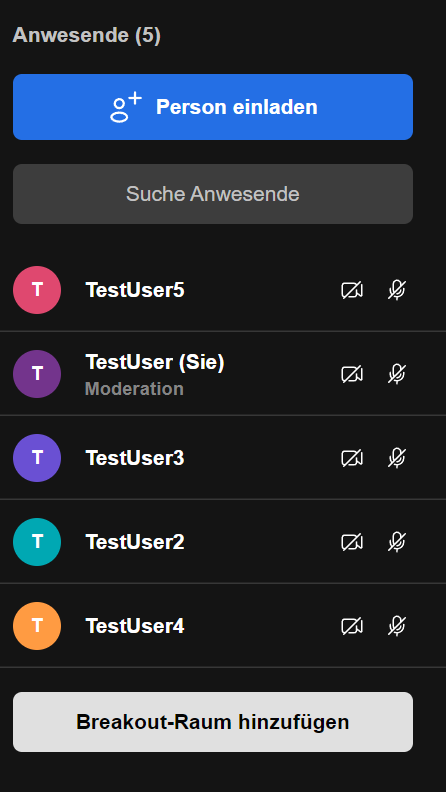

Nachdem Sie einen Raum hinzugefügt haben, können Sie die Teilnehmerinnen und Teilnehmer dem Raum zuordnen. Klicken Sie dazu auf die **drei Punkte am Benutzernamen** und wählen Sie unten den gewünschten Breakout-Raum aus:

Wenn Sie oder Teilnehmerinnen und Teilnehmer selbstständig in einen Breakout-Raum gehen möchten, gibt es auch die Möglichkeit eigenständig den Raum zu betreten. Dazu gehen Sie mit der Maus auf den erstellten Breakout-Raum und klicken Sie **Teilnehmen**:

Um den Breakout-Raum zu verlassen und in den Hauptraum zurückzukehren klicken Sie auf **Breakout-Raum verlassen**:

### Bildschirm freigeben

Öffnen Sie als Erstes das Programm bzw. das Dokument, das allen Teilnehmerinnen und Teilnehmern gezeigt werden soll.

Klicken Sie im Anschluss auf das **Bildschirmfreigabe-Symbol** (der Bildschirm mit dem Pfeil nach rechts):

Über das Symbol **Bildschirmfreigabe** **ein- und ausblenden** haben Sie verschiedene Möglichkeiten, um Bildschirminhalte allen Konferenzteilnehmerinnen und Konferenzteilnehmern zu zeigen:

1. gesamten Bildschirminhalt
1. einzelne Programmfenster
1. einzelne Tab-Fenster Ihres Browsers  

Klicken Sie auf das Fenster, was Sie freigeben möchten. Im Anschluss mit **Teilen** bestätigen. Den anderen Teilnehmerinnen und Teilnehmern wird im Anschluss der gewählte Bildschirminhalt angezeigt.

**Hinweis:** Die Freigabe eines Anwendungsfensters bzw. eines Browser-Tabs hat den Vorteil, dass die anderen Teilnehmerinnen und Teilnehmer nicht den gesamten Bildschirminhalt angezeigt bekommen und weitere Anwendungsfenster (z. B. ein E-Mail-Programm) unsichtbar bleiben. Der Vorteil beim Teilen des gesamten Bildschirms ist, dass man zwischen mehreren Anwendungen, die gezeigt werden sollen, hin- und herspringen kann.

#### Bildschirmfreigabe beenden

Wenn Sie Ihren Bildschirm teilen, können Sie immer über das Informationsfenster am unteren Bildschirmrand die Bildschirmfreigabe beenden. Klicken Sie dazu **Nicht mehr teilen**.

Sollte das Informationsfenster **nicht zu sehen** sein, können Sie auf Ihr Konferenz-Fenster gehen und hier über die Menüleiste die Übertragung beenden (der durchgestrichende Bildschirm mit dem Pfeil nach rechts).

### Chat

In einem Konferenzraum kann mit allen Teilnehmerinnen und Teilnehmern gechattet werden. Der private Nachrichtenaustausch zwischen einzelnen Konferenzteilnehmerinnen und Konferenzteilnehmern wird zusätzlich angeboten.

#### Öffentlicher Chat

In dem öffentlichen Chat können Sie allen Konferenzteilnehmerinnen und Konferenzteilnehmern Nachrichten senden. Den Chat können Sie über das **Chat-Symbol** öffnen:

In dem sich anschließend öffnenden Chat-Fenster können Sie jetzt Nachrichten lesen und schreiben:

#### Privater Chat

Wenn Sie wollen, dass **nur eine bestimmte Person** Ihre Nachricht bekommt, können Sie diese über **Private Nachrichten** senden. Wenn Sie auf das violette Icon mit den drei Punkten **in der Kachel der Person** klicken, können Sie eine private Nachricht senden:

Die folgenden Nachrichten, die Sie schreiben, werden nun an nur eine Person gesendet. Wenn Sie wieder in den öffentlichen Chat schreiben möchten, klicken Sie auf das weiße **X.**

### Umfragen

Moderatorinnen und Moderatoren sowie Konferenzteilnehmerinnen und Konferenzteilnehmer können Umfragen erstellen. Öffnen Sie dazu den Chat-Bereich über das **Chat-Symbol:**

Hier können Sie das Register **Umfrage** auswählen und **Fragen mit den entsprechenden Antworten** erstellen. Die Reihenfolge der Antworten kann nachträglich per Drag &amp; Drop geändert werden.

### Einstellungen als Moderatorin und Moderator

Als Moderatorin oder Moderator können Sie Einstellungen vornehmen. Wählen Sie dazu das Drei-Punkte-Menü **Weitere Einstellungen.**

")

- Über **Qualitätseinstellungen** regulieren Sie Ihre Übertragungsqualität des Videos
- Bei den **Sicherheitsoptionen** gibt es zwei Optionen, den Zugang zur Konferenz zu schützen - zum einen durch die Vergabe eines Passwortes und zum anderen durch die Aktivierung einer Lobby
- Wenn Sie Ihr Mikrofon einschalten und dann auf **Rauschunterdrückung** klicken, werden Hintergrundgeräusche entfernt
- Mit **Hintergrund auswählen** können Sie einen Hintergrund aussuchen, der hinter Ihnen im Video zu sehen ist

Über **Einstellungen** können Sie Ihre Geräte, wie Mikrofon, Audioausgabe oder die Kamera auswählen. Auch hier können Sie Ihren Anzeigenamen und Hinweistöne einstellen. 

**Hinweis:** Sie haben auch die Möglichkeit direkt über die Symbolleiste **Einstellungen** für Ihre Kamera oder Ihr Mikrofon vorzunehmen. Klicken Sie dafür auf die kleinen Pfeile über den Symbolen:

Um weitere Einstellungen vorzunehmen können Sie auf **Anwesende** klicken:

1. Auf der rechten Seite haben Sie nun die Möglichkeit alle Teilnehmerinnen und Teilnehmer stumm zu schalten
1. Wenn Sie auf das Icon mit den drei Punkten klicken, können Sie alle Kameras der Teilnehmerinnen und Teilnehmer ausschalten und weitere Moderationsoptionen öffnen

