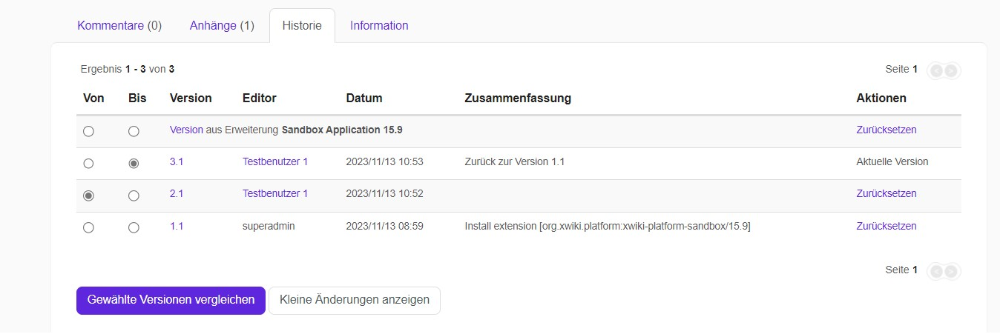
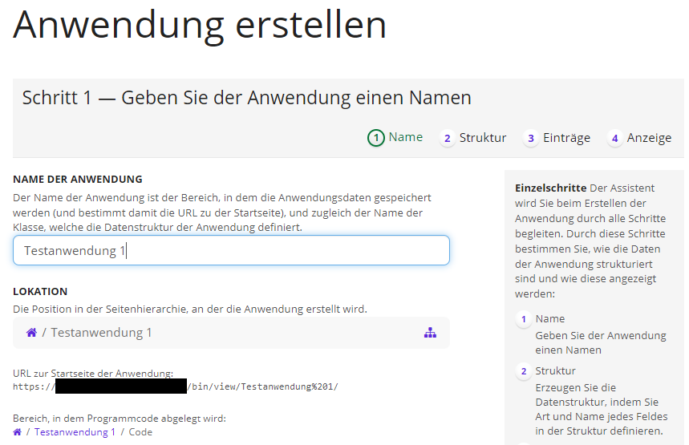
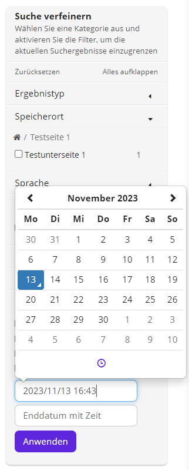

Willkommen in der Einführung zum Modul **Wissen**. Dieser Leitfaden bietet grundlegende Informationen zur Einrichtung und Nutzung von Wissen.

Das Modul **Wissen** kann für viele verschiedene Zwecke verwendet werden: als kollaboratives Intranet, Wissensdatenbank, Content-Management-System (CMS), Instrument zur Wettbewerbsanalyse, Plattform für öffentliche Diskussionen, gemeinsame Erstellung von Schulungsmaterialien, Erstellung von Webseiten und vieles mehr.

## Grundlegende Informationen

Wenn Sie sich in Ihr Wiki einloggen, sehen Sie als Erstes die Startseite des Wikis.

1. Wissen ist in Wikis und Seiten unterteilt. Innerhalb eines Wikis können Sie eine Hierarchie von Seiten erstellen, indem Sie Seiten in anderen Seiten erstellen. Diese Funktion wird als verschachtelte Seiten bezeichnet. In diesem Bereich können Sie neue Seiten hinzufügen, indem Sie auf die Schaltfläche oben rechts **Erstellen** klicken.
1. Zum Ändern einer Seite klicken Sie auf die Schaltfläche **Bearbeiten** oben rechts. Nehmen Sie Ihre Änderungen vor und speichern Sie die Seite. Die geänderte Seite ersetzt nun die vorherige Version. Jede Version der Seite wird in der Seitenhistorie gespeichert und kann bei Bedarf wiederhergestellt werden. Weitere Seitenaktionen, wie Verwalten, Kopieren, Umbenennen, Löschen, Exportieren, sind auch über das Menü auf der rechten Seite verfügbar.
1. In der oberen rechten Ecke erreichen Sie Ihr **Profil** oder das **Benachrichtigungsmenü**.
1. Wenn Sie das **Menü** in der rechten Leiste ausklappen, können Sie sich **einloggen, registrieren**, Ihr **Profil aufrufen** oder zur **Wiki-Verwaltung** in **Home** und **Global** gehen. Sie können auch das Wiki, **Dokumentenindex**, **Benutzerverzeichnis** oder **Anwendungen** aufrufen sowie das Wiki Verzeichnis einsehen.
1. Sie können den Inhalt der **Startseite** leicht bearbeiten/ändern, um diesen durch Ihren eigenen Inhalt zu ersetzen.
1. Seitliche Menüs werden mit Panels gehandhabt. Ein Panel ist ein Widget, das Sie links und/oder rechts auf jeder Seite Ihres Wikis in der Standardversion sehen können. Standardmäßig sehen Sie links die Panels **Anwendungen** und **Navigation.** Auf der rechten Seite finden Sie **Tipps** und **Benötigen Sie Hilfe?** und ebenso **Meine letzten Änderungen.**
1. Der Registerkartenbereich unten auf der Seite bietet standardmäßig **Kommentare**, **Anhänge**, **Seitenhistorie** und **Seiteninformationen.**

## Das Grundkonzept

Wissen unterteilt sich in Seiten und Wikis. Die Seitenmenüs werden über Panels verwaltet.

### Seite

In Wissen bildet eine Seite die Grundeinheit für Inhalte. Seiten sind in folgende Bereiche unterteilt:

- Aktionsleiste (im oberen Bereich): ermöglicht die Interaktion mit der aktuellen Seite
- Titel (wie die Seite benannt ist)
- Autor und Datum (welche Benutzerin oder welcher Benutzer hat die Seite zuletzt geändert und an welchem Datum)
- Inhaltsbereich
- Panels (entweder links oder rechts auf der Seite, auf beiden Seiten oder versteckt)
- Fußzeilenbereich: dort finden Sie Ersteller und Datum (wer war die Erstellerin oder der Ersteller der Seite und zu welchem Datum) sowie Tags (einige Kategorien, in die die Seite passt)

Im Registerkartenbereich am unteren Rand finden Sie:

- Kommentare und Anmerkungen (was andere über die Seite zu sagen haben),
- Anhänge (Dateien, die auf die Seite hochgeladen wurden)
- Historie (jede Version der aktuellen Seite)
- Informationen (enthaltene Seiten, Backlinks)

### Aktionen auf einer Seite

Nutzerinnen und Nutzer können folgende Aktionen durchführen.

**Bearbeiten der Seite:**

- Mit dem WYSIWYG-Editor: Ein Rich-Text-Editor, mit dem Sie den Inhalt Ihrer Wiki-Seite leicht ändern können.
- Mit dem Wiki-Editor: für Nutzerinnen und Nutzer, die es gewohnt sind, in Auszeichnungssyntax zu schreiben

**Drucken und Exportieren der Seite über das Menü Weitere Aktionen:**

- Lassen Sie sich eine Druckvorschau der aktuellen Seite anzeigen

Jede Seite kann in den folgenden Formaten exportiert werden: HTML, PDF, ODT und RTF (für MS Office)

**Die Seite ansehen:**

- Beobachten Sie die aktuelle Seite, um über Änderungen informiert zu werden. Klicken Sie dazu auf das Herz "Gefällt mir" am Ende des Haupttextes. So erhalten Sie Benachrichtigungen per E-Mail bei Änderungen.

**Weitere mögliche Aktionen:**

- Unterseiten erstellen
- Zugriffsrechte für die Seite ändern
- Bearbeiten von Objekten und Klassen der Seite
- Umbenennen, Kopieren und Löschen der Seite

### Wiki

Zunächst befinden Sie sich auf dem Hauptwiki. Es ist jedoch möglich, weitere Wikis (auch Subwikis genannt) zu erstellen. Ein Wiki ist eine Sammlung von Wikiseiten.

Dies kann nützlich sein, wenn Sie eine saubere Trennung zwischen verschiedenen Arten von Inhalten wünschen. Es gibt keine Beschränkungen der Anzahl der Wikis. In jedem Wiki können außerdem so viele Seiten wie sie benötigen erstellt werden. In der Regel beginnen Sie mit einem einzigen Wiki. Wenn der Bedarf oder die Inhalte entsprechend stark wachsen, können Sie die Inhalte in mehrere Wikis gliedern.

### Panels

Ein Panel ist ein Widget, das Sie auf jeder Seite Ihres Wikis sehen können. Panels werden innerhalb von Spalten angezeigt. Standardmäßig sehen Sie auf der linken Seite die Bereiche Anwendungen und Navigation und auf der rechten Seite einige weitere Bereiche.

Sie können die Bereiche auf verschiedene Weise steuern:

- Wählen Sie, welche Spalten angezeigt werden sollen (rechte Spalte, linke Spalte, beide Spalten, keine) 
- Wählen Sie die Breite der anzuzeigenden Spalten (klein, mittel, groß) 
- Wählen Sie, welche Felder Sie in Ihre Seitenspalten einfügen möchten

Panels sind nützlich, um Menüs zu erstellen oder Funktionen zu Ihren Seiten hinzuzufügen. Sie können für jeden Bereich Ihres Wikis verschiedene Bereiche festlegen.

## Seiten

### Erstellen einer Seite

Es gibt mehrere Möglichkeiten eine Seite auf Wissen zu erstellen. Im Folgenden finden Sie alle verfügbaren Methoden.

- Verwendung der Schaltfläche **Erstellen**
- Verwendung von Links auf der Seite

### Verwendung der Schaltfläche Erstellen

 Klicken Sie zuerst auf der Startseite von Wissen das Symbol **Erstellen**:

Daraufhin wird Ihnen dieser Bildschirm angezeigt:

Hier können Sie einen Titel vergeben und den Typ des Dokuments auswählen den Sie erstellen möchten.

### Verwendung von Links auf der Seite

Links können als Verweise auf noch nicht existierende Seiten genutzt werden. Wenn sie zu diesem Zweck verwendet werden, erscheint der Link unterstrichen mit einem Fragezeichen rechts daneben.

Ein Klick auf einen solchen Link fordert Sie auf, einen Seitentyp auszuwählen. Nachdem Sie auf **Erstellen** geklickt haben, wird Ihnen die Seite im Bearbeitungsmodus angezeigt. Die neue Seite wird erstellt, wenn Sie auf **Speichern &amp; Anzeigen** klicken. Diese Methode ist besonders praktisch, da sie gleichzeitig zur Erstellung neuer Inhalte auch die Struktur Ihres Wikis aufbaut.

### Seiten bearbeiten

Wissen ist ein Wiki, wodurch der Inhalt seiner Seiten leicht zu bearbeiten und zu modifizieren ist.

- Klicken Sie auf den **Bearbeiten-Button**.
- Sie können den Titel und den Inhalt der Wiki-Seite bearbeiten, während Sie im Ansichtsmodus bleiben, mit dem zusätzlichen Vorteil, dass Sie den Kontext nicht verlieren. Die Sektionsbearbeitung hilft Ihnen, einen Abschnitt zu bearbeiten, ohne die Seite scrollen zu müssen.
- Wenn Sie mit Ihren Änderungen fertig sind, können Sie unter **Zusammenfassung hinzufügen** eine Notiz eingeben, die erklärt, was Sie geändert haben. Wählen Sie dann einen der folgenden Button: **Speichern &amp; Weiterarbeiten**, **Speichern &amp; Anzeigen** oder **Vorschau.**
- Nachdem Sie die Seite gespeichert haben, ist die neue Version mit Ihrer Bearbeitung sofort online.

#### Die Bedeutung von Links

Eine der Hauptstärken eines Wikis ist, dass Sie leicht Links zwischen Seiten erstellen können. Die einfache Linkerstellung ermöglicht es Ihnen, eine Struktur in Ihrem Wiki zu erstellen und Seiten zu verweisen. Links machen Inhalte einfacher durchsuch- und auffindbar. Deshalb ist es wichtig, Links zwischen Ihren Seiten zu erstellen. Um neue interne Wiki-Links beim Bearbeiten einer Seite zu erstellen, führen Sie folgende Schritte durch:

- Im Rich-Text-Bearbeitungsmodus (WYSIWYG) markieren Sie das Wort oder die Wörter, die Sie verlinken möchten. 
- Klicken Sie auf den **Link-Button**, dann auf den **Seite-Button** und wählen Sie die Seite aus dem Baum aus, auf die Sie verlinken möchten.
- Anschließend klicken Sie auf **Auswählen**, dann auf **OK**.

### Seiten-Historie

Jedes Mal, wenn Sie eine Seite in Wissen ändern, wird diese Änderung in der Versionshistorie der Seite gespeichert. Sie können zwei Versionen einer Seite vergleichen, um zu sehen, was sich zwischen ihnen verändert hat. Es geht nie Inhalt verloren — alles, was Sie im Laufe der Zeit zu Ihrem Wiki hinzufügen, wird gesichert. Wenn sich eine kürzliche Änderung als falsch herausstellt, können Sie problemlos zu einer früheren Version der Seite zurückkehren.

Um zwei Versionen einer Seite zu vergleichen, suchen Sie nach dem Tab **Historie** am unteren Rand der Seite. Sie finden auch den Menüpunkt **Historie**, indem Sie oben auf einer Seite auf den Button **Weitere Aktionen** klicken.

Um zwei beliebige Versionen einer Seite zu vergleichen, wählen Sie diese beiden Versionen aus und klicken Sie auf den Button **Ausgewählte Versionen vergleichen**, der sich am unteren Rand der Seite befindet. Eine Seite wird Ihnen die Unterschiede im Inhalt, den Anhängen und Kommentaren zwischen den beiden Versionen der Seite zeigen. Klicken Sie auf den **Zurück-Button** Ihres Browsers, um dorthin zurückzukehren, wo Sie waren. Um den Inhalt einer früheren Version der Seite anzusehen, klicken Sie in der Spalte **Version** auf die Nummer der Seitenversion. Um zu einer früheren Version der Seite zurückzukehren, klicken Sie auf den Button **Zurücksetzen**.

### Seite als E-Mail versenden

Sie können Seiten per E-Mail mit anderen Nutzerinnen und Nutzern teilen. Öffnen Sie dazu die gewünschte Seite und klicken Sie auf die Schaltfläche **Weitere Aktionen (drei Punkte)**. Wählen Sie dann den Menüpunkt **Als E-Mail versenden**.

Das Fenster **Diese Seite versenden** öffnet sich.

Klicken Sie zunächst in das Textfeld unter **Senden an**, um auszuwählen mit wem Sie die Seite teilen möchten. Daraufhin wird eine Liste eingeblendet, in der Sie die gewünschten Personen auswählen können. Sie können auch einen Namen eingeben, um gezielt nach bestimmten Personen zu suchen oder von Hand die E-Mail-Adresse einer Empfängerin bzw. eines Empfängers eingeben. Wiederholen Sie den Vorgang, um mehrere Empfängerinnen und Empfänger auszuwählen.

Wenn Sie selbst eine Kopie der E-Mail erhalten möchten, setzen Sie einen Haken bei **Sende mir eine Kopie**.

Unter **Füge das aktuelle Dokument ein** können Sie auswählen, ob die Empfängerinnen und Empfänger lediglich einen Link zur Seite erhalten sollen (**Nur als Link**) oder die gesamte Seite in der E-Mail enthalten sein soll (**Im Volltext der Nachricht**).

Unter **Die folgende Nachricht wird gesendet werden** finden Sie ein Textfeld, in dem Sie eine persönliche Nachricht eingeben können. Erklären Sie hier z. B. den Empfängerinnen und Empfänger, warum die Seite für sie relevant ist.

Klicken Sie abschließend auf **Senden**.

## Seitenleiste

### Dashboard

Auf dem Dashboard werden wichtige Informationen zusammenfasst. Sie erhalten dort einen direkten Zugriff auf häufig verwendete Funktionen.

Sie erreichen das Dashboard von der Startseite aus. Klicken Sie in der Seitenleiste links unter **Anwendungen** auf den entsprechenden Menüpunkt.

#### Navigieren im Dashboard

Das Dashboard ist in mehrere Schlüsselbereiche unterteilt, die für eine effektive Navigation und Verwaltung sorgen. Der Bereich **Seiten** bietet einen direkten Zugriff auf wichtige Seiten wie die Startseite, die Hilfe-Sektion für Anleitungen, den Sandkasten zum Experimentieren und Ihre persönliche Wiki-Seite.

#### Überblick über Aktivitäten

Im **Aktivitätenbereich** werden Sie über neueste Profiländerungen und Seitenbearbeitungen informiert. Es ist auch erkennbar, welche Seiten bei den Benutzerinnen und Benutzern beliebt sind.

#### Tags (Schlagwörter) und Dokumentenmanagement

Der **Tag-Bereich** erleichtert die Organisation und Suche nach Dokumenten durch eine strukturierte Tagging-Funktion.

Im **Dokumentenbereich** können Sie neue Dokumente hinzufügen und bestehende verwalten, was eine strukturierte Dokumentation und Archivierung ermöglicht.

#### Seiten erstellen und bearbeiten

Auch auf dem Dashboard haben Sie schnellen Zugriff auf Funktionen zum Erstellen und Bearbeiten von Seiten. Sie finden die Schaltflächen **Erstellen** sowie **Bearbeiten** oben rechts neben dem Titel **Dashboard**. Für ausführlichere Hinweise zum Erstellen und Bearbeiten von Seiten schauen Sie bitte in das entsprechende Kapitel der Dokumentation.

### Hilfe

Das Modul **Wissen** verfügt über einen eigenen Hilfebereich. Sie erreichen ihn, indem Sie im Menü links unter **Anwendungen** auf **Hilfe** klicken.

Sie gelangen auf eine Übersichtsseite und können Informationen zu verschiedenen Themen abrufen. Einige Links führen zu englischsprachigen Seiten.

Auf den Unterseiten Vorlagen, Makros und Anwendungen finden Sie die Schaltfläche **Probieren Sie es aus!**. Sie öffnet einen Editor, in dem Sie die entsprechende Funktion direkt anwenden können.

Folgende Abschnitte sind auf der Übersichtsseite zu finden:

- Erste Schritte: Dieser Link führt zu einer englischsprachigen Seite, auf der Sie sich mit den Grundfunktionen des Moduls vertraut machen können
- Videos (englisch): Über diesen Link gelangen Sie zu einer Übersicht von englischsprachigen Videoanleitungen, die Sie einzeln nach Bedarf abrufen können
- Seitenbearbeitung: Dieser Link öffnet den Sandkasten (näheres dazu im entsprechenden Abschnitt der Hilfe), in dem Sie die Bearbeitung von Seiten ausprobieren und üben können
- Vorlagen: Über diesen Link erfahren Sie mehr über Vorlagen, also Seiten, die Sie einrichten und später als Grundlage neuer Seiten wiederverwenden können. Sie finden hier auch Beispiele für vorgefertigte Vorlagen. Der Link **Mehr erfahren** führt zu einer englischsprachigen Anleitung
- Makros: Über diesen Link erfahren Sie mehr über Makros und können sich Beispiele ansehen. Makros sind automatisierte Funktionsabläufe, die Ihnen die Arbeit erheblich erleichtern können. Beispielsweise können Sie mithilfe eines Makros automatisch ein Inhaltsverzeichnis für Ihre Seite anlegen, statt von Hand eine entsprechende Übersicht mit Verweisen zu jeder einzelnen Überschrift zu erstellen
- Anwendungen: Erfahren Sie Näheres zu Anwendungen. Sie können ganz ohne Programmierkenntnisse eigene Anwendungen erstellen oder nach einer geeigneten Anwendung suchen, die von Community-Mitgliedern erstellt wurde. Unter **Beispiele** finden Sie Links zur englischsprachigen Anleitung einiger häufiger Anwendungen
- Inhaltsorganisation: Hier erfahren Sie, wie Sie die Seiten in Ihrem Wiki hierarchisch ordnen
- Versionskontrolle: Hier erfahren Sie, wie Sie frühere Seitenversionen anzeigen, vergleichen und zurücksetzen können
- Importieren/Exportieren: Hier erfahren Sie, wie Sie Seiteninhalte aus dem Modul exportieren oder in das Modul importieren können

### Sandkasten

Der Sandkasten ist eine vorgefertigte Seite, die beispielhaft zeigt, welche Formatierungen Sie auf Seiten vornehmen können und welche Funktionen Ihnen zur Verfügung stehen. Sie können im Sandkasten sämtliche Funktionen ausprobieren, um sich mit dem Anlegen und Bearbeiten von Seiten vertraut zu machen.

Klicken Sie in der Seitenleiste links auf **Sandkasten**, um den Sandkasten zu öffnen.

Folgen Sie nun einfach den Anweisungen auf der Sandkastenseite, um das Arbeiten mit Seiten zu üben.

### Mehr Anwendungen

Im Modul Wissen haben Sie die Möglichkeit, binnen weniger Minuten ohne Programmierkenntnisse Ihre eigenen kollaborativen Web-Anwendungen zu erstellen. Klicken Sie dafür zunächst im Seitenleisten-Abschnitt **Anwendungen** auf **Mehr Anwendungen** und dann auf **Erstellen Sie Ihre eigene!**.

Sie gelangen auf die Seite **Anwendung erstellen in wenigen Minuten**.

#### Anwendung erstellen

Um mit der Erstellung Ihrer ersten eigenen Anwendung zu beginnen, klicken Sie auf die Schaltfläche **Anwendung erstellen** . Danach müssen Sie als ersten Schritt einen Namen für die Anwendung eingeben.

Ein Assistent wird Sie durch die nächsten Schritte führen. Folgen Sie den Anweisungen auf der Seite.

#### Liste eigener Anwendungen

Unten auf der Seite **Anwendung erstellen in wenigen Minuten** finden Sie den Abschnitt **Anwendungen**. Hier sind alle Anwendungen aufgelistet, die von Nutzerinnen und Nutzern selbst erstellt wurden. Klicken Sie auf die Überschriften **Anwendung** (Sortierung/Filterung nach Anwendungsname), **Letzer Autor** oder **Änderungsdatum**, um die Anwendungen nach diesen Kriterien zu **sortieren**. Wenn Sie wiederholt auf die jeweilige Überschrift klicken, können Sie zwischen auf- und absteigender Sortierung wechseln.

Unter den genannten Überschriften finden Sie jeweils ein Textfeld, in dem Sie einen passenden Suchbegriff eingeben können, um die Liste einzugrenzen. So können Sie beispielsweise nur Anwendungen anzeigen lassen, die an einem bestimmten Datum bearbeitet wurden. Schon während der Eingabe eines Suchbegriffs wird die Liste entsprechend gefiltert.

Unter der Überschrift **Aktionen** erhalten Sie Direktzugriff auf die Funktion **Bearbeiten**, um Änderungen an der gewünschten Anwendung vorzunehmen.

### Navigation

Im Abschnitt **Navigation** sehen Sie die Baumstruktur Ihrer Seiten und können per Mausklick zu jeder gewünschten Seite navigieren. Klicken Sie auf **Startseite**, um zur Startseite Ihres Wikis zu gelangen.

Seiten, die Unterseiten enthalten, erkennen Sie an einem kleinen **Pfeilsymbol** links neben dem Seitentitel. Mit Klick auf den Pfeil können Sie diese Unterseiten aufklappen. Sie können auch auf den Titel der übergeordneten Seite klicken, um diese zu öffnen und gleichzeitig etwaige Unterseiten einzublenden.

Je nachdem, wie komplex Ihr Wiki ist, können Sie mehrere solcher Hierarchieebenen einrichten. Das heißt, dass Unterseiten wiederum eigene Unterseiten haben können usw.

#### Einfluss der Navigation auf die Erstellung von Seiten

Beim Erstellen neuer Seiten sollten Sie darauf achten, welche Seite Sie gerade geöffnet haben. Wenn Sie sich auf der Startseite befinden und dann auf die Schaltfläche **Erstellen** klicken, wird Ihre neue Seite auf der höchsten Hierarchieebene erstellt. Befinden Sie sich hingegen auf einer von Ihnen erstellten Seite, so wird eine Unterseite dieser Seite erstellt.

**Beispiel:** Sie haben aktuell die Seite „Testseite 1“ geöffnet.

Im Dialog **Seite erstellen** sehen Sie unter **Speicherort**, dass „Testseite 1“ als Speicherort Ihrer neuen Seite vorausgewählt ist. Die neue Seite wird also eine Unterseite von „Testseite 1“. Sie können diese Auswahl allerdings ändern, indem Sie rechts auf die Schaltfläche **Einen neuen Speicherort auswählen** klicken.

Näheres zum Erstellen von Seiten erfahren Sie unter **Seiten – Seiten erstellen**.

## Menüleiste

### Suche

Mithilfe der Suchfunktion können Sie schnell gewünschte Inhalte finden. Klicken Sie dafür zunächst auf die Schaltfläche **Suche**.

Ein Textfeld erscheint. Geben Sie einen Suchbegriff ein. Dies kann der Titel einer Seite, ein Stichwort aus dem Seiteninhalt oder auch der Name einer Nutzerin oder eines Nutzers sein. Etwa wenn Sie nach Seiten suchen, die von bestimmten Personen bearbeitet wurden. Schon während der Eingabe werden Ihnen Vorschläge angezeigt.

Wenn Sie unter den Vorschlägen bereits den gesuchten Inhalt sehen, können Sie ihn direkt per Mausklick öffnen. Sie können auch mit den Pfeiltasten auf Ihrer Tastatur zum gewünschten Inhalt navigieren und ihn mit der Eingabetaste auswählen.

Je nachdem, wie viele Treffer Sie erhalten, kann es hilfreicher sein, sich alle Suchergebnisse auf einer neuen Seite anzeigen zu lassen. Dort können Sie die Suche bei Bedarf auch noch weiter eingrenzen. Klicken Sie dazu nach Eingabe Ihres Suchbegriffes auf **Alle Ergebnisse zeigen** oder drücken Sie die **Eingabetaste**.

In den detaillierten Suchergebnissen stehen Ihnen verschiedene Optionen zur Anzeige, Sortierung und Eingrenzung Ihrer Suche zur Verfügung.

#### Anzeigen

- Normalerweise wird in der Liste mit Suchergebnissen jeweils eine Vorschau angezeigt, in der Ihr Suchbegriff hervorgehoben wird. Klicken Sie auf **Hervorheben**, um diese Vorschau auszuschalten. Nun werden lediglich Titel und Speicherort der Seite sowie die letzte Person angezeigt, von der die Seite bearbeitet wurde
- Klicken Sie auf **Facetten**, um zur besseren Übersicht den Bereich **Suche verfeinern** auf der rechten Seite auszublenden. Näheres zu diesem Bereich finden Sie weiter unten
- Durch erneuten Klick auf **Hervorheben** bzw. **Facetten** können Sie die Einstellung wieder rückgängig machen

#### Sortierung

Wählen Sie hier aus, wie Ihre Suchergebnisse sortiert werden sollen. Folgende Sortierungskriterien stehen zur Auswahl:

- Relevanz
- Titel
- Letztes Bearbeitungsdatum
- Letzter Autor, d. h. die letzte Person, von der die Seite zuletzt bearbeitet wurde  

Klicken Sie wiederholt auf die jeweiligen Kriterien, um zwischen auf- und absteigender Sortierung umzuschalten.

#### Suche verfeinern

Wenn die Liste mit Suchergebnissen noch zu lang und unübersichtlich ist, können Sie Ihre Suche hier weiter eingrenzen. Dazu stehen Ihnen folgende Kriterien zur Auswahl, die Sie mit einem Klick auf den kleinen Pfeil neben dem jeweiligen Kriterium aufklappen können:

- Ergebnistyp: In aller Regel werden Sie dieses Kriterium nicht benötigen, da hier alle Seiten als Dokumente aufgeführt werden
- Speicherort: Grenzen Sie Ihre Suche auf Seiten ein, die sich in einem bestimmten Bereich der Baumstruktur befinden, beispielsweise Unterseiten von „Testseite 1“
- Sprache: Grenzen Sie Ihre Suche auf Seiten in einer bestimmten Sprache ein, falls in Ihrem Wiki mehrere Sprachen verwendet werden
- Letzter Autor: Grenzen Sie Ihre Suche auf Seiten ein, die von bestimmten Nutzerinnen und Nutzern bearbeitet wurden
- Ersteller: Grenzen Sie Ihre Suche auf Seiten ein, die von bestimmten Nutzerinnen und Nutzern erstellt wurden
- Letztes Bearbeitungsdatum: Grenzen Sie Ihre Suche auf Seiten ein, die in einem bestimmten Zeitraum bearbeitet wurden. Sie haben dabei die Wahl zwischen **Heute**, **Letzte 7 Tage**, **Letzte 30 Tage** sowie **Frei angebbarer Zeitraum**. 	

Wenn Sie die letzte Option auswählen, klicken Sie in die Felder **Startdatum mit Zeit** und **Enddatum mit Zeit**. Ein Kalender öffnet sich, in dem Sie das gewünschte Datum auswählen können. Klicken Sie unten im Kalender auf die Schaltfläche **Select Time (Uhrsymbol)**, um eine Uhrzeit hinzuzufügen. Bestätigen Sie Ihre Auswahl mit einem Klick auf **Anwenden**.

- Erstelldatum: Grenzen Sie Ihre Suche auf Seiten ein, die in einem bestimmten Zeitraum erstellt wurden. Die Auswahlmöglichkeiten sind die gleichen wie unter **Letztes Bearbeitungsdatum**. 

Sie können mehrere Kriterien gleichzeitig auswählen, um Ihre Suche möglichst genau einzugrenzen. Klicken Sie auf **Zurücksetzen**, um alle ausgewählten Kriterien auszuschalten. Wenn Sie sämtliche Optionen auf einmal einsehen möchten, klicken Sie auf **Alles aufklappen**.

Wenn Sie die gewünschte Seite gefunden haben, öffnen Sie diese mit einem Klick auf den Seitentitel.

### Benachrichtigungen

Mithilfe von Benachrichtigungen bleiben Sie über relevante Inhalte und Aktivitäten auf dem Laufenden. Die meisten Benachrichtigungen beziehen sich auf Änderungen an Seiten, die Sie beobachten oder selbst erstellt haben.

#### Benachrichtigungen in der Menüleiste

Die Schaltfläche **Benachrichtigungen (Glockensymbol)** in der Menüleiste zeigt mit einer Zahl an, wie viele neue Benachrichtigungen Sie haben. Wenn Sie dort keine Zahl sehen, haben Sie aktuell keine neuen Benachrichtigungen.

Mit Klick auf die Schaltfläche öffnet sich ein Kontextmenü mit den folgenden Optionen:

- **RSS:** Falls Sie RSS-Feeds abonniert haben, können Sie diese hier abrufen
- **Einstellungen:** Stellen Sie ein, wie häufig und auf welchen Kanälen Sie Benachrichtigungen erhalten und über welche Art von Aktivität Sie benachrichtigt werden möchten
- **Diese Seite abonnieren:** Wählen Sie aus, ob Sie die aktuell geöffnete Seite abonnieren möchten. Für Seiten, die Sie selbst erstellt haben, ist diese Option standardmäßig eingeschaltet. Sie erhalten Benachrichtigungen über Änderungen an abonnierten Seiten, sofern Sie solche Benachrichtigungen nicht in den Einstellungen ausgeschaltet haben
- **Diese Seite mitsamt Unterseiten abonnieren:** Wählen Sie aus, ob Sie neben der geöffneten Seite auch etwaige Unterseiten abonnieren möchten. Standardmäßig ist diese Option ausgeschaltet
- **Dieses Wiki abonnieren:** Wählen Sie aus, ob Sie das gesamte Wiki abonnieren möchten. In dem Fall erhalten Sie Benachrichtigungen über Änderungen an sämtlichen Seiten im Wiki, sofern Sie solche Benachrichtigungen nicht in den Einstellungen ausgeschaltet haben. Standardmäßig ist diese Option ausgeschaltet
- **Alle löschen:** Entfernen Sie alle Benachrichtigungen, die weiter unten aufgelistet sind. 

Falls es aktuelle Benachrichtigungen gibt, werden diese weiter unten im Kontextmenü aufgelistet. In dieser Liste sehen Sie die zugehörigen Seitentitel, die Bearbeiterin bzw. den Bearbeiter sowie eine ungefähre Angabe dazu, wann die Änderung vorgenommen wurde. Sie können die Seiten, auf die sich einzelne Benachrichtigungen beziehen, mit einem Mausklick auf den Seitentitel öffnen. Außerdem können Sie auf den Namen der Bearbeiterin bzw. des Bearbeiters klicken, um ihr bzw. sein Benutzerprofil zu öffnen. Dort können Sie alle weiteren letzten Aktivitäten der Person einsehen.

Für jede Benachrichtigung stehen Ihnen auf der rechten Seite 2 Schaltflächen zur Verfügung:

- Ereignis als gelesen markieren (Hakensymbol): Hiermit geben Sie an, dass Sie die Benachrichtigung zur Kenntnis genommen haben. Sie wird daraufhin nicht mehr als neue Benachrichtigung gewertet. Die Zahl bei der Schaltfläche **Benachrichtigungen (Glockensymbol)** reduziert sich entsprechend
- Zeige Ereignis-Details (drei Punkte): Hiermit blenden Sie Informationen dazu ein, um was für ein Ereignis es sich handelt (ob z. B. eine Seite bearbeitet, erstellt oder kommentiert wurde) und wann dies erfolgt ist. Wenn Änderungen an einer vorhandenen Seite vorgenommen wurden, können hier auch mehrere Zeitpunkte auftauchen. Klicken Sie auf einen der Zeitpunkte, um zu einer Übersicht über die Änderungen und Versionen der Seite zu gelangen

#### Erwähnungen

Sie können Benachrichtigungen erhalten, wenn Sie von anderen Nutzerinnen und Nutzern namentlich erwähnt werden, beispielsweise auf Seiten oder in Kommentaren.

#### E-Mail-Benachrichtigungen

Sie können Benachrichtigungen per E-Mail erhalten, wenn andere Nutzerinnen und Nutzer Seiten per E-Mail mit Ihnen teilen. Wie Sie selbst Seiten per E-Mail teilen können, erfahren Sie unter **Seiten – Seite als E-Mail versenden**.

### Profil

Um Ihr Profil einzusehen und zu bearbeiten, klicken Sie in der Menüleiste auf die Schaltfläche mit Ihrem Profilbild. Falls Sie noch kein Profilbild ausgewählt haben, befindet sich hier ein Platzhalterbild. Als Alternativtext für die Schaltfläche ist Ihr Name hinterlegt.

#### Übersicht

Ihre Profilansicht besteht aus drei Teilen:

- Links können Sie Ihr **Profilbild** ändern und auf verschiedene Einstellungen zugreifen
- In der Mitte können Sie Ihre Profilinformationen einsehen und ändern, aufgeteilt in **Persönliche Informationen**, **Kontaktinformationen** und **Externe Links**
- Rechts sehen Sie Ihre letzten **Aktivitäten**, beispielsweise Seiten, die Sie bearbeitet oder erstellt haben

#### Profilbild hinzufügen, ändern oder entfernen

Oben links im Profil haben Sie die Möglichkeit, ein Profilbild hinzuzufügen oder ein vorhandenes Profilbild auszutauschen. Klicken Sie dazu auf die Schaltfläche **Foto ändern** oben rechts im vorhandenen Bild. Sie gelangen in ein neues Fenster.

Im rechten Fensterbereich sehen Sie eine Auswahl an bereits vorhandenen Bildern. Um ein Bild auszuwählen, klicken Sie auf die Schaltfläche **Auswählen (grüner Haken)** über dem jeweiligen Bild. Um das Bild größer anzuzeigen, klicken Sie auf das Bild selbst. Mit der Schaltfläche **Entfernen (rotes X)** können Sie Bilder löschen. Das Platzhalterbild **Standard** steht jederzeit zur Verfügung und kann nicht gelöscht werden.

Um ein neues Bild hochzuladen, klicken Sie im linken Fensterbereich auf **Datei auswählen**. Der Dateibrowser öffnet sich. Navigieren Sie zum Ordner, in dem Ihr Bild gespeichert ist. Wählen Sie das gewünschte Bild aus und klicken Sie auf **Öffnen**. Sie können das Bild auch mit einem Doppelklick direkt öffnen. Abschließend müssen Sie noch auf **Hochladen und auswählen** klicken.

#### Profilinformationen einsehen und bearbeiten

Hier können Sie die bisher gespeicherten Informationen in Ihrem Profil einsehen. Diese werden anderen Nutzerinnen und Nutzern angezeigt. Wenn Sie Angaben hinzufügen oder ändern möchten, klicken Sie oben rechts auf die Schaltfläche **Profil bearbeiten (Stift-Symbol)**.

- **Persönliche Informationen:** Geben Sie Ihren Namen und Ihre Firma an. Je nach Konfiguration können Sie Ihren Namen möglicherweise nicht ändern. Hier können Sie Ihr Profil auch durch einen Kommentar ergänzen, der sich mithilfe der Werkzeugleiste formatieren lässt
- **Kontaktinformationen:** Geben Sie Ihre E-Mail-Adresse, Telefonnummer und Postadresse an. Auch die Adresse lässt sich mithilfe der Werkzeugleiste formatieren
- **Externe Links:** Wenn Sie einen persönlichen Blog haben (ggf. mit Blog-Feed), können Sie hier entsprechende Links hinzufügen

#### Speichern und Vorschau

Wenn Sie alle gewünschten Angaben gemacht haben, stehen Ihnen unten mehrere Optionen zur Verfügung:

- **Speichern &amp; Ansehen:** Speichern Sie Ihre Angaben und kehren Sie zur Profilansicht zurück
- **Speichern:** Speichern Sie Ihre Angaben, ohne die Bearbeitung zu verlassen, z. B. wenn Sie vor der Fertigstellung Ihre Angaben zwischenspeichern möchten
- **Vorschau:** Sehen Sie sich Ihr bearbeitetes Profil an, so wie es anderen Nutzerinnen und Nutzern angezeigt werden würde. So können Sie vor dem Speichern Ihre Angaben noch einmal übersichtlich überprüfen. Von der Vorschau aus stehen Ihnen wiederum die Optionen **Speichern &amp; Ansehen**, **Speichern** sowie **Abbrechen** zur Verfügung. Wenn Sie Ihre Änderungen noch nachbearbeiten möchten, klicken Sie auf **Zurück zum Bearbeiten**
- **Abbrechen:** Damit wird die Bearbeitung abgebrochen und Sie kehren zurück zur Profilansicht, ohne dass Ihre Änderungen gespeichert werden
- **Zusammenfassung hinzufügen:** Beschreiben Sie optional, welche Änderungen Sie vorgenommen haben, um diese später nachvollziehen zu können oder anderen Nutzerinnen und Nutzern mitzuteilen. Kommentare, die Sie hier eingeben, tauchen später in der Historie Ihrer Profilseite auf. Näheres dazu finden Sie unter **Seiten – Seiten-Historie**
- **Kleine Änderungen:** Setzen Sie hier einen Haken, wenn Sie nur geringfügige Änderungen vorgenommen haben, für die keine Zusammenfassung erforderlich ist. Für Ihre Profilseite werden Sie die letzten beiden Funktionen in aller Regel jedoch nicht benötigen

### Das Hamburger-Menü

Die Schaltfläche **Menüleiste (Hamburger-Menü)** ganz rechts in der Menüleiste bietet schnellen Zugriff auf einige nützliche Funktionen.

Öffnen Sie das Menü mit einem Mausklick.

#### Funktionsübersicht

Folgende Funktionen stehen im oberen Bereich des Menüs zur Verfügung:

- Klicken Sie auf Ihr Profilbild oder Ihren Benutzernamen, um in Ihr Profil zu gelangen
- Abmelden: Melden Sie sich aus der Arbeitsumgebung ab  

Folgende Funktionen stehen im Abschnitt **Home** zur Verfügung:

- Dokumentenindex: Zeigt eine durchsuchbare Liste aller Dokumente an, die aktuell in Ihrem Wiki enthalten sind
- Benutzerverzeichnis: Zeigt eine durchsuchbare Liste aller Personen an, die aktuell für die Nutzung des Wikis registriert sind
- Anwendungen: Zeigt eine Liste aller Anwendungen an, die aktuell für Ihr Wiki installiert sind  

Folgende Funktionen stehen im Abschnitt **Global** zur verfügung:

- Wiki-Verzeichnis: Zeigt eine durchsuchbare Liste aller verfügbaren Wikis an
- Was gibt's Neues: Zeigt Informationen zu aktuellen Softwareversionen und damit verbundenen Änderungen an  

Nähere Angaben zu Dokumentenindex, Benutzer- und Wiki-Verzeichnis finden Sie auf den entsprechenden Unterseiten dieser Anleitung.

